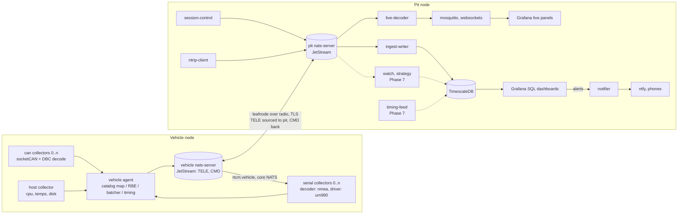
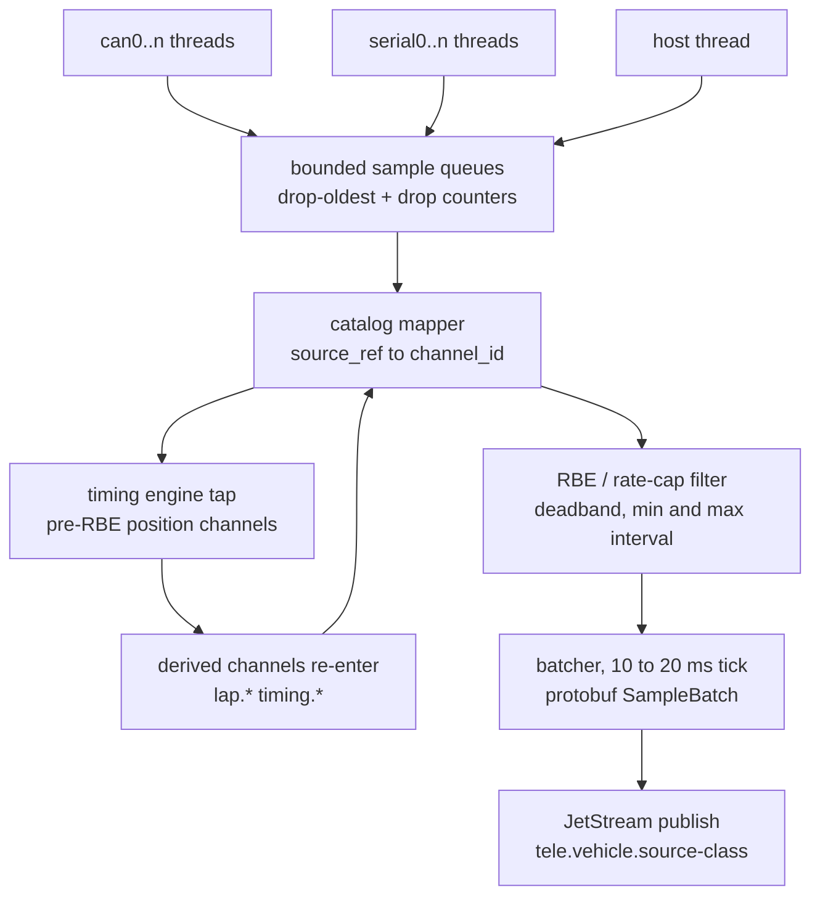
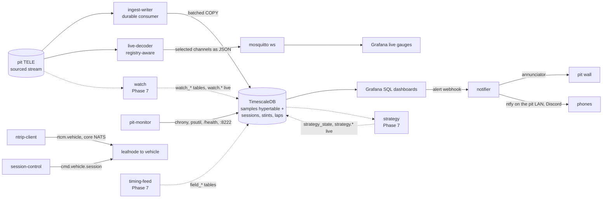
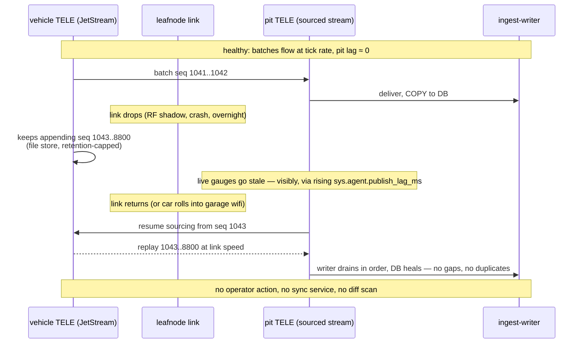

# openlaps architecture

openlaps is a racing telemetry platform split across two hosts: a **vehicle**
node that collects, times, and durably stores telemetry, and a **pit** node
that receives the stream over a constrained wireless link, lands it in a
time-series database, and serves live and historical dashboards. Everything
specific to one car — buses, DBC files, sensors, channel names, tracks — lives
in a configuration *profile* (see `CATALOG.md`); the platform code is generic.

Design goals, in priority order:

1. **Survive a bad link.** The vehicle↔pit radio (e.g. 802.11ah HaLow) is
   half-duplex, long-range, and sometimes awful. Data must never be lost to a
   dropout; the pit view must heal itself when the link returns.
2. **The car is config.** Adding a CAN bus, moving GPS from a serial receiver
   onto a bus, or renaming a sensor is a profile edit — no consumer (dashboard,
   timing, export) changes.
3. **Bandwidth is a budget, not a hope.** The wire format is binary, batched,
   and carries no repeated name strings; per-channel report-by-exception
   trims what crosses the link.
4. **Open source hygiene.** No credentials in the repo, ever; deployments
   inject secrets via environment. The example profile is documentation.

## System overview

One durable stream (`TELE`) on the vehicle is the system's source of truth.
The pit's copy of `TELE` is a JetStream *sourced stream*: it pulls from the
vehicle's stream by sequence number over a NATS leafnode connection, so after
any interruption — a corner of the track with no RF, a dead radio, an
overnight power-down — it resumes exactly where it left off. There is no
separate synchronisation service and no diff-based backfill: catch-up *is*
the transport.

## Layered data model

| Layer | Owns | Knows about |
| --- | --- | --- |
| **Collectors** | Transport + decode: socketCAN frames → DBC signals, serial bytes → NMEA fields, host stats | Nothing about racing. A collector emits `Sample{source_ref, t, value}` where `source_ref` is `bus:device.MESSAGE.SIGNAL` |
| **Channel catalog** | Meaning: maps source refs to canonical channels (`engine.rpm`, `position.lat`, `chassis.accel_x`) with units, types, and link policies | The profile YAML. Integer channel IDs come from here (via the `ChannelRegistry`) |
| **Apps & consumers** | Lap timing, dashboards, exports | Canonical channel names only — never a bus, DBC, or wire detail |

This is the load-bearing indirection: the timing engine subscribes to
`position.*` and does not care whether fixes come from a serial GNSS receiver
or a CAN frame. Swapping hardware is a catalog edit (`CATALOG.md` has the
worked example).

Derived data re-enters the same pipeline: the timing engine's outputs (lap and
sector events, delta-vs-best, predicted lap, distance) are published as
`lap.*` / `timing.*` channels and flow to the pit like any sensor channel.

## Vehicle agent data flow

Behaviours that matter (full spec in `AGENT_DESIGN.md`):

- **Timestamps** — each `SampleBatch` carries a wall-clock and a monotonic
  epoch; samples carry microsecond offsets. True capture time survives
  batching, and cross-host latency is measurable.
- **RBE is a link policy, not a data policy** — the timing engine taps the
  stream *before* report-by-exception filtering, so timing always sees
  full-rate position data. Every RBE channel has a `max_interval` heartbeat
  so downstream fill-forward is bounded.
- **Backpressure by shedding, visibly** — every queue is bounded and
  drop-oldest; drop counters are themselves channels (`sys.agent.*`), so
  overload shows up on a dashboard instead of in a log nobody reads.
- **Local durability** — the agent publishes to a NATS server on the same
  host. The only loss window is a hard crash between capture and local ack.

## Wire format

Defined in `WIRE_FORMAT.md` + `proto/telemetry.proto`. In one paragraph:
channels are registered once in a `ChannelRegistry` message (id → name, units,
type, source ref); data rides in `SampleBatch` messages — one per 10–20 ms
tick per source class — containing `{channel_id, t_offset, value}` triples.
No topic-per-signal, no repeated JSON keys, no name strings on the hot path.
Against the predecessor system's per-signal JSON-over-MQTT this is roughly an
order of magnitude less wire traffic at identical data rates, which is what
lets full-rate telemetry (including 100 Hz IMU) fit a 2 MHz HaLow channel
with headroom for video.

## Pit data flow

- **ingest-writer** is a durable JetStream consumer: decode batch → resolve
  registry → batched `COPY` into the `samples` hypertable; lap/sector events
  additionally materialise rows in the relational `laps` table. Target
  source-to-row latency: under 500 ms when the link is healthy.
- **live-decoder** republishes a configured subset of channels as plain JSON
  over a small local MQTT broker (websockets) for Grafana's live gauge
  panels. This is the only MQTT left in the system, it never crosses the
  radio, and it is disposable — replacing it with Grafana Live push would
  touch nothing else.
- **session-control** publishes driver/stint/session state on `cmd.<vehicle>.*`
  (replicated to the vehicle over the same leafnode); the agent stamps active
  session identity onto derived channels so every lap is attributable.
- **ntrip-client** runs at the pit because that's where the internet is:
  RTK correction bytes flow vehicle-ward on core NATS (`rtcm.<vehicle>`),
  deliberately fire-and-forget — a stale correction is a useless correction.
  GNSS credentials never exist on the vehicle.
- **pit-monitor** polls the pit's own chrony, host resources, ntrip-client
  `/health` and NATS monitoring port, and writes them to the `pit_metrics`
  table (`docs/PIT_SCHEMA.md`). It is the one pit service that reads nothing
  off the wire and publishes nothing: the vehicle's equivalents arrive as
  ordinary telemetry through the catalog, but the pit has no catalog and no
  agent, and three of these four sources existed only in an HTTP endpoint
  that shows *now* with no history behind it. It runs on the host network
  namespace so `chronyc` reaches chronyd and psutil sees the real machine.
  NATS is scraped only at the pit's own `:8222` — `/leafz` reports the
  leafnode's remote, so the pit learns the state of both ends without
  needing the vehicle reachable for monitoring.

The dashed nodes are **Phase 7** (`docs/plan/PHASE7.md`, ADR 0011) and are
drawn before they exist so a reader knows where they will sit; each one
derives data rather than carrying it, writes its own tables in the
pit-monitor pattern, and publishes live values only under a pit-owned
namespace (`watch.*`, `strategy.*`, `field.*`).

- **watch** consumes the sourced stream like the timing extrapolator does
  and scores anomaly monitors — envelopes, per-lap drift, physical ratios,
  and a whole-car residual model — writing scores and findings to
  `watch_*` tables and publishing live scores for the reliability
  dashboard. Findings become alerts through the same Grafana rules as
  every threshold.
- **strategy** runs per lap off the read surface: fuel remaining, burn
  with bounds, the pit window, the stop plan against the operator's race
  plan, driver-time compliance, and the race forecast once field data
  exists. `fuel.json` reads its table rather than computing in a panel.
- **timing-feed** ingests the other cars from a timing provider — the
  Natsoft TCP feed first, a browser relay as fallback — into `field_*`
  tables, and reconciles our own car's count against `v_laps`.
- **notifier** (landed, P7.2–P7.3) is Grafana's only contact point. It
  records every alert in the `alert_events` ledger, serves the annunciator
  at `:8086` (sound, acknowledge buttons, a heartbeat that proves the path
  is alive), repeats unacknowledged critical alerts, and fans out by
  severity to phones through the stack's own `ntfy` server on `:8087` --
  a push over the pit wifi with no internet at all, carrying an
  Acknowledge button -- and to Discord when there is internet, with a
  retry queue for when there is not.

## Link dropout and recovery

`sys.agent.publish_lag_ms` is vehicle-side telemetry — it measures the
agent's own unacked-publish age and arrives over the radio like any other
channel, so it goes stale (not zero) the instant the link drops, which is
exactly the visible symptom a pit operator watches for. Pit-side ingest
lag — how far behind the DB write path is once batches *do* arrive at the
pit — is a separate, pit-local health concern owned by ingest-writer
(P3.2)'s `/health` endpoint, not a telemetry channel that crosses the
radio.

That `/health` lag figure is **relative, not absolute**: the vehicle's and
the pit's monotonic clocks share no epoch, so `batch_epoch_mono_ns` cannot
yield a true one-way latency (`WIRE_FORMAT.md` → Timestamp scheme). What it
reports is how far transit has degraded from the best recently observed —
~0 when the link is healthy, climbing the moment the pit falls behind —
alongside a naive wall-clock `wall_lag_ms` that is only as trustworthy as
the vehicle's GPS-disciplined clock. Anything wanting absolute source-to-row
latency has to measure it end to end with a shared time reference, which is
Phase 4's bench work, not something this endpoint can answer.

Overload behaves the same way as outage: if offered load exceeds link
capacity on a bad-RF day, the pit stream lags rather than dropping. Live
dashboards fall behind (and say so); history is complete once the stream
catches up. The manual relief valve is per-channel `rate_cap`/`rbe` in the
catalog — a config push, not a code change.

## What replaced what

The predecessor system (same author, private repo) accreted seven always-on
data services; openlaps needs four. For the curious:

| Before | After | Why it could be deleted |
| --- | --- | --- |
| 3 × mosquitto (vehicle, pit, bridge) | 2 × nats-server + 1 small pit-local mosquitto | The bridge's topic-forwarding job *is* leafnode + sourced stream |
| 2 × telegraf (topic→measurement shaping) | ingest-writer | The catalog already names everything; no per-topic parsing config to maintain in duplicate |
| 2 × InfluxDB kept consistent by a sync service | 1 × TimescaleDB | Vehicle durability is the JetStream file store; there is no second database to reconcile |
| data-sync-service (diff-based gap backfill) | — | Sourced streams resume by sequence number; recovery is transport-native |
| per-signal JSON topics (~850 msg/s) | protobuf SampleBatch ticks | ~10× wire reduction; name strings live in the registry, not the hot path |
| GPS "processor" (serial + NTRIP + NMEA + timing + publish in one class) | serial collector + catalog + timing app | Each concern is a layer; GPS-over-CAN becomes a config edit |
| psmqtt host monitoring | host collector | One fewer sidecar and broker dependency; host metrics are ordinary channels |

## Deployment

Two compose stacks (`deploy/vehicle-compose.yaml`, `deploy/pit-compose.yaml`).
The pit initiates the leafnode connection (works behind NAT/WSL2; the vehicle
never needs inbound reachability from the pit LAN). All credentials — NATS
creds files, TLS material, database and dashboard passwords, NTRIP account —
arrive via environment/mounted files documented in `example.env`; none exist
in this repository.

The two servers run **distinct JetStream domains** (`veh`, `pit`), which is
what makes cross-server JetStream addressing possible over the leafnode: the
pit sources the vehicle's `TELE` into its own `TELE_VEHICLE`, and
session-control publishes into the vehicle's domain from a connection to its
own local server. `deploy/README.md` is the operational reference — bring-up
order, how to verify each hop, and the one thing to get right about the
sourced stream.

Phase 7 adds `notifier`, `watch`, `strategy`, `timing-feed` and an `ntfy`
server to the pit stack, each pinned and health-checked like the services
above; `ntfy` is the one third-party service among them and exists so a
phone on the pit wifi gets a push with no internet at all.

## Document map

- `WIRE_FORMAT.md` — subjects, streams, protobuf schema, registry lifecycle, timestamps
- `AGENT_DESIGN.md` — vehicle agent threading, queues, RBE semantics, failure modes
- `CATALOG.md` — profile schema (`vehicle.yaml`, `catalog.yaml`), naming convention, worked examples
- `PIT_SCHEMA.md` — the pit database: tables, registry resolution, chunking/compression, stable views
- `LINK_BUDGET.md` — measured bandwidth model vs. radio capacity
- `../deploy/README.md` — the two stacks, the leafnode topology, bring-up and verification
- `adr/` — decision records with alternatives considered
