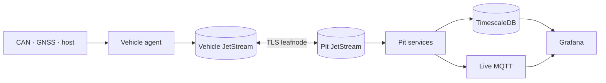

# openlaps

Open-source telemetry for club-level motorsport. openlaps collects CAN, GNSS,
and host data in the vehicle, carries it over a loss-tolerant NATS JetStream
link, and serves live and historical pit-wall views from TimescaleDB and
Grafana.

[Get started](getting-started/index.md){ .md-button .md-button--primary }
[View the architecture](ARCHITECTURE.md){ .md-button }

## What it does

- Collects multiple SocketCAN buses, serial GNSS and host health data.
- Maps hardware-specific signals onto a stable channel catalog.
- Calculates laps, sectors and timing deltas in the vehicle.
- Buffers telemetry locally and resumes transfer after radio dropouts.
- Stores named samples, laps, sessions, strategy and field timing at the pit.
- Serves provisioned Grafana dashboards, alerts and phone notifications.

## Topology

The vehicle owns the durable telemetry stream. The pit sources it by sequence,
so a temporary link failure delays data instead of discarding it.

## Choose a path

| Goal | Start here |
| --- | --- |
| Understand the system | [Architecture](ARCHITECTURE.md) |
| Run a local development environment | [Development](getting-started/development.md) |
| Install a vehicle | [Vehicle installation](operations/vehicle.md) |
| Install the pit stack | [Pit installation](operations/pit.md) |
| Configure a car | [Profiles and channel catalog](CATALOG.md) |
| Check implementation maturity | [Project status](status.md) |
| Diagnose a deployment | [Verify the stack](operations/verification.md) |

## Documentation policy

Current behavior belongs in concepts, configuration, operations and reference.
ADRs explain why decisions were made. Dated bench reports record evidence.
Phase plans are historical and are not specifications for the current system.
