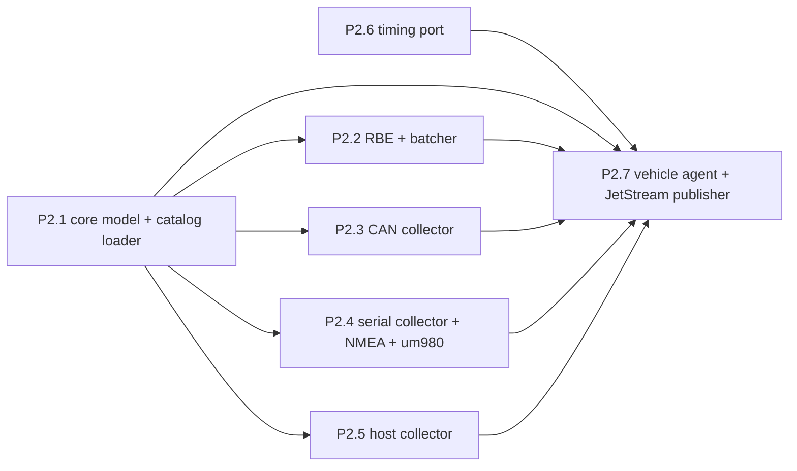

# Phase 2 work packages — core + collectors

Agent-ready briefs for implementing the vehicle-side core. Each brief is
self-contained: an agent with no prior context should be able to execute it
from this file plus the referenced specs. Phase 1 (all design docs, wire
format + bindings, example profile) is complete and committed.

## Ground rules for every work package

- Repo: `/home/muggles/openlaps`. Specs are authoritative — read the ones
  named in your brief *before* coding: `docs/ARCHITECTURE.md`,
  `docs/AGENT_DESIGN.md`, `docs/WIRE_FORMAT.md`, `docs/CATALOG.md`.
- The predecessor system (source material for ports) is at
  `/mnt/data/logger` — read-only. Never copy credentials from it; never
  reference its car/team specifics except via the example profile.
- Python 3.13, `uv`-managed. Style: PEP 8, type hints on public functions,
  Google-ish docstrings, `snake_case`. Run `uv run ruff check .`,
  `uv run ruff format`, and `uv run pytest -q` before finishing — all green.
- Naming: canonical channels are flat `car.*` plus reserved `position.*`,
  `sys.*`, and derived `lap.*`/`timing.*` (see `docs/CATALOG.md`).
- Tests are not optional. Pure modules get thorough unit tests; collectors
  get tests against fakes/replays (no hardware in CI). The example profile
  (`profiles/example-club-racer/`) is the canonical test fixture.
- Commit your own work when done: one commit per work package,
  conventional message (`feat: ... (P2.x)`), and let the pre-commit hooks
  (ruff, gitleaks) pass — never `--no-verify`. Do not push.
- No secrets, ever. No references to proprietary analysis tools (see
  ADR 0007).

## Dependency graph

P2.1 first; then P2.2–P2.6 fully in parallel; P2.7 last. Suggested models:
P2.1–P2.6 are well-specified enough for a mid-tier model; P2.7 integrates
everything and deserves the strongest model available plus a review pass.

---

## P2.1 — Core sample model + catalog loader + registry builder

**Specs:** `docs/CATALOG.md` (schema), `docs/AGENT_DESIGN.md` (sample
lifecycle, registry lifecycle), `docs/WIRE_FORMAT.md` (ValueType,
scale/offset).

**Deliverables** (in `src/core/`):
- `samples.py`: the `Sample` type — `(source_ref: str, t_mono_ns: int,
  t_wall_ms: float, value)` (a slotted dataclass or similar; this is the
  hot-path object, keep it lean).
- `config.py`: pydantic models for `vehicle.yaml` and `catalog.yaml`
  exactly per `docs/CATALOG.md` — buses (n, each with n DBCs under device
  aliases), serial sources (decoder + optional driver config), host,
  channels (from/units/type/rbe/live_hz and the wire-encoding lever),
  apps. Validation is fail-fast with precise errors (file, key, reason) —
  a malformed catalog must never silently drop channels
  (`AGENT_DESIGN.md` → Failure modes). Reject channel names outside
  `car.*`/`position.*`/`sys.*`; reject `lap.*`/`timing.*` (reserved for
  derived channels).
- `catalog.py`: builds the runtime mapping `source_ref → (channel_id,
  policies)` and the `ChannelRegistry` protobuf (`src/core/pb`) —
  stable integer IDs in catalog order, `registry_seq` persisted beside the
  profile and bumped when the catalog content hash changes
  (`AGENT_DESIGN.md` → Registry lifecycle). Derived channels get reserved
  IDs.
- Add `pydantic` and `pyyaml` as runtime deps (`uv add`).

**Tests:** load the example profile end-to-end (it must parse, 100+
channels, registry round-trips through protobuf); rejection cases
(bad name domain, unknown keys, missing DBC file reference, duplicate
channel names, reserved-namespace mapping); registry_seq stability across
reloads and bump-on-change.

## P2.2 — RBE filter + batcher (pure)

**Specs:** `docs/AGENT_DESIGN.md` (Sample lifecycle steps 4–5, RBE
evaluation order), `docs/WIRE_FORMAT.md` (SampleBatch, batching rules,
wire-type encoding + scale/offset).

**Deliverables** (in `src/core/`):
- `rbe.py`: per-channel filter with exact evaluation order —
  `max_interval` forces send → `min_interval` suppresses → `deadband`
  suppresses → send. State per channel: `(last_sent_value,
  last_sent_t_mono)`. Pure: caller provides samples in order; no threads,
  no clocks of its own.
- `batcher.py`: accumulates post-RBE samples per source-class; on tick
  (caller-driven — no internal timer) emits one serialized `SampleBatch`
  per non-empty class with correct epochs, per-sample `t_offset_us`,
  `registry_seq`, `format_version=1`, and per-channel wire encoding
  (double/float/uint-with-scale per the catalog).

**Tests:** deadband suppression and release; min_interval rate-cap;
max_interval heartbeat fires even when value frozen; no-policy channels
pass through untouched; batch epoch/offset arithmetic reconstructs
original capture times exactly; wire-type encoding round-trips through the
registry's scale/offset; empty ticks emit nothing; suppressed-count
accounting (feeds `sys.agent.rbe_suppressed`).

## P2.3 — CAN collector

**Specs:** `docs/CATALOG.md` (bus/device config), `docs/AGENT_DESIGN.md`
(capture timestamps, queues are the caller's — the collector just calls an
`emit(sample)` callback from its read loop).

**Port from:** `/mnt/data/logger/src/telemetry-processor/signal_parser.py`
(cantools-based multi-DBC decode — already handles several DBCs; adapt so
each DBC keeps its device alias for `source_ref` formatting
`bus:device.MESSAGE.SIGNAL`) and `can_reader.py` (socketCAN read loop
shape). Old include/exclude filtering is NOT ported — the catalog decides
what's consumed; the collector decodes everything its DBCs know and emits
it (unmapped refs are dropped cheaply by the mapper).

**Deliverables:** `src/collectors/can.py` — one collector instance per
configured bus; uses socketCAN frame timestamps for `t_mono_ns` basis;
handles bus-off/interface-absent with retry-backoff (never crash the
process); `cantools` + `python-can` deps.

**Tests:** decode recorded frames from
`/mnt/data/logger/tests/fixtures/candump/` replayed through the parser
(no real bus needed — feed `can.Message` objects directly); source_ref
formatting incl. two DBCs with a colliding message name under different
device aliases; malformed/unknown-ID frames are counted and skipped.
Include one optional vcan integration test marked `skipif` no vcan.

## P2.4 — Serial collector + NMEA decoder + um980 driver

**Specs:** `docs/CATALOG.md` (serial source schema), `docs/AGENT_DESIGN.md`
(startup config routine, RTCM write-back, device-absent behaviour).

**Port from:** `/mnt/data/logger/src/telemetry-processor/gps_config.py`
(UM980 command/config routine — port nearly verbatim, it's well-tested at
the bench) and the NMEA/RMC parsing bits of `gps_processor.py` (parsing
ONLY — the old class's NTRIP client, MQTT, and timing calls are explicitly
NOT ported; see ADR 0006 and `docs/ARCHITECTURE.md`).

**Deliverables:** `src/collectors/serial/` — transport (pyserial read
loop, reconnect-on-absent), `nmea.py` decoder (RMC → source refs
`serial0:um980.RMC.lat` etc., speed normalized knots→km/h, posMode passed
through), `um980.py` driver (applies rate/sentences on start per profile
config; exposes a `write_rtcm(bytes)` method for the agent to wire to the
`rtcm.<vehicle>` subject).

**Tests:** feed recorded NMEA sentences (grab real RMC samples from the
old repo's test fixtures / `tests/` — several GPS replay assets exist
there) through the decoder; malformed sentence handling; um980 config
routine against a scripted fake serial port (assert command sequence and
failure-on-bad-ack behaviour, mirroring the old `gps_config.py` tests at
`/mnt/data/logger/tests/`).

## P2.5 — Host metrics collector

**Specs:** `docs/CATALOG.md` (`host:` config), catalog maps
`host:<metric>` refs.

**Deliverables:** `src/collectors/host.py` — psutil loop at the configured
interval emitting cpu percent/temps/mem/disk/net as `host:cpu.percent`
style source refs. Small; `psutil` dep. Replaces the predecessor's psmqtt
sidecar (`docs/ARCHITECTURE.md` → What replaced what).

**Tests:** one pass with psutil mocked; metric-name stability.

## P2.6 — Timing engine port (pure modules)

**Port verbatim** (with their tests) from
`/mnt/data/logger/src/telemetry-processor/`: `timing_core.py`,
`distance_model.py`, `reference_lap.py` → `src/timing/`. Also port the
track-definition loading out of `track_manager.py` into a pure
`src/timing/tracks.py` (KML + JSON sidecar parsing only — no MQTT/session
code; see the old repo's `docs/TRACK_SETUP.md` for the format). Old tests
live in `/mnt/data/logger/tests/` (`test_timing_core.py` etc. — port all
that apply, adapting imports only). The example profile's
`profiles/example-club-racer/tracks/Wanneroo.*` files are the fixture.

**Acceptance:** ported tests green unmodified in their assertions; no
behaviour changes; modules stay side-effect free (this is the property the
whole port preserves — the predecessor validated these against a real
24-hour event).

## P2.7 — Vehicle agent + JetStream publisher  *(strongest model; last)*

**Specs:** `docs/AGENT_DESIGN.md` — the whole document is this work
package's spec; also `docs/WIRE_FORMAT.md` (streams, subjects, dedupe
msg-id) and `docs/ARCHITECTURE.md`.

**Deliverables** (in `src/agent/`): process wiring exactly per
AGENT_DESIGN — collector threads → bounded queues → single pipeline
thread (mapper → pre-RBE timing tap → RBE → batcher) → async JetStream
publisher (`nats-py`); clock discipline (monotonic truth, GPS-slewed wall
mapping); stream provisioning (idempotent TELE/CMD per WIRE_FORMAT);
`sys.agent.*` health channels incl. drop counters; timing engine hosting
(subscribes per `apps.lap_timing`, emits derived `lap.*`/`timing.*`
re-entering at the mapper); `cmd.<vehicle>.session` consumption with
persisted last-known session state; RTCM subject → um980 driver
write-back; startup/shutdown ordering and every failure-mode row from the
spec's table.

**Tests:** unit-test the pipeline with fake collectors (deterministic
tick driving); integration test against a real `nats-server` via
docker/testcontainers (skip-if-unavailable): publish → consume → decode →
assert channel values, timestamps, registry recovery, and dedupe on
reconnect. A mini end-to-end: replay a candump fixture + recorded NMEA
through real collectors into a real local JetStream and assert lap events
appear as derived channels.

---

## After Phase 2

Phase 3+ per the approved plan: pit services (ingest-writer + TimescaleDB
schema, live-decoder + mosquitto, ntrip-client, session-control), deploy
compose stacks + NATS leafnode configs, tooling (replay harness, lap
simulator port, historical-data importer), then validation & cutover
(timing parity against the recorded June-2025 event, bandwidth/latency/
dropout tests on the real radio). Write the Phase 3 briefs when Phase 2
integration reveals what they need.
