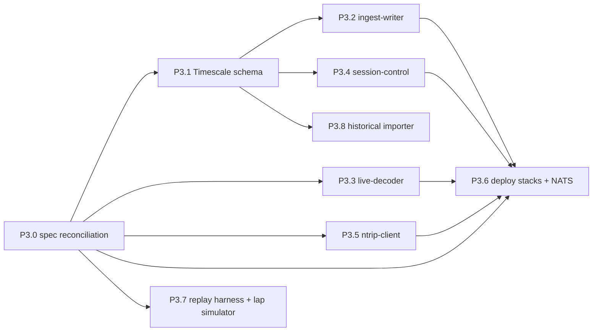

# Phase 3 work packages — pit services, deploy, tooling

Agent-ready briefs for the pit side. Each brief is self-contained: an agent
with no prior context should be able to execute it from this file plus the
referenced specs. Phase 1 (design docs, wire format, example profile) and
Phase 2 (core, collectors, timing port, vehicle agent + JetStream publisher)
are complete and committed.

**Done so far in this phase: P3.0, P3.1, P3.2, P3.3.** The pit database
schema and migration applier are in `src/pit/db/` and documented in
`docs/PIT_SCHEMA.md`; the ingest-writer is in `src/pit/ingest_writer/`; and
`RegistryCache` — the shared decode half — now lives in
`src/pit/registry_cache.py`, imported by both the pit services and
`tools/decode.py`. The live-decoder is in `src/pit/live_decoder/`, with its
pit-side view configuration in `deploy/pit-config/live-decoder.yaml`. The
briefs below have been updated where implementation changed what a later
package should do; those places say so explicitly.

Phase 2 froze the producer contract. Phase 3 builds everything that consumes
it, plus the deployment and tooling needed to run both ends together on the
bench. Validation & cutover (timing parity against the June-2025 event,
bandwidth/latency/dropout on the real HaLow radio) is deliberately **not** in
this phase — those briefs become `PHASE4.md`, written once Phase 3
integration reveals what they need. `docs/LINK_BUDGET.md` calls the garage
bench test "Phase 6"; that numbering is stale and P3.0 fixes it.

## Ground rules for every work package

Everything in `PHASE2.md` → "Ground rules" still applies verbatim. Additions
and clarifications for the pit side:

- Repo: `/home/muggles/openlaps`. Specs are authoritative — read the ones
  named in your brief *before* coding: `docs/ARCHITECTURE.md`,
  `docs/WIRE_FORMAT.md`, `docs/CATALOG.md`, `docs/AGENT_DESIGN.md`,
  `docs/LINK_BUDGET.md`, and `docs/adr/`.
- **The wire format is frozen.** No pit service may require a change to
  `proto/telemetry.proto`, the published subjects, or the agent's runtime
  behaviour. If you believe you need one, stop and raise it — it is a spec
  decision, not an implementation detail.
- **Consumer obligations are non-negotiable** (`docs/WIRE_FORMAT.md` →
  Registry lifecycle): hard `registry_seq` equality (never decode a batch
  against a different generation), apply `scale`/`offset` when non-zero,
  reject unknown `format_version` loudly. `tools/decode.py` is a working
  reference for all three — read it first; two packages promote it directly.
- Pit code lives under `src/pit/<service>/`. `src/pit/` and
  `src/pit/session_control/` already exist as empty packages and are already
  registered in `[tool.hatch.build.targets.wheel]`. Packages are flat and
  top-level: `import core.pb`, not `import openlaps.core.pb`.
- Each service gets a `__main__.py` with argparse + logging + SIGTERM/SIGINT
  handling, mirroring `src/agent/__main__.py`, and a `[project.scripts]`
  entry point.
- Config surface follows `docs/AGENT_DESIGN.md` → Configuration surface: no
  channel names, rates or policies in env. Everything new is documented in
  `example.env` in the same commit that reads it.
- Tests are not optional. Pure modules get thorough unit tests; services get
  tests against real containers using the **existing docker fixture pattern**
  in `tests/conftest.py:112` (`nats_url` — `shutil.which("docker")` guard,
  random free port, TCP readiness poll, `pytest.skip` on unavailable,
  `docker rm -f` in a `finally`). Add `timescale_dsn` and `mosquitto_url`
  fixtures in exactly that shape. Keep the existing sync-test +
  `asyncio.run()` convention; do not add `pytest-asyncio`.
- Commit your own work when done: one commit per work package, conventional
  message (`feat: ... (P3.x)`), pre-commit hooks green, never `--no-verify`.
  Do not push.
- No secrets, ever. No references to proprietary analysis tools (ADR 0007).

## Decisions locked for this phase

Settled with the owner before these briefs were written — do not relitigate:

1. **Scope** is pit services + deploy + tooling. Validation & cutover is
   Phase 4.
2. **`samples` stores values as `value DOUBLE PRECISION NULL` +
   `value_text TEXT NULL`** — one hypertable, numerics (including bool→0/1
   and scale-applied ints) in `value`, the ~0.1% of rows from STRING
   channels in `value_text`. Not typed-column-per-wire-type, not a split
   events table.
3. **No Grafana in Phase 3.** `live-decoder` and mosquitto still ship — they
   are pit services in `docs/ARCHITECTURE.md` and the bridge is verifiable
   with `mosquitto_sub` — but no Grafana container, no provisioning, no
   datasource wiring, and no dashboard porting. `GRAFANA_*` stays stubbed in
   `example.env`. The eight-dashboard SQL rewrite (ADR 0003) is a later
   phase.
4. **Historical importer targets the June-2025 Wanneroo event as its
   acceptance gate**, but is built to stream the full `.lp.gz` dumps.
5. **Live channel selection and rate limiting are configured at the pit**,
   in the live-decoder's own config file — not in the vehicle's
   `catalog.yaml`. Which channels the garage watches is a pit concern and
   must not require touching the car. The redundant `live_hz` catalog field
   has already been removed from `src/core/`, `docs/CATALOG.md` and the
   example profile — it was parsed but never consumed.

## Dependency graph



P3.0 first (it is small and unblocks everything). Then P3.1. Then P3.2–P3.5
and P3.7 fully in parallel. P3.6 integrates them and lands last alongside
P3.8. Suggested models: P3.0, P3.5, P3.7 are well-specified enough for a
mid-tier model; P3.1, P3.3, P3.4, P3.8 want a strong model; **P3.2 and P3.6
deserve the strongest model available plus a review pass** — P3.2 owns
exactly-once-in-effect ingest, P3.6 owns the leafnode/JetStream-domain
topology that ADR 0002 calls "the single biggest unvalidated assumption in
the whole rewrite".

---

## P3.0 — Spec reconciliation (docs only; no code)

Phase 2 integration and the bench run exposed places where the docs disagree
with the shipped implementation or are silent on something Phase 3 needs to
build against. Fix the docs to match reality *before* anyone codes against
them. **The implementation is correct in every case below** — this package
changes prose, not behaviour.

**Deliverables:**

- `docs/AGENT_DESIGN.md`: the registry subject is `tele.<vehicle>.catalog`,
  not `tele.<vehicle>.registry` (see `REGISTRY_SOURCE_CLASS` in
  `src/agent/publisher.py`). `tools/decode.py:186` already targets the
  correct one.
- `docs/WIRE_FORMAT.md`: document the dedupe scheme where `PHASE2.md`
  already claims it lives — `Nats-Msg-Id: <source-class>:<batch_epoch_unix_ms>`,
  set per batch (`src/agent/pipeline.py:150`). State plainly what it does and
  does not buy: it makes reconnect-scale republication idempotent within the
  stream's `duplicate_window`, and nothing beyond that window. Specify
  `duplicate_window` explicitly on `TELE` (2 min) rather than leaning on the
  server default.
- `docs/CATALOG.md`: document the `encode:` lever. Three other documents and
  `proto/telemetry.proto` point at CATALOG.md for its syntax and it is not
  there. It is implemented in `src/core/config.py` as `EncodeConfig`
  (`type` ∈ `double|float|uint|int`, `scale`, `offset`; scale/offset are
  only valid for `uint`/`int`, and `encode` is rejected on bool/string
  channels). It is the primary bandwidth lever (−24% to −26% offered load,
  `docs/LINK_BUDGET.md` §7) and every pit decoder must honour it — it cannot
  stay undocumented. Add a worked example matching the coolant-temp one in
  `WIRE_FORMAT.md`.
- **Pin the `lap.event` payload schema** in `docs/WIRE_FORMAT.md` (new
  subsection) as normative. It is currently only implicit in
  `src/agent/timing_app.py:196` `_encode_event`. This is the schema P3.2
  materialises into relational rows, so it must be written down: a compact
  JSON object with keys `type`, `time`, `line`, `lap_number`, `sector`,
  `split_time`, `lap_time`, `valid`, `direction`, `pit_status`, `lat`,
  `lon`, plus whichever of `session_id`, `driver`, `stint_number`,
  `session_type`, `track_name` the active session supplies. `type` values
  come from `timing.timing_core.EventType`. Document that unknown keys must
  be tolerated by consumers.
- **Pin the `cmd.<vehicle>.session` payload schema** in `docs/WIRE_FORMAT.md`.
  Owned by session-control (P3.4), read opaquely by the agent
  (`src/agent/session.py`) which only consumes the five stamp keys. Schema:
  `session_id`, `session_type` (`practice|qualifying|race|test`), `driver`,
  `track_name`, `car`, `stint_number` (int), `session_start` (unix ms),
  `stint_start` (unix ms), `status` (`none|active|ended`), `timestamp`
  (unix ms). Document that consumers must preserve unknown keys and that a
  malformed payload leaves prior state in force.
- `docs/ARCHITECTURE.md`: the pit data-flow diagram references a `sys.link`
  lag channel that is defined nowhere. Replace it with the channel that
  actually exists — `sys.agent.publish_lag_ms` (vehicle-side publish lag) —
  and note that pit-side ingest lag is a pit-local health concern owned by
  P3.2, not a telemetry channel arriving over the radio.
- `docs/LINK_BUDGET.md`: the bench test is Phase 4, not "Phase 6". Fix the
  reference and the surrounding sentence.

**Acceptance:** no code changes, no test changes. Every statement added is
checkable against a named source file and line. A reviewer diffing each new
claim against the implementation finds no discrepancies.

---

## P3.1 — TimescaleDB schema + migrations

**Specs:** ADR 0003 (the only prior schema documentation — two sentences),
ADR 0007 (cross-repo read compatibility constraint),
`docs/ARCHITECTURE.md` → pit data flow, `proto/telemetry.proto` (the
`Channel.id` comment on registry-generation scoping),
`docs/CATALOG.md` → reserved namespaces.

**The load-bearing design constraint:** `Channel.id` is only meaningful
within one `registry_seq` — a catalog reload renumbers it. So `channel_id`
off the wire is **not** a stable key and must never be stored in `samples`.
The writer resolves `(registry_seq, wire_id) → stable channel_key` at
ingest time; history then survives any number of catalog edits.

**Deliverables** (in `src/pit/db/`):

- `migrations/001_init.sql` … applied in filename order. Use plain SQL files
  plus a ~60-line applier (`src/pit/db/migrate.py`) that runs them inside a
  transaction and records applied versions in a `schema_migrations` table.
  No Alembic, no ORM — there is no ORM in this codebase and the schema is
  small and mostly DDL.
- Tables:
  - `channels(channel_key BIGINT GENERATED ALWAYS AS IDENTITY PK,
    vehicle_id TEXT, name TEXT, units TEXT, value_type SMALLINT,
    first_seen TIMESTAMPTZ, UNIQUE(vehicle_id, name))` — the stable identity
    of a channel across all registry generations.
  - `channel_registry(vehicle_id, registry_seq, created TIMESTAMPTZ,
    received TIMESTAMPTZ, PK(vehicle_id, registry_seq))` — one row per
    generation seen.
  - `channel_map(vehicle_id, registry_seq, wire_id, channel_key FK,
    source_ref, units, value_type, scale, "offset",
    PK(vehicle_id, registry_seq, wire_id))` — the registry history ADR 0003
    asks for, and the writer's decode lookup.
  - `samples(time TIMESTAMPTZ NOT NULL, channel_key BIGINT NOT NULL,
    value DOUBLE PRECISION NULL, value_text TEXT NULL)`, made a hypertable
    on `time` with `chunk_time_interval => INTERVAL '1 hour'` (~14 M rows
    per chunk at the LINK_BUDGET rate of ~4,000 samples/s). **No foreign key
    on `samples`** — the per-row FK check is real cost on the COPY path and
    referential integrity is the writer's job; document that choice in the
    migration.
  - `drivers(driver_id PK, name TEXT UNIQUE, created)`.
  - `sessions(session_id TEXT PK, vehicle_id, session_type, track_name, car,
    started TIMESTAMPTZ, ended TIMESTAMPTZ NULL, status)`.
  - `stints(stint_id PK, session_id FK, stint_number INT, driver_id FK,
    started, ended NULL, UNIQUE(session_id, stint_number))`.
  - `laps(lap_id PK, vehicle_id, session_id FK NULL, stint_id FK NULL,
    track_name, lap_number INT, crossed_at TIMESTAMPTZ, lap_time_s DOUBLE
    PRECISION NULL, valid BOOLEAN, pit_status TEXT, direction TEXT,
    UNIQUE(vehicle_id, crossed_at))` — nullable session/stint FKs
    because laps are recorded whether or not a session is open. **The unique
    key is the crossing instant, not the lap number** (corrected during
    implementation): `lap_number` is in-memory timing-engine state scoped to
    one agent run and one track, and is *not* reset by a session change, so
    an agent restart mid-session replays lap numbers 1..k under the same
    `session_id` — keying on it would silently overwrite the earlier laps.
    One car cannot complete two laps at the same instant, and redelivery or
    a re-import presents the same instant, so `(vehicle_id, crossed_at)`
    converges exactly where it should. Nothing mints a synthetic session for
    unattributed laps; with this key, attribution is not needed for
    correctness.
  - `lap_sectors(lap_id FK, sector INT, split_time_s, crossed_at,
    PK(lap_id, sector))`.
  - `ingest_cursor(consumer TEXT PK, stream TEXT, stream_seq BIGINT,
    updated TIMESTAMPTZ)` — P3.2's idempotency anchor, see that brief.
- Indexes: `samples(channel_key, time DESC)` as the hypertable's working
  index; `laps(session_id, lap_number)` for the session-scoped lookups
  `v_laps` exists for. No separate `laps(vehicle_id, crossed_at DESC)` — the
  unique constraint's index leads with exactly those columns and Postgres
  scans it backwards for free.
- Compression: `ALTER TABLE samples SET (timescaledb.compress,
  timescaledb.compress_segmentby = 'channel_key',
  timescaledb.compress_orderby = 'time DESC')` plus a compression policy at
  7 days. **No retention policy** — Timescale is the archive; ship the
  `drop_chunks` recipe as a documented, commented-out knob instead.
- **The ADR 0007 read surface.** ADR 0007 states the private companion repo
  reads this database as a downstream consumer, with no automated check
  spanning both repositories. Give it a contract that is cheap to keep
  stable: a view `v_samples_named(time, vehicle_id, channel, units, value,
  value_text)` joining `samples` to `channels`, plus `v_laps` flattening
  `laps` with driver and session names. Document in
  `docs/PIT_SCHEMA.md` (new) that **the views are the stable surface and the
  base tables are not** — anything downstream should read the views.
- `docs/PIT_SCHEMA.md`: the schema reference — every table, the
  registry-generation resolution rule, the value/value_text convention, the
  chunk/compression settings and why, and the stable-view contract.
- Add `psycopg[binary,pool]>=3.2` as a runtime dep (`uv add`). Async COPY via
  `async with cur.copy(...)`; the same driver serves P3.2, P3.4 and P3.8.

**Tests:** a `timescale_dsn` docker fixture (`timescale/timescaledb:latest-pg17`,
same shape as `nats_url`); migrations apply cleanly from empty and are
idempotent on re-run; `samples` is a hypertable with the expected chunk
interval; a value round-trips through `v_samples_named` for each of a
numeric and a string channel; the same `(vehicle_id, name)` across two
registry generations with different `wire_id`s resolves to one
`channel_key`; compression policy exists and a manually compressed chunk
still answers a range query.

---

## P3.2 — ingest-writer  *(strongest model; review pass)*

**Specs:** `docs/ARCHITECTURE.md` (ingest-writer responsibilities, "target
source-to-row latency under 500 ms when the link is healthy"),
`docs/WIRE_FORMAT.md` (registry lifecycle, timestamp scheme, consumer
obligations), ADR 0005 (`max_interval` heartbeats bound fill-forward drift),
`docs/PIT_SCHEMA.md` (from P3.1). Reference implementation for the decode
half: `tools/decode.py`.

**Deliverables** (in `src/pit/ingest_writer/`):

- A durable JetStream **pull** consumer on the pit's sourced `TELE` stream,
  filtered to `tele.<vehicle>.>`, durable name from env (default
  `ingest-writer`), explicit ack, `max_ack_pending` sized to the batch
  window. Pull, not push: the writer sets its own pace and backpressure is
  natural.
- **Registry handling.** On startup, replay `tele.<vehicle>.catalog` from
  the earliest retained message to warm a `RegistryCache` — promote the
  class from `tools/decode.py:52`, do not rewrite it — and upsert every
  generation into `channel_registry` / `channels` / `channel_map`. A batch
  whose `registry_seq` is unknown is **not** decoded: NAK it with a delay and
  re-scan the catalog subject. Never decode against a different generation;
  never guess.
- **Decode.** `batch_epoch_unix_ms + t_offset_us/1000.0` → `time`; apply
  `scale`/`offset` when non-zero; bool → `value = 0/1`; STRING → `value_text`.
  Reject unknown `format_version` loudly (log once per version, count it,
  drop the batch — a poison batch must not wedge the consumer).
- **Write path.** Accumulate rows and flush on whichever comes first: a row
  count (default 5,000) or a flush interval (default 200 ms, which keeps the
  500 ms end-to-end target reachable). Flush is `COPY` into a per-flush
  `TEMP` table then `INSERT ... SELECT`, all inside one transaction that
  **also** advances `ingest_cursor.stream_seq`. Ack the consumer only after
  commit.
- **Idempotency.** JetStream redelivers on crash; `samples` has no unique
  key and `COPY` cannot `ON CONFLICT`. The cursor is the guarantee: on
  startup, read `ingest_cursor` and **skip any delivered message whose
  `stream_seq` is at or below the committed cursor**, acking it without
  writing. That makes redelivery a no-op regardless of dedupe windows,
  outage length, or consumer recreation. Note in the module docstring why
  `Nats-Msg-Id` dedupe alone is insufficient here (it only covers
  reconnect-scale republication inside `duplicate_window`).
- **Lap materialisation.** `lap.event` samples are decoded from JSON per the
  P3.0-pinned schema and written to `laps` / `lap_sectors` in the same
  transaction as the samples that carried them. `LAP_COMPLETED` closes a lap
  row; `SECTOR_COMPLETED` appends a `lap_sectors` row; `PIT_ENTRY`/
  `PIT_EXIT` update `pit_status`. Session/stint FKs resolve from the stamped
  `session_id`/`stint_number` where present, and are left NULL where not —
  a lap with no session is still a lap, and a stamped `session_id` with no
  `sessions` row yet (session-control's own write still queued behind an
  outage) is written NULL rather than failing the whole flush on the FK.
  Upsert on the unique key — `(vehicle_id, crossed_at)`, see P3.1 — so replay
  and the historical importer (P3.8) converge rather than duplicate.
  **Do not key laps on `lap_number`**: it restarts at 1 on an agent restart
  or a track switch, within the same session. Sector events arrive before the
  lap they belong to (the final `SECTOR_COMPLETED` is emitted in the same
  list as `LAP_COMPLETED`, earlier ones during the lap), so buffer them in
  memory keyed by `lap_number` and write `lap_sectors` once the lap row
  exists; discard the buffer when `lap_number` regresses, which is the
  restart signal.
- **Health.** A pit-local health surface, not a telemetry channel (per
  P3.0): log at 1 Hz and expose via a `/health` HTTP endpoint —
  ingest lag (using `batch_epoch_mono_ns` deltas per
  `docs/WIRE_FORMAT.md` → Timestamp scheme), rows/s, flushes/s, last
  committed `stream_seq`, unknown-seq and bad-version counters, DB
  reconnects. Also alert-worthy: staleness of `sys.agent.status`, which
  `docs/AGENT_DESIGN.md` explicitly assigns to the pit as the replacement
  for the old MQTT LWT.
- **Failure modes**, each with a test: DB down at start (retry-backoff, do
  not consume); DB down mid-run (stop acking, let the consumer backlog —
  never drop); unknown registry seq (NAK + rescan); malformed `lap.event`
  JSON (count, log, still write the raw sample to `value_text`); poison
  batch (drop after logging, advance).

**Tests:** unit-test decode and lap materialisation against synthetic
batches built with the real `Batcher` (`src/core/batcher.py`) so encoding
stays honest. Integration test with both docker fixtures: run the real
agent-side publisher (reuse the helpers in
`tests/test_publisher_integration.py`) into a real nats-server, run the
writer against a real Timescale, assert rows land with exact capture times,
`scale`/`offset` applied, and channel names resolved. Then: kill the writer
mid-flush, restart it, and assert **zero duplicate rows** and no gap.
Registry-rollover test: publish generation 1, some batches, generation 2
with different wire ids, more batches — assert one `channel_key` per name
and correct values throughout.

---

## P3.3 — live-decoder

**Specs:** `docs/ARCHITECTURE.md` (live-decoder: "republishes a configured
subset of channels as plain JSON over a small local MQTT broker
(websockets)… the only MQTT left in the system, it never crosses the radio,
and it is disposable"), `docs/CATALOG.md` (which now states explicitly that
live gauge selection is pit-side config, not catalog config),
`docs/WIRE_FORMAT.md` (consumer obligations). Forerunner: `tools/decode.py`,
whose docstring already declares this relationship.

**Channel selection and rate limiting are pit-side config** (locked decision
5). What the garage chooses to watch is a pit concern and must never require
editing the vehicle profile, restarting the agent, or touching the car. The
live-decoder therefore needs **nothing from the profile** — `ChannelRegistry`
already carries `name`, `units`, `type`, `scale` and `offset`, which is
everything required to decode and label a value.

**On the rate limit:** Grafana publishes no messages-per-second limit. Its
only documented Live figure is 100 simultaneous *connections*, which is about
WebSockets, not throughput; Grafana Labs' own CAN-telemetry guidance is
architectural ("do not visualize all data simultaneously") with no numbers.
The real bottleneck is browser repaint — every message re-renders a panel.
Default to **10 Hz** per channel: a human cannot read a gauge changing faster
than that, and browsers repaint at 60 fps, so a dozen panels above 20 Hz
spends frames on data nobody can see. Treat 10 Hz as a defensible starting
point, not a measured one, and make it trivially tunable; Phase 4's bench
work measures where a real dashboard actually degrades.

**Deliverables** (in `src/pit/live_decoder/`):

- An ephemeral **ordered** consumer on `tele.<vehicle>.>` with
  `DeliverPolicy.NEW` — this service is live-only and must never replay a
  backlog. Same registry-recovery preamble as `tools/decode.py:186`
  (drain `tele.<vehicle>.catalog` first so the very first batch decodes).
  **`RegistryCache` already lives in `src/pit/registry_cache.py`** — P3.2
  promoted it there and `tools/decode.py` imports it too, so import it and
  change nothing. Its API: `add(payload)` / `add_registry(registry)`,
  `known(seq)`, and `decode(payload) -> DecodedBatch | None` where
  `DecodedBatch.samples` are `DecodedSample(capture_unix_ms, channel,
  value)` with `scale`/`offset` already applied. Use
  `decode_or_reason(payload)` if you need to tell an unknown generation
  (`REJECT_UNKNOWN_SEQ`) from an unknown payload shape
  (`REJECT_BAD_VERSION`) — for a live-only service both simply mean "do not
  publish", so `decode()` is probably enough. `MSG_TYPE_HEADER`,
  `MSG_TYPE_REGISTRY` and `REGISTRY_SOURCE_CLASS` are exported from the
  same module; don't redefine them.
- **No database.** This service reads NATS and writes MQTT — it never
  touches Timescale, and it must not gain a dependency on `pit.db`.
- **`config.py`** — pydantic models for a pit-side live view config, in the
  same strict style as `src/core/config.py` (`extra="forbid"`, frozen,
  fail-fast with precise errors). Shape:

  ```yaml
  # deploy/pit-config/live-decoder.yaml
  vehicle: example-club-racer

  defaults:
    max_hz: 10          # per-channel ceiling when a rule doesn't set one
    total_max_hz: 500   # aggregate ceiling across all channels (0 = unlimited)

  channels:
    - match: "position.*"
    - match: "car.rpm"
      max_hz: 20
    - match: "car.accel_*"
      max_hz: 5
    - match: "car.coolant_temp"
      max_hz: 1
    - match: "lap.*"          # events are rare and each one matters
      max_hz: 0               # 0 = no limit
    - match: "timing.*"
    - match: "sys.agent.status"
      max_hz: 1
  ```

  Rules: selection is **opt-in** — a channel matched by no `match` glob is
  not published at all. **First matching rule wins**, in file order, so a
  specific rule placed above a broad one overrides it; this is predictable
  and easy to explain, unlike specificity scoring. Absent `max_hz` inherits
  `defaults.max_hz`. Warn at startup for any rule that matches nothing in
  the current registry — a typo'd channel name should be loud, not silent.
- **The limiter is conflating, not queueing.** Per channel, keep only the
  most recent value and emit at most once per `1/max_hz` interval. A live
  gauge wants the newest reading; publishing a queued stale one to satisfy a
  rate budget is strictly worse than skipping it. Never average or
  interpolate — the pit database is where derived values belong.
- **`total_max_hz`** is an aggregate safety valve across all channels,
  because the failure mode operators actually hit is "the whole dashboard
  went sluggish", not "one channel is too fast". When the aggregate budget
  is exceeded, shed by dropping the *least recently published* channels'
  updates for that window and count the sheds. Default it generously and
  document it as the first knob to turn in Phase 4.
- **Reload without restart.** `SIGHUP` re-reads the config file, plus an
  mtime poll (default 5 s) so an edit takes effect on its own. Adding a
  channel to the live view mid-session is a normal pit operation and must
  not need a container restart. A config that fails to parse on reload is
  logged and **the previous config stays in force** — the same discipline
  `src/agent/session.py` applies to malformed session payloads.
- **Topic and payload.** `openlaps/<vehicle>/<channel>` carrying
  `{"time": <unix_ms>, "value": <number|string>}`. One channel per topic
  (this is what a live gauge subscribes to), JSON, no batching. Publish QoS
  0, non-retained: stale live data is worse than none, the same reasoning
  ADR 0006 applies to RTCM.
- Reconnect handling on both sides (NATS and MQTT) with bounded backoff;
  MQTT down must never block the NATS consumer — drop and count.
- `/health` reporting per-channel published and suppressed counts, aggregate
  publish rate, current config mtime, and any rules matching nothing. This
  is what makes "why isn't my gauge updating?" answerable in one look.
- Add `aiomqtt>=2.3` as a runtime dep (thin asyncio wrapper over paho, which
  suits this asyncio-native service).

**`live_hz` has already been retired** from `src/core/config.py`,
`src/core/catalog.py`, `docs/CATALOG.md` and the nine IMU channels in
`profiles/example-club-racer/catalog.yaml` — it was parsed but never
consumed, and leaving it alongside this service's config would have been a
two-places-to-configure-one-thing trap. Nothing to do here beyond knowing it
is gone: because catalog models are `extra="forbid"`, any catalog still
carrying `live_hz:` now fails loudly with a precise error rather than being
silently ignored, which is the desired outcome.

**Tests:** unit-test config parsing including first-match-wins ordering,
`max_hz: 0`, inheritance from `defaults`, and rejection of unknown keys.
Unit-test the limiter: a 100 Hz channel at `max_hz: 10` yields ≤10
publishes/s and always the *most recent* value (assert the conflating
behaviour explicitly — a queueing implementation passes a naive rate test
but fails this one); an unmatched channel yields zero publishes;
`max_hz: 0` passes everything through; the aggregate budget sheds and counts.
Unit-test SIGHUP reload, including that a malformed reload preserves the
previous config. Unit-test topic/payload formatting. Integration test with
the `nats_url` and a new `mosquitto_url` docker fixture: publish real
batches, subscribe over MQTT, assert decoded physical values (including a
scaled `uint` channel) arrive on the right topics at the configured rates.
Assert an unknown `format_version` batch produces zero publishes and one log.

---

## P3.4 — session-control

**Specs:** `docs/ARCHITECTURE.md` (session-control responsibilities),
`docs/WIRE_FORMAT.md` (`CMD` stream, last-value semantics via
`max_msgs_per_subject = 1`; session payload schema pinned by P3.0),
`src/agent/session.py` (the consumer's guarantees), `docs/PIT_SCHEMA.md`.

**Port from:** `/mnt/data/logger/src/session-control/session_state.py` —
the pure session/driver-stint state machine. Port it nearly verbatim into
`src/pit/session_control/state.py` (it is already pure, side-effect free and
documented as such). Its `payload()` output *is* the pinned wire schema.
The HTTP service around it (`service.py`) is a shape reference only:
**MQTT and the retained-message mechanism are not ported** — the equivalent
is a JetStream publish to `cmd.<vehicle>.session` on a stream configured
with `max_msgs_per_subject = 1`, which `docs/WIRE_FORMAT.md` explicitly
calls out as the replacement for the MQTT retained flag.

**Deliverables** (in `src/pit/session_control/`):

- `state.py` — the ported state machine, plus tests ported with it.
- `service.py` — an asyncio HTTP API (stdlib `http.server` in a thread is
  fine and matches the predecessor; do not add a web framework for five
  endpoints): `POST /session/start {session_type, driver, track_name?, car?}`,
  `POST /session/driver {driver}`, `POST /session/end`, `GET /session`,
  `GET /roster`, `GET /health`.
- **Publishing.** Every state change publishes the payload to
  `cmd.<vehicle>.session`. The agent already provisions and consumes `CMD`
  on the *vehicle* server (`src/agent/publisher.py`), so session-control
  publishes into the vehicle's JetStream domain across the leafnode —
  `nc.jetstream(domain=<vehicle-js-domain>)`, see P3.6. **No agent change is
  required.** A publish that fails because the link is down is retried with
  backoff; last-value semantics mean only the newest state matters, so
  collapse queued retries to the latest payload rather than replaying a
  history.
- **Persistence and DB rows.** Persist state to disk (atomic tempfile +
  `os.replace`, mirroring `src/agent/session.py`) and re-publish on startup
  so a restart re-asserts current state. Additionally write `sessions`,
  `stints` and `drivers` rows to Timescale on each transition — this is the
  service that owns those tables; P3.2 only reads them to resolve lap FKs.
  A DB outage must not block the NATS publish or the HTTP response: queue
  the row write and retry. Get the connection string from
  `pit.db.dsn.dsn_from_env` (P3.1) rather than reading `TIMESCALE_*`
  again.
- **The contract with P3.2**, now that the writer exists — get these wrong
  and every lap is silently unattributed, with no error anywhere:
  - The writer resolves a lap's session by `sessions.session_id = ` the
    `session_id` **stamped into the `lap.event` payload**, and its stint by
    `(session_id, stint_number)` on `stints`. Whatever `session_id` this
    service publishes to `cmd.<vehicle>.session` must be exactly the
    `session_id` it writes to the `sessions` table.
  - `sessions.session_type` and `sessions.status` are CHECK-constrained to
    the pinned payload vocabularies (`practice|qualifying|race|test`,
    `none|active|ended`); `stints.driver_id` is `NOT NULL` and references
    `drivers`, so the driver row has to be upserted first.
  - **Write the database rows before publishing to NATS** whenever the
    database is reachable. The agent stamps the new `session_id` onto lap
    events the moment the CMD message lands, and a lap completing before
    the `sessions` row exists is written with NULL FKs and is *not*
    backfilled (`docs/PIT_SCHEMA.md` -> Laps). Queue-and-retry stays the
    behaviour for an outage; it should not be the behaviour for the happy
    path. If unattributed laps during an outage turn out to matter, a
    backfill pass is a deliberate addition — raise it, don't assume it.
- `config/roster.json` equivalent under the profile or a mounted config dir,
  listing drivers and session types for the operator UI. No real names in
  the repo — the example profile gets placeholder drivers.

**Tests:** port the predecessor's state-machine tests, adapting imports
only; assert invalid transitions (double start, no-op driver change, end
with no session) raise. Integration test against `nats_url`: start a
session, assert exactly one retained message on `cmd.<vehicle>.session`
readable with `DeliverPolicy.LAST`; change driver, assert the new payload
supersedes it and only one message is retained. Integration test against
`timescale_dsn`: a session with two stints produces one `sessions` row and
two `stints` rows with correct start/end bounds. End-to-end with the agent:
publish a session, assert `LapTimingApp` stamps `session_id`/`driver` onto
subsequent `lap.event` payloads (extend `tests/test_timing_app.py`'s
approach).

---

## P3.5 — ntrip-client

**Specs:** ADR 0006 (the whole ADR is this brief's rationale — pit-side
NTRIP, RTCM over **core NATS**, at-most-once, credentials never on the
vehicle), `docs/WIRE_FORMAT.md` (`rtcm.<vehicle>`, core NATS, no stream),
`src/agent/publisher.py` (the already-implemented vehicle side:
`client.subscribe(f"rtcm.{vehicle}")` → `SerialCollector.write_rtcm`).

**Deliverables** (in `src/pit/ntrip_client/`):

- An NTRIP v1/v2 client over stdlib `asyncio.open_connection` — no new
  dependency. NTRIP v1 is HTTP-shaped but not HTTP-conformant (v1 casters
  answer `ICY 200 OK`), so a plain HTTP library is the wrong tool. Send
  `GET /<mountpoint>` with `Ntrip-Version: Ntrip/2.0`, `User-Agent:
  NTRIP openlaps/<version>`, and basic auth; accept both `ICY 200 OK` and
  `HTTP/1.1 200 OK`; then stream the body.
- Publish received bytes to `rtcm.<vehicle>` on **core NATS** — never
  JetStream, never a stream-captured subject. Chunk on caster read
  boundaries; do not buffer, do not retry, do not replay. If the link is
  down the bytes are dropped, which ADR 0006 states is correct.
- **Optional GGA upstream** for VRS / network-RTK mountpoints that require
  the rover's approximate position. When enabled, subscribe to the vehicle's
  `position.lat` / `position.lon` off the pit `TELE` stream (live only,
  `DeliverPolicy.NEW`), and send a synthesised `$GPGGA` sentence to the
  caster every `NTRIP_GGA_INTERVAL_S` (default 10 s). Off by default;
  document that some casters will not stream corrections without it.
- Reconnect with bounded backoff on caster disconnect; a caster that
  authenticates but sends nothing for a configurable idle timeout is
  treated as dead and re-dialled.
- Counters and a `/health` endpoint: bytes/s from the caster, publishes/s,
  reconnects, last-byte age, GGA sends. A silently-dead correction stream is
  the failure this service must make visible — ADR 0006 flags "if the pit's
  own backhaul goes down, RTCM corrections stop entirely" as a new failure
  mode with no other symptom.
- Credentials come only from `NTRIP_*` env (already stubbed in
  `example.env`); add `NTRIP_GGA_INTERVAL_S` and `NTRIP_ENABLE_GGA`.
  Never log the password, never echo it in `/health`.

**Tests:** a scripted fake caster (`asyncio.start_server`) asserting the
request line, `Ntrip-Version` header and basic-auth encoding; both `ICY 200`
and `HTTP/1.1 200` responses accepted; a `401` produces a clear fatal error
rather than a reconnect loop. Assert streamed bytes reach `rtcm.<vehicle>`
verbatim, in order, against `nats_url` — and assert **no JetStream stream
captured them** (publish, then confirm `js.stream_info` finds no stream
subscribed to `rtcm.>`). GGA synthesis unit tests against known lat/lon with
a checksum check. End-to-end: bytes from the fake caster arrive at
`SerialCollector.write_rtcm` through a real agent with a fake serial port.

---

## P3.6 — Deploy: compose stacks + NATS leafnode/sourced-stream configs  *(strongest model; review pass)*

**Specs:** `docs/ARCHITECTURE.md` → Deployment (the entire documentation is
one paragraph — this package writes the rest), ADR 0002 (leafnode + sourced
stream; "leafnode behaviour over a lossy, half-duplex link under real RF
conditions is the single biggest unvalidated assumption in the whole
rewrite"), `docs/WIRE_FORMAT.md` (stream configs). `deploy/` currently holds
only `.gitkeep`; everything here is greenfield.

**The topology, stated precisely** — get this wrong and nothing else works:

- Both servers run JetStream with **distinct domains**: vehicle `veh`, pit
  `pit`. Domains are what make cross-server JetStream addressing possible
  over a leafnode.
- **The pit dials the vehicle.** The vehicle's `nats-server` runs a
  `leafnodes { port: 7422 }` listener; the pit config has a
  `leafnodes { remotes: [...] }` entry pointing at it over TLS. This is
  load-bearing: `docs/ARCHITECTURE.md` requires that the vehicle never needs
  inbound reachability from the pit LAN (NAT/WSL2).
- The vehicle owns `TELE` (created by the agent, unchanged) and `CMD`
  (likewise). The pit owns **`TELE_VEHICLE`**, a *sourced-only* stream:
  `{"name":"TELE_VEHICLE","sources":[{"name":"TELE","external":{"api":"$JS.veh.API"}}]}`.
  It declares **no `subjects` of its own** — a sourced stream that also
  claims `tele.>` would double-capture. Subjects are preserved through
  sourcing, so pit consumers filter on `tele.<vehicle>.>` from
  `TELE_VEHICLE`.
- Pit retention is **not** the vehicle's 72 h: Timescale is the archive and
  the pit stream is a buffer. Size it by disk with a modest age cap and
  document the reasoning next to the value.
- `cmd.<vehicle>.session` flows pit → vehicle by session-control publishing
  into the vehicle's domain (`nc.jetstream(domain="veh")`), not by mirroring.
  One direction, one stream, no reconciliation.
- `rtcm.<vehicle>` is **core NATS** and must be captured by no stream on
  either side. Assert this in a test rather than trusting the config.

**Deliverables** (in `deploy/`):

- `nats/vehicle.conf` — jetstream `{domain: veh, store_dir: /data}`, leafnode
  listener with TLS, accounts/users, sane `max_file_store`. Carry forward
  the bench lesson: the JetStream store must be a real bind-mounted
  directory with room for `TELE`'s 8 GiB `max_bytes`, or stream creation
  fails with err 10047.
- `nats/pit.conf` — jetstream `{domain: pit, store_dir: /data}`, leafnode
  remote to the vehicle with credentials and TLS.
- `nats/README.md` — how to generate creds and TLS material, what each file
  is, and explicitly: none of it lives in this repo.
- `provision_pit_streams.py` (or a documented `nats` CLI invocation) —
  idempotent creation of `TELE_VEHICLE`, mirroring the
  `add_stream`-then-`update_stream`-on-`BadRequestError` convergence pattern
  already used in `src/agent/publisher.py::_ensure_streams`.
- `vehicle-compose.yaml` — `nats-server` + `openlaps-agent`. Host
  networking or explicit device passthrough for `can0` and `/dev/ttyUSB0`;
  `restart: unless-stopped`; env from `.env`.
- `pit-compose.yaml` — `nats-server`, `timescaledb`, `mosquitto`
  (websockets), `ingest-writer`, `live-decoder`, `session-control`,
  `ntrip-client`. **No Grafana** (locked decision 3). Healthchecks and
  `depends_on: condition: service_healthy` for the DB.
- **Migrations are a bring-up step, not a service.** The schema is applied
  by `openlaps-migrate` (P3.1: plain SQL files plus an applier, safe to
  re-run, serialised on an advisory lock). Every pit service that touches
  the database assumes it has already run. Model it as a one-shot
  `openlaps-migrate` container that the DB-dependent services declare
  `depends_on: condition: service_completed_successfully` against — not as
  an entrypoint step in each service, which would have four containers
  racing the same DDL on every restart. It belongs in `deploy/README.md`'s
  bring-up order too, immediately after the database is healthy.
- **Give each service a distinct health port** and put the map in
  `deploy/README.md`; three services defaulting to 8080 is a bad first
  hour. `ingest-writer` already defaults to **8081**
  (`OPENLAPS_INGEST_HEALTH_PORT`); suggested for the rest —
  `session-control` **8080** (it is the operator-facing API, not just
  health), `live-decoder` **8082**, `ntrip-client` **8083**.
- Note that `OPENLAPS_NATS_URL` means *the local server for this stack*:
  the vehicle server in `vehicle-compose.yaml`, the pit server in
  `pit-compose.yaml`. Same variable name, two different stacks, one `.env`
  each — worth a sentence in `deploy/README.md` so nobody points the pit
  services at the car.
- `mosquitto/mosquitto.conf` — pit-local, websockets listener, no bridge to
  anywhere. It must be impossible for this broker to reach the radio.
- `pit-config/live-decoder.yaml` — the P3.3 live view config, mounted
  read-only into the live-decoder container. Ship a sensible starting set
  (position, a handful of engine channels, `lap.*`, `timing.*`,
  `sys.agent.status`) and document in `deploy/README.md` that editing this
  file is the normal way to change what the garage watches — no restart
  required, no vehicle-side change.
- Dockerfiles for the four pit services (one shared multi-stage image with
  four entry points is preferable to four images).
- `systemd/openlaps-agent.service` — the SBC alternative to compose, since
  the bench runs the agent directly today.
- Extend `example.env` with every new variable in the same commit, grouped
  by service, with the same commented style as the existing file.
- `deploy/README.md` — bring-up order, how to verify each hop
  (`nats stream ls`, `nats stream report`, `tools/decode.py --watch`,
  `mosquitto_sub`, a SQL row count), and how to tear down.

**Tests:** a compose-level integration test marked skip-if-no-docker that
brings up **both** stacks on one host (the vehicle NATS and pit NATS in
separate containers, leafnode between them), publishes real batches into the
vehicle's `TELE`, and asserts they appear in the pit's `TELE_VEHICLE` and
then as Timescale rows. Then the recovery case that is the whole point of
ADR 0002: **sever the leafnode** (disconnect the pit container from the
network), keep publishing to the vehicle, reconnect, and assert the pit
catches up with **no gap and no duplicates** — resuming by sequence, exactly
as `docs/ARCHITECTURE.md` → "Link dropout and recovery" describes. Also
assert `rtcm.>` is captured by no stream, and that a session published at
the pit reaches a vehicle-side consumer.

---

## P3.7 — Tooling: replay harness + lap simulator port

**Specs:** `docs/ARCHITECTURE.md`, `docs/LINK_BUDGET.md` (what the harness
must be able to measure). This package exists so Phase 4's validation has
something to drive it, and so bench work does not need a car.

**Deliverables** (in `tools/`):

- `replay.py` — replay recorded inputs through the **real** collectors and
  the **real** agent pipeline into a **real** JetStream. Sources: a candump
  log (`tests/fixtures/candump/`), an NMEA file (`tests/fixtures/nmea/`),
  and a GPS trace extracted from the predecessor's `gps.lp` dump. Options:
  `--rate` (1.0 = wall clock, higher = accelerated), `--loop`, `--vehicle`,
  `--server`. Build it by promoting the machinery already proven in
  `tests/test_agent_e2e.py` rather than writing a parallel path — the value
  of this harness is that it is the same code the car runs.
- `lap_simulator.py` — port from
  `/mnt/data/logger/scripts/lap_simulator.py`. Keep the parts that are the
  actual value: the closed-loop path through the track's timing-line
  midpoints, the curvature-derived speed profile with lateral-g and
  accel/brake limits, per-lap pace variation, and 20 Hz GPS with RTK noise.
  **Do not port** the MQTT publishing, `TrackManager`, or `SessionCache`
  coupling — emit `position.*` samples into the agent pipeline (or straight
  into a `SerialCollector`-shaped emit callback) and let the real
  `LapTimingApp` do the timing. Keep the predecessor's `--dry-run`
  path-validation mode and its convention of labelling simulated data with a
  distinct track name (`<track>_sim`) so it is trivially filterable and
  deletable from the pit database.
- Both tools use `tools/decode.py`'s existing conventions (env-defaulted
  `--server`, `--vehicle`) so the three compose into one bench workflow.

**Tests:** replay a short candump slice at `--rate 50` into a real
nats-server and assert the expected channel set and sample counts arrive
(reuse `tests/test_agent_e2e.py` helpers). For the simulator: `--dry-run`
produces a closed path whose length is within a few percent of the track's
configured `length_m`; ten simulated laps through the real `TimingEngine`
produce ten `LAP_COMPLETED` events with plausible, varying lap times and no
invalid laps. Assert simulated data carries the `_sim` track name.

---

## P3.8 — Historical-data importer

**Specs:** `docs/CATALOG.md` → the 101-entry old→canonical mapping table
(lines 271–373) is the translation key, `docs/PIT_SCHEMA.md` (P3.1),
ADR 0001 (the June-2025 Wanneroo event is the validation corpus).
No prior design documentation exists for this — it is greenfield.

**Inputs** (read-only, `/mnt/data/logger/backups/backup_migration_tmp/`):
InfluxDB line-protocol dumps — `can.lp.gz` (537 MB), `gps.lp.gz` (83 MB),
`lap.lp.gz` (177 KB), `system.lp.gz` (2.3 MB). Shapes observed:

```
can,message=ambient,signal=ambient_air_temperature,topic=... units="K" 1749784516615000000
gps,topic=telemetry/gps/data,track_name=Wanneroo heading=240.7 1749784529601615234
lap,crossed_line=PitEntry,crossing_direction=counterclockwise,event_type=line_crossing,lap_number=14,pit_status=pit_entry,sector=3,track_name=Wanneroo lap_time=108842.29711914062 1749788158462718017
```

Note the units-only `can` rows carrying no value field, the nanosecond
timestamps, and that old lap times are in **milliseconds** where the new
schema uses seconds.

**Deliverables:**

- `tools/import_legacy.py` — streams gzipped line protocol (never loads a
  file into memory), maps old measurement/signal names to canonical
  channels, and `COPY`s into `samples` / `laps` / `lap_sectors` using the
  same write path as P3.2. Options: `--since`/`--until`, `--vehicle`,
  `--dry-run` (report what would be written, including unmapped names and
  their row counts), and `--resume` (checkpoint by file offset so a 537 MB
  import survives interruption).
- `tools/legacy_channel_map.yaml` — the old→canonical mapping as data,
  derived from the CATALOG.md table. Checked in, reviewable, and the single
  place a mapping is corrected. Include the documented exceptions:
  `GEARBOX_TEMPERATURE` is unmapped (a stale name that never matched a DBC
  signal — CATALOG.md flags it for owner confirmation), and the
  wiring-dependent PD16A I/O entries are unmapped by design.
- Imported channels are registered in `channels` under a synthetic
  registry generation (`registry_seq = 0`, `vehicle_id` from `--vehicle`)
  so historical and live data share one `channel_key` per canonical name
  and one query answers across both. `docs/PIT_SCHEMA.md` already reserves
  generation 0 for exactly this. Note the ordering the schema enforces:
  `channel_map` has a composite FK to `channel_registry`, so the
  `(vehicle_id, 0)` row must be inserted **before** any generation-0
  mapping — and the live registry generations start at 1, so nothing
  collides.
- Reuse P3.2's write path rather than writing a second one:
  `pit.ingest_writer.store.TimescaleStore` already does the `COPY` into a
  temp table, the `INSERT ... SELECT`, the lap upsert on
  `(vehicle_id, crossed_at)`, the sector upsert and the session/stint FK
  resolution. If the importer needs something it doesn't have, add it
  there so both callers get it.
- Old `lap` rows convert to `laps`/`lap_sectors` with ms→s conversion,
  upserting on the same unique key P3.2 uses — `(vehicle_id, crossed_at)`,
  which the legacy nanosecond timestamps supply directly — so a re-run of the
  import converges rather than duplicating. Legacy laps carry no session, and
  nothing synthesises one: with this key, imports spanning several events
  cannot collide even though their lap numbers repeat.
- Unmapped names are counted and reported, never silently dropped — the
  same principle `docs/AGENT_DESIGN.md` applies to the catalog.

**Tests:** unit-test the line-protocol parser against hand-written lines
covering each observed shape, including the units-only rows with no value,
escaped tag values, and nanosecond timestamps. Unit-test the mapping against
a representative slice of the CATALOG.md table. Integration test against
`timescale_dsn`: import a small extracted slice and assert row counts,
channel resolution, and that re-running the import produces no duplicates.

**Acceptance gate:** the June-2025 Wanneroo event imports and is queryable —
`v_samples_named` returns GPS and CAN traces over the event window, and
`v_laps` contains the event's laps. Cross-check the lap set against
`/mnt/data/logger/exports/timing_validation_june2025.csv` (2,395 matched
crossings from the predecessor's own replay validation): same lap count,
same lap numbers, lap times agreeing to the millisecond after ms→s
conversion. Full-history import is supported but not a Phase 3 gate.

---

## After Phase 3

Phase 4 is validation & cutover, and its briefs should be written once Phase
3 integration reveals what they need — the same discipline `PHASE2.md`
applied to this document. The shape is already known:

- **Timing parity.** Replay the June-2025 event through the new stack and
  compare against `exports/timing_validation_june2025.csv`. The predecessor
  already did this exercise against its own engine
  (`/mnt/data/logger/scripts/validate_timing_replay.py`), and P2.6 ported the
  timing modules with their tests unmodified, so parity is expected —
  proving it end-to-end through collectors, wire format, transport and
  database is the actual test.
- **Bandwidth, latency and dropout on the real radio.** `docs/LINK_BUDGET.md`
  is the spec and names its own soft spots: rates measured from a 5.3 s
  bench capture rather than a track session, an assumed airtime efficiency
  of 0.5, and — the big one — a reverse-channel acknowledgement pattern
  (consumer acks, sourcing flow control) that is "structurally different,
  not just smaller" from the old stack and has never been measured over real
  HaLow. P3.6's dropout test proves the logic; only the garage bench test
  proves the RF.
- **Grafana.** Datasource provisioning and the eight-dashboard SQL rewrite
  (ADR 0003), plus the live gauge panels fed by P3.3's MQTT bridge.
- **Cutover.** Per ADR 0001: gated on replay parity plus the garage bench
  test, big-bang, with the old stack retained as a rollback for the first
  on-track sessions.
