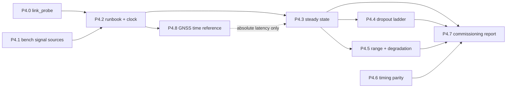

# Phase 4 work packages — bench validation

Briefs for proving the stack on real hardware over a real HaLow link, and
for proving the timing engine against the June-2025 event end to end.
Phase 1 (design docs, wire format, example profile), Phase 2 (core,
collectors, timing port, vehicle agent + JetStream publisher) and Phase 3
(pit services, deploy stacks, tooling, historical import) are complete and
committed. `uv run pytest -q` is green at 365 passed, 1 skipped — the skip
being `tests/test_can_collector.py::test_vcan_roundtrip_emits_samples`,
which P4.1 turns on.

**This phase is structurally different from the two before it, and the
briefs are written accordingly.** Phase 2 and Phase 3 were code: an agent
with no prior context could execute a brief end to end. Half of Phase 4 is
not code. P4.3, P4.4 and P4.5 are *runs* — someone stands at the bench,
moves a radio, pulls an antenna, and writes down what happened. An agent
can build the instruments, prepare the conditions, analyse the output and
write the result up; it cannot execute the run. Each of those briefs
therefore separates **what the operator does** from **what the agent does
with the result**, and says which is which.

The other half — P4.0, P4.1, P4.6 — is ordinary code and is agent-ready in
the Phase 3 sense.

## What this phase exists to answer

`docs/LINK_BUDGET.md` is a static analysis. It concludes that the full-rate
stream offers **~0.55 Mbit/s** and clears 2 MHz MCS4 with ~3.5× headroom,
and then §8 lists three caveats that only a bench can close:

1. **The signal-mix rates come from a 5.3 s bench capture**, not a session.
2. **Airtime efficiency of 0.5 is the softest input** — "a standard planning
   figure for a clean link", and required PHY scales inversely with it.
3. **The reverse channel has never been measured.** The predecessor's MQTT
   bridge paid per-message QoS-1 PUBACKs; openlaps instead has the pit
   *source* the vehicle's `TELE` as durable batch replication, and §8 says
   the resulting acknowledgement pattern is "structurally different, not
   just smaller" and "has not been bench-measured over real HaLow".

ADR 0002 puts it harder still: leafnode behaviour "over a lossy,
half-duplex link under real RF conditions is the single biggest unvalidated
assumption in the whole rewrite". P3.6 closed the *logic* half of that — a
severed-and-restored leafnode pair caught up with zero missing, zero
duplicate, order preserved (`tests/test_deploy_topology.py`) — but it did
so over a container network disconnect, not a radio. What is left is purely
RF, and it is this phase.

ADR 0001 gates cutover on "replay parity plus a garage HaLow bench test".
Phase 4 produces both, and nothing else.

## Ground rules for every work package

Everything in `PHASE2.md` → "Ground rules" and `PHASE3.md` → "Ground rules"
still applies verbatim. Additions for a measurement phase:

- **The wire format is still frozen.** Phase 4 measures; it does not
  redesign. If a measurement says the format has to change, that is a spec
  decision and an ADR, not an implementation detail — stop and raise it.
- **A number without provenance is not a result.** Every run emits a
  manifest (git sha, profile, `OPENLAPS_TICK_MS`, radio channel/MCS
  configuration, clock offset and how it was established, signal-source
  mode, start/end). A figure quoted in a document cites the manifest it
  came from, or it does not go in the document.
- **Never report a modelled number as measured, and never quietly delete a
  caveat.** Where `LINK_BUDGET.md` is updated, measured values go *beside*
  the modelled ones so the delta stays visible and `tools/size_batch.py`
  stays useful for the next signal-mix change. A caveat that the bench
  could not close gets restated, not dropped.
- **Instruments must survive the conditions they measure.** A probe that
  dies when the link degrades measures nothing about the interesting part
  of a range walk. Unreachable endpoints yield null columns and a recorded
  reason; they never raise.
- **Bench artefacts:** manifests and summary documents are checked in under
  `docs/bench/`; raw per-sample CSVs are not — they are large, they are
  local, and the manifest records their path. Add the ignore rule in the
  same commit that creates the convention.
- **No secrets.** Router credentials come from `ssh-agent` / `~/.ssh/config`
  — never in the repo, never in a manifest, never as a command-line
  argument that lands in shell history. The HaLowLink routers are
  OpenWrt boxes on a private network; that is not a reason to check in a
  password.
- Same commit discipline as Phase 3: one commit per work package,
  conventional message (`feat: ... (P4.x)`, `docs: ... (P4.x)` for the
  write-up packages), pre-commit green, never `--no-verify`. Work lands
  through a branch and a PR.

## Decisions locked for this phase

Settled with the owner before these briefs were written — do not relitigate:

1. **Scope is bench validation plus timing parity.** Grafana (datasource
   provisioning and the eight-dashboard SQL rewrite, ADR 0003) and cutover
   (ADR 0001) are **Phase 5**, and `PHASE5.md` gets written once this phase
   reveals what they need — the same discipline `PHASE2.md` applied to
   `PHASE3.md` and `PHASE3.md` applied to this document.
2. **The bench is the real deployment.** The pit machine
   (**192.168.12.118**) runs the full `deploy/pit-compose.yaml` stack —
   nats, timescaledb, mosquitto, ingest-writer, live-decoder,
   session-control, ntrip-client. The vehicle SBC (**192.168.12.176**) runs
   the agent and the vehicle nats-server. They are bridged by the
   HaLowLink pair. Measuring a reduced stack would measure something we are
   not going to run.
3. **Two probes, one per host, merged afterwards** — not one probe reaching
   across the link it is measuring. A single probe polling the far end over
   the radio adds its own load, and loses exactly the samples that matter
   during a sever.
4. **Bench load comes from `canplayer` and a pty NMEA feeder, not from
   `tools/replay.py`.** Replay is the no-agent path: it drives the real
   pipeline and publishes itself, so running it alongside a live agent puts
   two registry generations for one vehicle into one `TELE`. For bandwidth
   we want the real agent reading real interfaces — so the load is injected
   *below* the agent, at the socketCAN and serial boundaries.
5. **`LINK_BUDGET.md` is updated in place**, measured beside modelled, as
   each run lands. It is the document this phase exists to commission.

## Dependency graph

P4.0 and P4.1 are independent and parallel; both are ordinary code. P4.2
turns them into a runnable bench. P4.3 must precede P4.4 and P4.5 because
both are read as *deltas from the healthy baseline* — without it, a degraded
number has nothing to be degraded against. **P4.6 is independent of the
radio entirely** and can be picked up at any point, including first: it
needs no bench, no HaLow, and no operator.

**P4.8 was added after the phase opened** (ADR 0008) and is the dashed edge:
P4.3 runs without it against P4.2's fallback discipline and produces a valid
*relative* latency number, but the *absolute* source-to-row latency P4.3
asks for is only reportable once the vehicle has a real time reference. It
needs the bench but not the radio.

Suggested models: P4.0 wants a strong model (it is the instrument every
later number depends on, and its arithmetic — counter wrap, server restart,
merge-on-timestamp — is where a silent measurement bug would live). P4.1 and
P4.6 are well-specified enough for a mid-tier model. P4.3–P4.5 are analysis
and prose over data the operator produces; they want a strong model but
little code. P4.7 is a strong model with no code at all.

---

## P4.0 — `tools/link_probe.py`: the instrument

**Specs:** `docs/LINK_BUDGET.md` §2 (what is and is not modelled), §5 (the
PHY table and airtime efficiency), §8 (the three open caveats);
`docs/ARCHITECTURE.md` → "Link dropout and recovery" (why `/health`'s
`lag_ms` is relative, not absolute); `deploy/README.md` → "Verify each hop".

Everything downstream reads this tool's output, so it is worth building
before anything is measured rather than growing it run by run.

**The shape: one sampler per host, one CSV each, merged on timestamp.**
`--role vehicle` polls only vehicle-local endpoints; `--role pit` polls only
pit-local ones; `--merge a.csv b.csv` joins them into the analysis frame.
This is locked decision 3, and it is what keeps the instrument alive through
a sever.

**Deliverables** (in `tools/`):

- `link_probe.py`, sampling at a configurable interval (default 1 s) and
  writing one CSV row per sample. Sources per role:

  - **NATS monitoring**, on the local server's `http://…:8222` (already
    enabled in both `deploy/nats/vehicle.conf` and `deploy/nats/pit.conf`):
    - `/varz` — `in_msgs`, `out_msgs`, `in_bytes`, `out_bytes`,
      `slow_consumers`, `start` (for restart detection).
    - `/leafz` — per-leaf `in_msgs`/`out_msgs`/`in_bytes`/`out_bytes` and
      `rtt`. This is the application-layer view of the link itself, and the
      forward/reverse split that §8 asks for lives here.
    - `/jsz?streams=1&consumers=1` — per stream `messages`, `bytes`,
      `first_seq`, `last_seq`; per consumer `num_pending`,
      `num_ack_pending`, `num_redelivered`. `last_seq` on the vehicle's
      `TELE` minus `last_seq` on the pit's `TELE_VEHICLE` is the sourcing
      backlog, and it is the single most informative column in a dropout
      run.
  - **Wire counters** — named `nft` counters on TCP :7422 in both
    directions, read with `nft -j list counters`. The runbook (P4.2)
    creates them; the probe only reads. These include TLS, TCP
    acknowledgements and retransmits, so the ratio against the `/leafz`
    byte counts *is* the framing overhead that §2 estimates at 6–13% and
    explicitly does not model. Fall back to `/proc/net/dev` deltas for the
    interface when no counter is found, and **record which source was used
    in the row** — a run must never be silently less precise than it looks.
  - **Pit service health** (`--role pit`), the four endpoints
    `deploy/README.md` publishes: session-control 8080, ingest-writer 8081,
    live-decoder 8082, ntrip-client 8083. Take the keys that matter rather
    than the whole blob: from ingest-writer `rows_per_s`, `flushes_per_s`,
    `lag_ms`, `wall_lag_ms`, `last_stream_seq`, `unknown_seq_batches`,
    `bad_version_batches`, `dropped_flushes` (`src/pit/ingest_writer/health.py`);
    from live-decoder `publish_rate`, `aggregate_sheds`, `mqtt_drops`,
    `nats_reconnects` (`src/pit/live_decoder/health.py`); from ntrip-client
    `bytes_per_s`, `reconnects`, `last_byte_age_s`
    (`src/pit/ntrip_client/health.py`).
  - **Radio**, via a pluggable adapter, polling the **local** router only.
    The HaLowLink units run OpenWrt with SSH, so the default adapter shells
    out to the system `ssh` (honouring `~/.ssh/config` and `ssh-agent` — do
    not add `paramiko`, and do not take a password argument) and parses
    `iw dev <iface> station dump`: `signal`, `tx bitrate`, `rx bitrate`,
    `tx retries`, `tx failed`, `expected throughput`. Fall back to
    `ubus call iwinfo assoclist '{"device":"<iface>"}'` where `iw` is
    absent or the vendor driver does not populate it. Adapter selection and
    the interface name are configuration, not hardcoded — the chipset's
    reporting varies and the brief should not pretend otherwise.

    *(The routers also run `collectd`. That is a viable alternative for
    long-horizon background history, but it is a push model on its own
    interval with its own storage, and it needs router-side configuration
    changes. For a bench run where every series has to land on one timeline
    in one file, pulling into the same sampler is simpler and changes
    nothing on the routers. If continuous history is wanted later, add it
    as a second adapter rather than replacing this one.)*

- **Derived series are computed at analysis time, not sampled.** The CSV
  holds counters; `--summary` and `--merge` do the arithmetic. Required
  derivations: kbit/s in each direction from byte deltas ÷ dt; sourcing
  backlog; **the reverse ratio** (pit→vehicle bytes ÷ vehicle→pit bytes,
  the §8 unknown, reported as a first-class number); framing overhead
  (wire bytes ÷ NATS bytes); and measured airtime efficiency (wire goodput
  ÷ reported PHY rate), which is the figure §5 currently assumes at 0.5.

- **Counter arithmetic is where the silent bugs are.** Handle: a counter
  that wraps; a server that restarted mid-run (`/varz` `start` changes and
  counters reset to zero — must not emit a negative or an absurd rate);
  a sample gap longer than the interval (divide by real elapsed time, not
  nominal); and an endpoint that was unreachable for part of the run
  (null, not zero — zero and "we could not ask" are different measurements
  and conflating them is how a dropout gets reported as idle).

- `--summary` prints per-series mean / p50 / p95 / max over a run, plus an
  explicit comparison line against `LINK_BUDGET.md` §3's modelled
  **544.4 kbit/s** at the deployed 20 ms tick (`OPENLAPS_TICK_MS=20`,
  `example.env:44`) and **552.8 kbit/s** at 10 ms.

- A **run manifest** written alongside the CSV as JSON: git sha, profile
  path and its registry content hash, `OPENLAPS_TICK_MS`, signal-source
  mode, radio configuration, clock-sync method and measured offset,
  operator notes, start/end. This is the provenance the ground rules
  require. It carries no credentials.

**Tests:** parse fixtures checked into `tests/fixtures/probe/` for `/varz`,
`/leafz`, `/jsz`, `nft -j list counters` and `iw … station dump` output —
captured from the real thing, not hand-invented, so the parsers are tested
against the shapes they will actually meet. Unit-test the delta arithmetic
including wrap, restart-to-zero, and irregular sample spacing. Unit-test
`--merge` alignment when the two roles sampled on different phases and one
has a gap. Assert an unreachable endpoint produces a null-filled row with a
reason and no exception. No live-hardware test in CI.

**Dependencies:** stdlib only (`urllib`, `subprocess`, `csv`, `json`). This
is a tool, not a service; it adds nothing to `[project.dependencies]`.

---

## P4.1 — Bench signal sources

**Specs:** `docs/LINK_BUDGET.md` §2 (the modelled mix: ~822 CAN frames/s →
~2,787 signal updates/s, GPS 50 Hz × 6, IMU 100 Hz × 10, **4,087
samples/s** total), `docs/CATALOG.md`, `src/core/config.py` (the profile
models), `tests/fixtures/candump/README.md`, `tests/fixtures/gps/README.md`.

The bench has to reproduce the modelled signal mix without a car. Locked
decision 4 puts the injection point *below* the agent, at the socketCAN and
serial boundaries, so the agent under test is the real agent reading real
interfaces.

**Deliverables:**

- **A bench profile**, `profiles/example-club-racer-bench/`. *(Superseded
  2026-09-09: this became `tools/bench-hardware.yaml`, an overlay on the
  example profile, when ADR 0010 landed. The plan below records what was
  built at the time; the mechanism moved, the reasoning did not.)* Its
  `catalog.yaml`, `dbcs/` and `tracks/` are the example profile's,
  unchanged — the bench must measure the real channel mix or it measures
  nothing. Only `vehicle.yaml` differs:
  - The bus keeps **`name: can0`** and takes `interface: vcan0`.
    `BusConfig.name` and `BusConfig.interface` are independent fields
    (`src/core/config.py:98-99`), so every catalog `from: "can0:…"`
    reference stays valid with no catalog edit at all.
    `tests/test_can_collector.py:397` already relies on exactly this
    mechanism.
  - The serial source points at a stable symlink to the pty that
    `bench_gps.py` provides, `decoder: nmea`, and **no `driver:` block** —
    `SerialConfig.driver` is optional (`src/core/config.py:131`), and the
    `um980` driver would otherwise try to configure a receiver that is not
    there.
  - Vehicle id stays `example-club-racer`. The bench is measuring the
    deployed configuration, and changing the id would change every subject
    and every pit-side setting along with it. **The consequence must be
    documented, because otherwise the first bench run looks broken:** the
    registry generation counter lives in `.registry-state.json` beside the
    profile, so the bench profile has its own generation sequence. A pit
    that has already seen the real profile's generations will reject bench
    batches with `unknown_seq_batches` until it rescans the catalog
    subject. The writer recovers on its own; the runbook (P4.2) starts each
    bench series from a clean `TELE`/`TELE_VEHICLE` anyway.
  - **`.gitignore` needs a rule in the same commit.** It currently ignores
    `profiles/*` and un-ignores only `example-club-racer`, so a new bench
    profile would be silently untracked. Add the matching
    `!profiles/example-club-racer-bench/` and `/**` pair, positioned with
    the same ordering care the existing comment calls out.

- **`tools/bench_gps.py`** — a pty NMEA feeder. Opens a pty pair, creates a
  stable symlink to the slave side (`--link`, default
  `/tmp/openlaps-bench-gps`) so the profile has a fixed path to name, and
  writes `$GPRMC` sentences at `--rate-hz` (default 50) from
  `tests/fixtures/gps/wanneroo-trace.csv`, looping with `--loop`. Reuse
  `rmc_sentence` from `tools/_bench.py:97` rather than writing a second
  sentence builder.

  **Why this exists, stated in the module docstring:** indoors the UM980
  reports a void fix and the NMEA decoder emits `position.*` only on an
  active fix, so a bench with a real receiver and no sky view silently
  omits GPS entirely. That is ~300 of the 4,087 samples/s §2 models —
  roughly 8% of offered load — and a bandwidth figure missing it is wrong
  in a direction that flatters the result.

- **CAN load needs no new tool.** `can-utils` is installed on the SBC;
  `canplayer` replays `tests/fixtures/candump/candump-sample.log`. Document
  both modes in the runbook (P4.2) with their trade-off stated plainly:

  - **Physical `can0`** — highest fidelity: real arbitration against the
    live FDI IMU, real driver and USB path, and socketCAN loops transmitted
    frames back to local sockets so the agent sees them exactly as it would
    on the car. **The constraint that will otherwise waste an afternoon:**
    classic CAN needs at least one other node to assert the ACK slot, so
    the IMU must be powered — with nothing else on the bus the adapter goes
    error-passive and then bus-off, which presents as a driver or
    permissions fault and is neither.
  - **`vcan0`** — no hardware, no ACK requirement, and the only option when
    the IMU is off the bench. Loses real arbitration and the USB adapter
    from the measured path.

  Note in the runbook that the fixture is 8,000 frames (~9.7 s at the
  recorded rate) and `-l i` loops it, and that the loop seam is a timestamp
  discontinuity — harmless for offered load, but per-signal rates must not
  be read across a seam.

- **Un-skip the vcan test.** With `vcan0` present on the SBC,
  `tests/test_can_collector.py::test_vcan_roundtrip_emits_samples` runs.
  CI has no vcan and will keep skipping it; that is fine and worth a
  sentence, because the value of the test is on the bench host.

- **A mix check, and it is not optional.** A `--check` mode (in
  `bench_gps.py` or a small sibling) that runs the agent against the bench
  sources for 30 s and reports achieved samples/s per source class against
  §2's modelled 4,087/s, with a stated tolerance. If the bench mix is
  wrong, every bandwidth number downstream is measuring the wrong signal
  set — that has to fail on day one, not be discovered when the results are
  being written up.

**Tests:** `bench_gps` sentence construction (NMEA checksum correctness,
cadence within tolerance, trace wrap-around continuity). Assert the bench
profile parses and that its runtime catalog is **identical** to the example
profile's — same channel set, same registry content hash — which is the
mechanical guarantee that the bench measures the real mix. Un-skipped vcan
round-trip where `vcan0` exists.

---

## P4.2 — Bench runbook and clock discipline

**Specs:** `deploy/README.md` (bring-up order, per-hop verification),
`docs/ARCHITECTURE.md` → "Link dropout and recovery" (why absolute latency
needs a shared time reference), `src/agent/clock.py` (`sys.agent.clock_source`).

This package turns P4.0 and P4.1 into something a person can run twice and
get comparable numbers from.

**Deliverables:**

- **`docs/BENCH_RUNBOOK.md`** — the operator document:
  - Topology as built: vehicle SBC 192.168.12.176, pit 192.168.12.118,
    HaLowLink pair between them, and which router is which end.
  - Bring-up, deferring to `deploy/README.md` rather than restating it, and
    noting only the bench-specific deltas (`OPENLAPS_PROFILE` pointing at
    the bench profile, `vcan0` creation, `bench_gps.py` before the agent).
  - The signal-source matrix from P4.1 and how to choose.
  - Probe invocation on each host, and where artefacts land.
  - **Clean-slate procedure between runs**, with exact commands: purge
    `TELE` and `TELE_VEHICLE`, truncate `samples`, reset the ingest cursor.
    A half-purged run silently mixes two conditions, and the resulting
    numbers are unattributable rather than merely wrong.
  - Teardown.

- **Clock discipline, established and written down.**
  `docs/ARCHITECTURE.md` is explicit that ingest-writer's `lag_ms` is
  *relative* — the two hosts' monotonic clocks share no epoch — and that
  anything wanting absolute source-to-row latency "has to measure it end to
  end with a shared time reference". P4.3's latency numbers are only as
  good as what this package establishes:
  - Discipline the pit to the SBC with `chrony`, the SBC itself being
    GPS-disciplined when it has a fix (`sys.agent.clock_source` reports
    which source is in use, so the run manifest can record it rather than
    assume it).
  - Record the achieved offset and its stability in the manifest.
  - **If the SBC has no fix** — which is the normal indoor case — say so,
    fall back to both hosts against one common NTP source, and record the
    resulting uncertainty. Reporting millisecond latency figures that the
    clock discipline cannot support would be worse than reporting none.

- **`nft` counter setup** for both hosts: the named counters P4.0 reads,
  created once, with the exact ruleset in the runbook.

- **`docs/bench/` convention**: one directory per run — manifest, summary,
  operator notes checked in; raw CSVs gitignored with their local path
  recorded in the manifest. Add the ignore rule here.

**Acceptance:** a second person, or the same person three weeks later, can
follow the runbook and produce a comparable run. The specific test is that
the clean-slate procedure plus the P4.1 mix check together make two
consecutive baseline runs agree within a stated tolerance — if they do not,
the bench is not yet an instrument and no result from it means anything.

---

## P4.3 — Steady-state bandwidth and latency  *(operator run + analysis)*

**Specs:** `docs/LINK_BUDGET.md` §2, §3, §5, §8; `docs/ARCHITECTURE.md`
(ingest-writer's "target source-to-row latency under 500 ms when the link
is healthy").

**The operator does:** brings up both stacks per the runbook on a healthy
link, starts both probes, runs full-rate bench sources for **at least 30
minutes**, once at `OPENLAPS_TICK_MS=20` and once at `10`. Records the
radio's channel width and MCS in the manifest.

**The agent does:** everything else — analysis, reconciliation against the
model, and the write-up.

**What the run must yield:**

- **Offered load at the NATS layer**, vehicle out, against §3's modelled
  544.4 kbit/s (20 ms) and 552.8 kbit/s (10 ms). Running both ticks is
  cheap here and §7 calls tick "a weak lever" — this is the opportunity to
  confirm that claim with two numbers instead of leaving it as an assertion.
- **Wire bytes on :7422**, both directions, against §2's unmodelled 6–13%
  TCP/IP + 802.11 framing estimate. This is the first time that estimate
  meets a measurement.
- **The reverse channel**, reported as a first-class figure: pit→vehicle
  bytes/s, and as a fraction of forward. This is §8's third caveat and the
  claim under test is specifically that the sourcing/ack pattern is
  "structurally different, not just smaller" than the predecessor's
  per-message QoS-1 PUBACKs. Compare against that baseline explicitly.
- **Airtime efficiency, measured** — wire goodput ÷ the PHY rate `iw`
  reports — replacing §5's assumed 0.5. §8 calls this the softest input in
  the document and notes required PHY scales inversely with it, so this
  single number moves every headroom figure in §5.
- **Absolute source-to-row latency** under P4.2's clock discipline: capture
  instant → row visible in `v_samples_named`, against the under-500 ms
  target. Report the distribution, not a mean; the tail is what an operator
  notices.
- **Signal-mix ground truth.** §8's first caveat is that the modelled rates
  come from a 5.3 s capture. A 30-minute run gives per-channel measured
  rates from `v_samples_named` — report them against the fixture's assumed
  mix and note where they diverge. This does not require regenerating
  `tests/fixtures/mqtt_payload_stats.json` (which is the *predecessor's*
  measurement, and `size_batch.py`'s input); it requires saying honestly
  how well that fixture represents a real session.
- **Health sanity**, all of which should be zero and any of which
  invalidates the run if not: `slow_consumers` in `/varz`,
  `sys.agent.publish_drops`, `unknown_seq_batches`, `bad_version_batches`,
  `dropped_flushes`.

**Deliverables:** `docs/bench/steady-state.md` (result, manifest reference,
method deviations), and **an update to `docs/LINK_BUDGET.md`** placing
measured values beside modelled ones in §3 and §5, and rewriting §8's first
three caveats as closed, partially closed, or restated — per the ground
rule, none of them is simply deleted.

---

## P4.4 — Dropout and recovery ladder  *(operator run + analysis)*

**Specs:** ADR 0002, `docs/ARCHITECTURE.md` → "Link dropout and recovery",
`docs/WIRE_FORMAT.md` → deduplication (`duplicate_window`, 2 min, now
actually set at `src/agent/publisher.py:303`),
`tests/test_deploy_topology.py` (the container-level version of this test,
and the source of the methodology notes below).

**The operator does:** the sever ladder, each rung **three times**: 5 s,
30 s, **2 min** (crosses `duplicate_window`), 10 min, and one overnight if
practical. Sever by **removing the RF path** — pull the antenna or power
down the remote radio — not by stopping a container: the point is TCP and
RF behaviour, not a clean socket close. Then run a clean-close case
separately, because "the car drove out of range" and "the SBC rebooted" are
different failures and the recovery differs.

**The agent does:** the assertions, the analysis, and the write-up.

**What must be asserted, per sever:**

- **No gap and no duplicate, at the database**, compared payload-by-payload
  rather than by count. P3.6's brief already learned this: a count-only
  assertion passes on a stream that dropped one message and duplicated
  another. Compare the exact `(channel_key, time)` set in `samples`
  against the vehicle's own `TELE` read back afterwards.
- **Catch-up behaviour, which is the number nobody has.** On reconnect the
  pit sources at maximum rate to drain the backlog *while live traffic
  continues*, over a link sized for ~1.1 Mbit/s required PHY. Measure peak
  sourcing rate and drain time per rung. If catch-up saturates the link,
  live gauges stay stale for a long time after the radio comes back — an
  operationally visible failure that no paper analysis surfaces, and the
  one thing most likely to change how the pit stack is configured.
- **Where the vehicle-side loss boundary is.** `JetStreamPublisher` sheds
  oldest-first past its byte budget (`src/agent/publisher.py:125`), and
  `TELE` is capped at 8 GiB / 72 h (`src/agent/publisher.py:47-48`). An
  outage long enough to hit the queue budget is a data-loss boundary; Phase
  4 should find where it is, or state plainly that the ladder did not reach
  it and extrapolate from the measured rate.
- **Cursor idempotency under real conditions:** restart the ingest-writer
  mid-outage and mid-catch-up, and assert still-zero duplicates. The unit
  and integration tests cover this; doing it once against the real stack is
  what makes the claim a fact.
- Leafnode reconnect latency, `slow_consumers`, and consumer
  `num_redelivered` across each event.

**Deliverables:** `docs/bench/dropout.md`, and an update to
`docs/ARCHITECTURE.md` → "Link dropout and recovery" that converts "no
gaps, no duplicates" from a design claim into a measured statement
**including the boundary conditions where it stops holding**. A guarantee
without its limits is not a guarantee an operator can plan around.

---

## P4.5 — Range and RF degradation  *(operator run + analysis)*

**Specs:** `docs/LINK_BUDGET.md` §5 (the PHY table), §7 (the levers), §8.

**The operator does:** a range walk — the vehicle radio progressively
further away or progressively attenuated — pausing at each station long
enough for a stable sample window. Then, at the cliff, applies the §7
levers in order and re-measures.

**The agent does:** the analysis and the degradation plan.

**What the run must yield:**

- **Goodput against link quality**: measured delivered rate versus RSSI,
  MCS, PHY rate, retries and failures at each station. §5's table maps
  channel/MCS to PHY rate; this maps PHY rate to *what actually gets
  through*, which is the part the table cannot tell you.
- **The cliff**: the RSSI/MCS at which delivered goodput falls below
  offered load and the sourcing backlog begins to grow monotonically rather
  than recover. That is the operational range limit for full-rate
  telemetry, and it is the headline number of this package.
- **The levers, measured rather than claimed.** At the cliff, apply each of
  §7's levers and record how much margin each buys:
  - `encode:` — §7 claims −24% to −26% offered load, and it is the only
    lever that is pure catalog config with no code change. If it holds, it
    is the pit's first response to a bad day and belongs at the top of a
    written degradation plan.
  - RBE on the PD16 voltage channels — §4 computes ≤77 kbit/s and is
    careful to call it an upper bound realised only while those channels
    are genuinely steady. On a bench with a stationary car it will look
    better than it will on track; say so.
  - Tick length — §7 already calls it weak; P4.3 will have the two numbers.
- **Optional, if a camera is on hand:** behaviour with a competing video
  stream. §5 explicitly reserves ~1.4 Mbit/s of headroom for one at 2 MHz
  MCS4, and that reservation is untested. Worth doing if it is cheap;
  worth saying it was not done if it is not.

**Deliverables:** `docs/bench/range.md`; `docs/LINK_BUDGET.md` §5 and §7
updated with measured numbers; and a short **degradation plan** — the
ordered list of what the pit changes, and what each buys, when the link is
bad. That plan is the practical output of this whole phase for the person
standing in a garage.

---

## P4.6 — Timing parity against the June-2025 event

**Specs:** ADR 0001 (parity is half the cutover gate),
`/mnt/data/logger/exports/timing_validation_june2025.csv` (the predecessor's
own replay-validation export), `tools/replay.py` and
`tests/fixtures/gps/README.md` (the `--gps-trace` path P3.7 built for
exactly this), `docs/PIT_SCHEMA.md` (`v_laps`).

**This package needs no radio, no bench and no operator.** It can be picked
up first.

**State the scope honestly up front, because the obvious reading of "replay
the event" over-promises.** `tools/replay.py` drives the real collectors and
the real pipeline, but the legacy corpus is InfluxDB line protocol —
already-decoded values, not raw CAN frames — so there is no way to drive CAN
decode from it. Parity is therefore driven from the event's GPS trace
through `--gps-trace`, which validates **collectors → pipeline → wire →
transport → pit → database → `v_laps`** on real recorded data. That is the
right scope: the timing engine consumes GPS, not CAN. CAN-side fidelity
against this event is covered by a different route — P3.8's import, already
accepted. Say all of this in the write-up rather than letting a reader infer
a broader claim.

**Deliverables:**

- Extract the full event's GPS trace at native rate from
  `/mnt/data/logger/backups/backup_migration_tmp/gps.lp.gz` into the CSV
  shape `--gps-trace` already takes. `tools/import_legacy.py` has the
  line-protocol streaming reader; reuse it rather than writing a second
  parser.
- Replay through the real agent into a real vehicle nats-server, ingest
  through the real pit stack, land in `v_laps`.
- **Use a distinct `--vehicle` for the parity run.** P3.8 already imported
  this event's laps under `registry_seq = 0`, and `laps` is unique on
  `(vehicle_id, crossed_at)` — the same instants under the same vehicle id
  would upsert over each other instead of being comparable. A separate
  vehicle id keeps both and makes the diff possible; this is one of the
  reasons the importer takes `--vehicle`.
- **`tools/compare_timing.py`** — reads `v_laps` for the parity vehicle and
  the validation CSV, and emits the diff table: matched crossings, missing,
  extra, and the lap-time delta distribution.

**Acceptance, with the tolerance stated and justified in advance:** the
validation CSV holds **769 `StartFinish`, 793 `Sector1`, 794 `Sector2`,
19 `PitEntry`, 20 `PitExit`** crossings. The gate is **no missing and no
extra crossings**, same lap numbering, and lap-time deltas **no worse than
the predecessor's own replay-versus-live spread** — which its `dt` column
puts in the tens of milliseconds (−0.038, −0.042, −0.001 s in the first
three rows). Exact equality is the wrong gate and would fail for reasons
that have nothing to do with this stack; the right gate is "no worse than
the system it replaces, measured the same way".

Cross-check against P3.8's accepted import as a second opinion: that import
produced 767 completed laps against the CSV's 769 `StartFinish` crossings
(the first crossing opens a lap rather than closing one) and 2,301 sectors
(767 × 3). A parity run that disagrees with *both* the CSV and the import
has a bug; one that disagrees with only one of them has found something
interesting.

**Deliverable:** `docs/bench/timing-parity.md`.

---

## P4.7 — Commissioning report

**Specs:** ADR 0001 → "gated on replay parity plus a garage HaLow bench
test"; the outputs of P4.3–P4.6.

No code. This package writes down whether the stack is commissioned, and on
what evidence.

**Deliverables:**

- **`docs/COMMISSIONING.md`** — one section per gate ADR 0001 names. Each
  states what was measured, the number, the manifest it came from, and
  pass/fail. Where a gate fails, it states what would have to change to
  pass — a failed gate with no stated remedy is an unfinished sentence.
- **ADR 0001 gains the evidence.** Either amend its Consequences with the
  measured result, or add a short ADR recording the commissioning outcome
  and linking to it. A decision record that stays silent about how its own
  gate turned out has stopped being a record.
- **Inputs for `PHASE5.md`** — not Phase 5 itself, which is Phase 5's own
  opening move. What the bench revealed that Grafana and cutover have to
  account for: the degradation plan from P4.5, any latency figure that
  bounds what a live dashboard can honestly show, any dropout boundary that
  the cutover rollback plan has to respect.

**Acceptance:** someone deciding whether to put this stack on the car can
read one document and see every number the decision rests on, with a path
back to the raw data for each.

---

## P4.8 — GNSS time reference: the RP2040 timing head

**Specs:** ADR 0008 (the decision and its accuracy ceiling);
`docs/ARCHITECTURE.md` → "Link dropout and recovery" (why absolute latency
needs a shared reference); `docs/BENCH_RUNBOOK.md` §3 (the clock discipline
this package replaces); `src/agent/clock.py` and `src/agent/pipeline.py`
(the dormant `SteeredClock`); ADR 0006 (why the receiver's serial port is
not available and why the vehicle has no internet).

P4.2 established clock discipline *as far as the hardware allowed* and was
honest that the indoor fallback bounds the two hosts against each other and
neither against true time. This package gives the vehicle a real reference
so that P4.3's absolute source-to-row latency is a measurement rather than a
caveat. **P4.3 is not blocked on it** — the P4.2 fallback still produces a
valid relative number — but the absolute figure P4.3 asks for is only
reportable with this in place.

**This is the first package in the repository with firmware in it.** The
build, the flashing procedure and the artefact's relationship to the host
shim are part of the deliverable, not an afterthought.

**Deliverables:**

- **`firmware/timing-head/`** — RP2040 firmware, pico-sdk, one `.uf2`.

  - **PPS capture** on a GPIO, timestamped in hardware. Resolution here is
    far below the transport noise that dominates; do not gold-plate it.
  - **1 Hz `ZDA` in** on a UART from the UM980's spare COM port, parsed
    minimally. The sentence names the second; the edge says when it was.
  - **Edge↔sentence association is the one error class that matters, and it
    is a whole second when it goes wrong.** The receiver raises PPS at the
    second boundary and *then* emits the sentence describing it, so the
    pairing is "the sentence that follows this edge", never the one that
    precedes it. A sentence arriving more than ~900 ms after its edge is not
    that edge's sentence and must be rejected rather than paired. Factor
    this into a pure function and test it on the host — it is not
    acceptable for the only test of second-numbering to be "it looked right
    on the bench".
  - **One message per second**, carrying: sequence, UTC second, the captured
    edge, **the firmware's own edge→transmit interval**, and a validity
    flag. The host must never have to estimate the part of the delay the
    firmware already knows.
  - **No fix, no message.** A timing head that emits a plausible-looking
    sample from a stale or void fix is worse than one that emits nothing.
  - **Both host transports, selectable at build time** — USB CDC and the
    RP2040↔N100 UART. Building both is not indecision; measuring them
    against each other is a deliverable of this package.

- **`tools/timing_head_shim.py`** — reads the message, timestamps arrival
  against `CLOCK_REALTIME`, subtracts the firmware's edge→transmit interval,
  and offers the result to `chrony` over the **SOCK refclock** protocol.
  Degrades to silence: a malformed line, a stale sequence, a cleared
  validity flag or a vanished device yields no sample and a counter, never a
  wrong sample and never an exception.

- **`deploy/chrony/vehicle.conf`** — the timing head as a `prefer`red
  refclock, internet NTP sources alongside it, `local stratum 10` so the pit
  can still discipline against the SBC when the SBC itself is free-running,
  and `allow` for the bench subnet. **The primary/fallback behaviour is
  chrony's source selection and nothing else** — if this package finds
  itself writing failover logic, it has taken a wrong turn.
  **`deploy/chrony/pit.conf`** — the pit pointed at the SBC, per P4.2.

- **Clock health as telemetry.** A `chrony` probe in
  `src/collectors/host.py` (the probe structure is already there and each
  group already fails independently) emitting `host:clock_offset_s`,
  `host:clock_source`, `host:clock_stratum`, `host:clock_root_dispersion_s`,
  mapped to `sys.host.clock_*` in the example catalogue. A PPS lead that
  falls off in a car degrades silently and correctly to NTP; the only thing
  that makes that visible in time is a channel on a dashboard.

- **`SteeredClock`'s GNSS steering retired**, per ADR 0008. The system clock
  is the authority. Removing it is preferable to leaving a dormant
  mechanism that the next person has to re-derive is dormant — P4.2 already
  had to spend a section explaining that it does nothing.

- **Docs.** `docs/BENCH_RUNBOOK.md` §3 rewritten around a configuration that
  can actually be built — the current "preferred" one cannot, because
  `gpsd` cannot open a port the collector holds. `deploy/README.md` gains
  the wiring (PPS pin, spare COM port, shared ground) and the RP2040
  flashing procedure, including that it replaces Radxa's stock GPIO
  firmware.

**The measurement, which is the point of putting this in a bench phase:**

- **Both transports characterised** — delay and jitter distribution over at
  least an hour each, and a stated choice with the numbers behind it. ADR
  0008's ~1 ms (USB) and ~90 µs (UART) are indicative and must be replaced
  by measured values or struck.
- **What cannot be measured here, said plainly.** There is no independent
  reference on this bench, so the *absolute* offset of the disciplined clock
  is not directly observable. What is observable, and what this package
  reports: the jitter distribution, the firmware-known delay component, and
  the agreement between the PPS-disciplined clock and good internet NTP when
  both are present — which bounds gross error without establishing
  microsecond truth. **Quote the bound, not a figure the bench cannot
  support**; this is the same rule P4.2 applied to latency.
- **A manifest under `docs/bench/`**, per the ground rules.

**Acceptance:**

- With the internet unplugged, `chronyc sources` shows the timing head
  selected and the system clock disciplined from a cold start with no RTC.
- Pulling the PPS lead falls back to internet NTP **by slew, without a
  step**, and `sys.host.clock_source` shows the transition on the dashboard
  rather than in a log.
- Restoring PPS re-selects it, again without a step.
- Host-side unit tests cover edge↔sentence pairing including the late-
  sentence rejection and a missing sentence, and cover the shim's
  degradation paths. No hardware in CI.
- The achieved offset and jitter, and which transport produced them, are in
  a manifest and quoted in `BENCH_RUNBOOK.md` §3 with a citation.

**Suggested model:** strong. The arithmetic is small but the second-
numbering rule is the kind of off-by-one that produces a confidently wrong
answer for a year, and the accuracy claims need someone willing to write
down what the bench cannot prove.

---

## After Phase 4

**Phase 5 is now briefed in `docs/plan/PHASE5.md`.** Its scope narrowed
during the writing, in three ways this section did not anticipate:

- **There is no dashboard parity obligation.** The owner's judgement is
  that the legacy set was a mess, and that porting a mess produces a mess
  with new syntax. The eight dashboards became reference material rather
  than a specification, and ADR 0003's "must be rewritten against SQL"
  consequence is superseded by a dated amendment.
- **Phase 5 ships one dashboard**, the car-and-engine view, designed
  against this stack's channels rather than translated. Lap analysis,
  sector analysis, pit-stop analysis and a live timing wall are deferred
  until the first one has been used in a real session.
- **Session management leaves Grafana** for a small static operator UI
  served by session-control itself, and **the rollback requirement is
  dropped** — cutover is not gated on a verified rollback, and ADR 0001
  gets an amendment saying what carries the risk instead.

The shape anticipated here was otherwise right, and is recorded below as
written:

- **Grafana.** Datasource provisioning against Timescale and the
  eight-dashboard SQL rewrite (ADR 0003: "all existing Grafana dashboards
  (eight in the current system) must be rewritten against SQL; there is no
  automatic Flux-to-SQL translation"), plus the live gauge panels fed by
  P3.3's MQTT bridge. The eight live at
  `/mnt/data/logger/grafana/dashboards/`. `GRAFANA_*` is stubbed in
  `example.env` and no Grafana container exists yet — that was locked
  decision 3 of Phase 3 and it expires here.
- **Cutover.** Per ADR 0001: big-bang, gated on P4.6's parity and P4.3–P4.5's
  bench result, with the old stack retained as a rollback for the first
  on-track sessions. The rollback procedure itself needs writing down;
  ADR 0001 asserts the old stack stays bootable but nobody has verified
  that recently, and "we assumed we could roll back" is a bad thing to
  discover on a Saturday morning.
