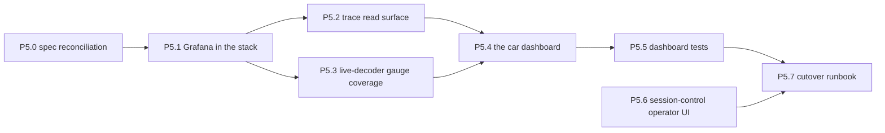

# Phase 5 work packages — the first dashboard and the session UI

Briefs for the pit's read surface: a provisioned Grafana, one dashboard
designed for this stack rather than translated from the last one, and a
session-control operator UI that leaves Grafana entirely. Phase 1 (design
docs, wire format, example profile), Phase 2 (core, collectors, timing
port, vehicle agent + JetStream publisher) and Phase 3 (pit services,
deploy stacks, tooling, historical import) are complete and committed;
Phase 4 (bench validation, timing parity) is finishing as this document is
written.

**This phase is deliberately small.** An earlier draft of it carried
thirteen packages and a parity obligation against eight legacy dashboards.
The owner's judgement is that the legacy set was a mess and that porting a
mess produces a mess with new syntax. So the parity obligation is gone, the
legacy dashboards are reference material rather than a specification, and
this phase ships **one** dashboard — the car-and-engine view — and the
session UI. What comes after it gets briefed once someone has stood in
front of the first one during a real session.

Everything here is agent-ready in the Phase 3 sense: a brief plus the specs
it names should be executable with no prior context. There is no operator
package and no bench run.

## What this phase exists to answer

1. **Nothing reads the pit database yet.** `docs/PIT_SCHEMA.md` defines a
   stable read surface — `v_samples_named` and `v_laps` — and declares it
   the contract for "a future dashboard". This phase is that contract's
   first consumer, which is the first real test of whether it holds.
2. **The pit has no UI at all.** The stack has run for a whole phase
   verified by `mosquitto_sub`, `psql` and `curl`. That is fine for a bench
   and useless at a track.
3. **Session control has no operator surface.** The service has had a
   complete HTTP API since P3.4 and nothing but `curl` has ever called it.

What this phase does **not** do is reproduce the old system. Where the
legacy dashboards asked a good question, the answer is worth keeping; where
they asked a question because Flux made it awkward to ask a better one,
they are ignored.

## Ground rules for every work package

Everything in `PHASE2.md` → "Ground rules", `PHASE3.md` → "Ground rules"
and `PHASE4.md` → "Ground rules" still applies verbatim. Additions:

- **The wire format is still frozen** and the pit schema's existing shape
  with it. P5.2 *adds*; it does not alter `samples`, `laps`,
  `v_samples_named` or `v_laps`. Migrations are additive and numbered
  (`002_*.sql`); `001_init.sql` is never edited once applied anywhere.
- **Dashboards read the views, not the base tables** (`docs/PIT_SCHEMA.md`
  → "The stable read surface"). A panel querying `samples` directly is a
  bug in the panel, not a missing view — if a view cannot answer it, add
  the view and say why.
- **Dashboards are code.** They live in `deploy/pit-config/grafana/` as
  JSON, are provisioned from disk, and are reviewed as diffs. The
  provisioner runs `allowUiUpdates: false` precisely so the UI cannot
  quietly become the source of truth. A panel changed in the browser and
  not committed does not exist.
- **No secrets, in a dashboard or in the UI.** This is a public repository
  and both are checked in. Every credential arrives through provisioning
  `secureJsonData` or the environment, documented in `example.env` in the
  same commit that reads it.
- **Every datasource gets an explicit, stable `uid`.** The legacy
  provisioning learned this the hard way and left a comment saying so:
  without one, Grafana generates a per-install uid and any dashboard
  authored elsewhere fails with "Datasource … was not found".
- **Units are physical, and the catalog says which.** `docs/CATALOG.md`
  keeps the donor car's real inconsistency: the Haltech ECU reports
  temperatures in **Kelvin**, the FDI IMU reports its board temperature in
  Celsius. A panel showing `car.coolant_temp` without Grafana's `kelvin`
  unit or an explicit conversion reads ~370 and looks plausible. Read
  `units` from the view; never assume.
- **No frontend toolchain.** P5.6 adds the repository's first HTML. It
  stays hand-written, dependency-free, and buildless. If a future UI
  genuinely needs a framework that is an ADR, not a `package.json` that
  appeared in a feature branch.
- Same commit discipline as Phases 3 and 4: one commit per work package,
  conventional message (`feat: … (P5.x)`, `docs: … (P5.x)`), pre-commit
  green, never `--no-verify`. Work lands through a branch and a PR.

## Decisions locked for this phase

Settled with the owner before these briefs were written — do not
relitigate:

1. **The eight legacy dashboards are reference material, not a
   specification.** There is no parity obligation, no coverage table, and
   no requirement that a legacy panel survive. ADR 0003's negative consequence — "all
   existing Grafana dashboards (eight in the current system) must be
   rewritten against SQL" — is superseded and gets a dated amendment
   (P5.0).

2. **One dashboard ships this phase**, the car-and-engine view, closest in
   spirit to the legacy `racing-dashboard` but designed against this
   stack's channels and this schema's shape. Lap analysis, sector
   analysis, pit-stop analysis and a dedicated live-timing wall are
   deliberately deferred — they are briefed after this one has been used in
   anger, because the useful version of each of them depends on what the
   first one turns out to be missing.

3. **Session management leaves Grafana.** It becomes a small static
   operator UI served by session-control itself (P5.6). The Grafana route
   would have needed `volkovlabs-form-panel` to draw three forms and
   `yesoreyeram-infinity-datasource` purely to make authentication work —
   three moving parts to render three buttons, on a service that already
   runs an HTTP server with the exact API those buttons need.

4. **The live path stays MQTT.** `grafana-mqtt-datasource` against the
   existing mosquitto websockets listener, as `ARCHITECTURE.md` and ADR
   0003 already describe. live-decoder needs no code change, only a wider
   channel selection (P5.3). **It is the only non-core Grafana plugin this
   stack is permitted**, a list that shortened from three the moment
   decision 3 was taken. Grafana Live push remains the documented escape
   hatch and remains untested.

   **Amended 2026-08-23 (Phase 6):** the single-plugin restriction is
   lifted — see `PHASE6.md` locked decision 7. The engineering constraints
   that motivated it survive as ground rules (exact version pins,
   pre-staged before an event, a stated reason core Grafana cannot do it);
   the cap on the number of plugins does not. The rest of this decision —
   MQTT as the live path, live-decoder needing config rather than code, and
   Grafana Live remaining an untested escape hatch — stands unchanged.

5. **Cutover is no longer gated on a verified rollback.** The earlier draft
   carried a package that booted the predecessor stack to confirm ADR
   0001's claim that it "remains bootable as an operational rollback". That
   package is dropped and the claim is not being relied upon; ADR 0001 gets
   a dated amendment saying so (P5.0).

   Stated once, because it is a real change to a decision's foundations and
   then it is the owner's call: ADR 0001 rejected a strangler-pattern
   migration partly *because* "full retention of the old stack as rollback
   removes most of the risk the strangler pattern is normally chosen to
   mitigate". Removing the rollback removes that mitigation. What still
   carries the risk is not nothing — the vehicle's JetStream file store
   means the car keeps recording locally and durably even if every pit
   service is broken (ADR 0002), so the failure mode of a bad cutover is a
   pit wall with no live view, not a lost session — and the old stack
   physically still exists, merely unverified. The residual exposure is a
   race weekend run without live telemetry, and P5.7's go/no-go says so
   plainly rather than implying a fallback that nobody has tested.

6. **`deploy/pit-config/` is the home for pit-side configuration that is
   not a service's own file.** live-decoder's YAML already lives there and
   is bind-mounted as a directory (the compose file explains why: editors
   rename over the inode). Grafana provisioning joins it under
   `deploy/pit-config/grafana/`.

## Dependency graph

P5.0 is docs-only and settles what the phase is building. P5.1 must land
before the dashboard, because a dashboard with no provisioned datasource
uid cannot even be tested. P5.2 and P5.3 are independent of each other and
parallel.

**P5.6 depends on nothing in this phase** — it touches session-control and
its tests, not Grafana, not the schema, not the dashboard. It is the
obvious thing to run in parallel with the whole Grafana track, and it is
the package most likely to surface a design question, so earlier is better.

Suggested models: P5.1 and P5.6 want a strong model — provisioning
failures are silent, and P5.6 changes an authentication path where the
obvious implementation is the insecure one. P5.2 wants a strong model for
the continuous aggregate's refresh policy. P5.3 and P5.4 are
well-specified and suit a mid-tier model. P5.5 wants a strong model: it is
the test that decides whether P5.4 is actually done. P5.7 is a strong model
with no code.

---

## P5.0 — Spec reconciliation (docs only; no code)

**Specs:** `docs/ARCHITECTURE.md`, `docs/CATALOG.md` §naming,
`docs/adr/0001-fresh-public-repo-and-big-bang-cutover.md`,
`docs/adr/0003-timescaledb-storage.md`, `README.md`.

Documents disagree with the code, and two ADRs disagree with locked
decisions above. Fix them before anything is built on top of them.

1. **`ARCHITECTURE.md` names channels that do not exist.** Line 58 gives
   `engine.rpm` and `chassis.accel_x` as the worked examples of canonical
   channels. `CATALOG.md` line 186 documents the *opposite* — it gives
   `engine.rpm -> car.rpm` and `chassis.accel_x -> car.accel_x` as the
   rename that flattened the namespace — and the example profile has only
   `car.*`. The architecture document is quoting pre-rename names as if
   they were current. Fix to `car.rpm`, `position.lat`, `car.accel_x`.

2. **`ARCHITECTURE.md`'s pit diagram already draws Grafana** (`G1 Grafana
   live panels`, `G2 Grafana SQL dashboards`) as though it exists. After
   P5.1 it will. Leave the diagram; add Grafana to the "Deployment"
   section, which lists the pit services without it. Add the session UI
   too — it is a surface on an existing box, but a reader of the
   architecture document should know it is there.

3. **ADR 0003 amendment** recording locked decision 1: the negative
   consequence said eight dashboards must be rewritten against SQL. What is
   happening instead is that the legacy set is abandoned and new dashboards
   are designed against the relational schema, starting with one. Say why —
   the legacy set accreted around Flux's constraints and around tag-based
   modelling that this schema replaced, so translating it would carry
   forward workarounds for problems that no longer exist. Follow the
   existing amendment's form; ADR 0003 already carries a 2026-07-28
   amendment and the convention is a dated `## Amendment` section. Do not
   edit the original decision text.

4. **ADR 0001 amendment** recording locked decision 5: cutover is not gated
   on a verified rollback, and the old stack's bootability is not being
   relied upon. State what carries the risk instead — the vehicle-side
   JetStream file store, per ADR 0002 — and state the residual exposure
   honestly. This amendment is the thing a reader in a year will use to
   understand why the strangler-pattern rejection in the original decision
   rests on one fewer leg than it did.

5. **`README.md` status paragraph is stale.** It says "the remaining pit
   services and the deploy stacks have not [landed]" — they did, in Phase
   3. Update it, and add Grafana and the session UI to the description of
   what the pit runs. They are not console entry points, so they belong in
   prose rather than in the entry-point table.

**Acceptance:** no document in `docs/` names a channel the example profile
does not define; ADR 0001 and ADR 0003 each carry a dated amendment
naming the decision that superseded them; `README.md` describes the current
state. `uv run pytest -q` still green — several tests assert doc/code
agreement, `tests/test_bench_runbook.py` being the pattern.

**Suggested model:** mid-tier. Careful reading, not hard reasoning.

---

## P5.1 — Grafana in the pit stack

**Specs:** `deploy/pit-compose.yaml` (and the comment at its head that this
package deletes), `deploy/mosquitto/mosquitto.conf` (the websockets
listener the MQTT datasource dials), `docs/PIT_SCHEMA.md`, `example.env`.

The pit compose file opens with "No Grafana: locked decision 3 of
`docs/plan/PHASE3.md`. … the dashboard work is a later phase." This is that
phase. Delete the comment and add the service.

**What to build:**

- **`grafana` service in `deploy/pit-compose.yaml`.** Pinned image tag —
  not `latest`, because a Grafana minor bump that changes panel schema is
  not something to discover from a restart. `depends_on: timescaledb
  service_healthy` and `mosquitto service_started`. A named volume for
  `/var/lib/grafana`. Port 3000. Healthcheck on `/api/health`. Exactly one
  plugin in `GF_INSTALL_PLUGINS`: `grafana-mqtt-datasource`.
- **`deploy/pit-config/grafana/provisioning/datasources/*.yaml`** — two
  datasources, each with an explicit stable `uid`:
  - `timescale` (type `grafana-postgresql-datasource`) against the
    `timescaledb` service, password in `secureJsonData` from the
    environment. Set `jsonData.timescaledb: true` so the query editor
    offers `time_bucket`, and pin `postgresVersion`. Connect as a
    **read-only role**, not as the owner the pit services write with — a
    dashboard must not be able to `DELETE FROM samples` because somebody
    pasted a query into the editor. Creating that role is part of P5.2.
  - `mqtt-live` (type `grafana-mqtt-datasource`), `uri: ws://mosquitto:9001`.
- **`deploy/pit-config/grafana/provisioning/dashboards/openlaps.yaml`** —
  one file provider, folder `openlaps`, path `/var/lib/grafana/dashboards`,
  `allowUiUpdates: false`, `disableDeletion: true`. The legacy provider set
  `allowUiUpdates: true`, which is exactly how dashboards drift away from
  the repository that is supposed to define them.
- **`deploy/pit-config/grafana/dashboards/`** — where P5.4's JSON lands,
  bind-mounted read-only. Ship it with a `README.md` stating that these
  files are the source of truth and the browser is not.
- **`example.env`** — expand the `# --- Grafana (pit) ---` block beyond its
  two existing stubs: admin user and password, the pinned image tag,
  `GF_SERVER_ROOT_URL`, and the read-only Timescale role's password. Every
  variable documented in the same commit that reads it, per the standing
  rule.

**Watch for:** Grafana must not receive the `TIMESCALE_PASSWORD` the
services use. Two credentials, two roles; write the env block so that is
hard to get wrong rather than merely documented.

**Acceptance:** `docker compose -f deploy/pit-compose.yaml up -d` brings
Grafana up healthy with both datasources green in `/api/datasources`, no
dashboards yet, and no credential visible in `git diff`. The head-of-file
comment in `pit-compose.yaml` no longer claims there is no Grafana.

**Suggested model:** strong. Provisioning failures are silent — a wrong
`uid`, a mistyped `secureJsonData` key, a datasource type string that
changed between Grafana majors — and they surface later as a dashboard that
renders empty rather than as an error at bring-up.

---

## P5.2 — The trace read surface (`002_*.sql`)

**Specs:** `docs/PIT_SCHEMA.md`, `src/pit/db/migrations/001_init.sql`,
ADR 0003 → continuous aggregates, `docs/LINK_BUDGET.md` §3 (the sample rate
this has to survive).

`v_samples_named` answers the dashboard's per-channel range query already.
Two things are missing.

1. **Long-range trace panels have no aggregate to read.** ADR 0003 promised
   "continuous aggregates replace hand-rolled Flux windowing for long-range
   dashboard panels" and nothing implements it. At the LINK_BUDGET rate of
   ~4,000 samples/s, a session-length timeseries panel over `samples` scans
   millions of rows per refresh — times the nine or so trace panels P5.4
   puts on one screen.

   Add one continuous aggregate — **`samples_1s`**: `time_bucket('1
   second')`, `channel_key`, `avg`, `min`, `max`, `count` — with a refresh
   policy, plus **`v_samples_1s_named`** exposing it in the same named
   shape as `v_samples_named` so a panel switches between them by changing
   one table name.

   Keep it deliberately minimal: one bucket size, numeric channels only
   (`value IS NOT NULL` — a `time_bucket` average of `lap.event` JSON is
   meaningless), no per-dashboard aggregates. The second bucket size gets
   added when a panel is measurably too slow, not in anticipation of one.

   `min` and `max` are in the column list on purpose. A one-second average
   of a 100 Hz channel hides exactly the transient — a knock spike, a
   momentary oil-pressure drop — that someone looking at an engine trace is
   looking for. A panel that renders avg as a line and min/max as a band
   shows the same amount of data as the raw view at a thousandth of the
   cost, and this is the one place where choosing the cheap version quietly
   destroys the answer.

2. **A read-only role** for Grafana's Timescale datasource: `CONNECT` on
   the database, `USAGE` on the schema, `SELECT` on the views only — not on
   the base tables. `docs/PIT_SCHEMA.md` already says the views are the
   contract and the base tables are not; granting the dashboard role
   exactly that makes the document enforceable instead of advisory. The
   password comes from the environment rather than from the migration file;
   whichever mechanism is chosen for that, write down why in the
   migration's header comment.

**Do not** alter `001_init.sql`, `samples`, `laps`, `v_samples_named` or
`v_laps`. Additive only.

**Also update `docs/PIT_SCHEMA.md`** in the same commit — the read-surface
table grows, and the new view needs the same treatment the existing two
get: what it answers, and what it deliberately does not.

**Deferred on purpose, and named here so the next brief does not have to
rediscover them:** `v_lap_sectors` (sector splits are not exposed by
`v_laps`) and `v_pit_stops` (pit stops are not a table at all — they are a
window-function pairing of `lap.event` `pit_entry`/`pit_exit` samples, and
the legacy Influx fields `pit_time`/`pit_stop_duration` have no equivalent
in this schema). Both are needed by the lap-analysis and session dashboards
that follow this phase, and neither is needed by P5.4.

**Acceptance:** `openlaps-migrate` applies `002` cleanly on a fresh
database and on one that already has `001`; `--dry-run` lists it as pending
exactly once. Tests in the `tests/test_pit_schema.py` style against the
`timescale_dsn` fixture cover: `samples_1s` bucketing seeded samples,
excluding text-valued rows, and reporting min/max that match a hand-checked
aggregate; the read-only role being able to `SELECT` every view and unable
to `SELECT` from `samples`. `docs/PIT_SCHEMA.md` describes the new view.

**Suggested model:** strong. A continuous aggregate with a wrong refresh
policy silently serves stale data to every long-range panel, and that is
not a failure anyone notices from looking at the chart.

---

## P5.3 — live-decoder gauge coverage

**Specs:** `deploy/pit-config/live-decoder.yaml`,
`src/pit/live_decoder/config.py` and `limiter.py`,
`profiles/example-club-racer/catalog.yaml`, `src/agent/timing_app.py`,
`docs/CATALOG.md`.

`live-decoder.yaml` publishes seven match rules. P5.4's live row needs
more, and one channel it wants is not emitted by anything yet.

**Widen the selection** to cover the car dashboard's live values:
`car.rpm`, `car.throttle_pos`, `car.brake_pedal_switch`, `car.oil_temp`,
`car.coolant_temp`, `car.oil_pressure`, `car.map`, `car.lambda1`,
`car.gear`, `car.battery_v`, `car.vehicle_speed`, `car.fuel_pressure` —
alongside the existing `position.*`, `lap.*`, `timing.*` and
`sys.agent.status`, and adding the rest of `sys.agent.*` for the link
health strip (`publish_lag_ms`, `publish_drops`, `rbe_suppressed`).

Pick each `max_hz` deliberately: a gauge a human reads gains nothing above
~10 Hz, and `total_max_hz` is a safety valve that should still have
headroom after the widening. Say in a comment why each rate was chosen, in
the style the file already uses.

**Add `timing.lap_elapsed`.** P5.4's lap-context strip wants current lap
time and there is no channel for it. The value already exists in
`src/agent/timing_app.py`: `elapsed = point.timestamp -
state.lap_start_time` is computed inside the `lap_start_time > 0.0` block,
used for the delta calculation, then discarded. Emit it alongside
`timing.distance`.

Worth doing rather than deriving in Grafana because of the ordering:
`timing.delta_best` and `timing.predicted_lap` are only emitted once a
reference lap exists, so on the out-lap and lap 1 those channels are
silent. `timing.lap_elapsed` is available from the first line crossing.

This is an agent change and carries agent obligations: `lap.*`/`timing.*`
are reserved derived channels per `docs/CATALOG.md`, it needs a test
alongside the existing `tests/test_timing_app.py` cases, and it touches
neither `proto/telemetry.proto` nor any subject — a new derived channel is
exactly what the catalog indirection exists to make cheap.

**Acceptance:** every channel referenced by a live panel in P5.4 appears on
MQTT under `openlaps/<vehicle>/<channel>` when the pit stack runs against
replayed data (`tools/replay.py` is the no-agent path, `mosquitto_sub -t
'openlaps/#'` is the check). `timing.lap_elapsed` has a unit test. The
aggregate publish rate under the widened selection is measured and recorded
in the YAML's header comment — this is a local broker rather than the
radio, but an unbounded gauge feed is still how a browser tab becomes
unresponsive.

**Suggested model:** mid-tier. The emit is two lines; the rate choices want
someone who reads the limiter before picking numbers.

---

## P5.4 — The car dashboard

**Specs:** `docs/PIT_SCHEMA.md` → the read surface,
`profiles/example-club-racer/catalog.yaml` for the channel names and their
units, `docs/CATALOG.md` on the Kelvin inconsistency,
`docs/ARCHITECTURE.md` → "Link dropout and recovery",
`docs/WIRE_FORMAT.md` → `lap.event` payload schema.
**uid:** `car`. **File:** `deploy/pit-config/grafana/dashboards/car.json`.

One dashboard: what the engine is doing now, and what it has been doing.
Three rows.

**Live row (`mqtt-live`).** Engine speed, throttle, brake, gear, vehicle
speed, coolant temperature, oil temperature, oil pressure, manifold
pressure, lambda, battery voltage, fuel pressure. Gauges where a threshold
matters, stat panels where the number is the point. Give every panel a
title — the legacy dashboard left four of its live panels untitled and it
is genuinely unclear what two of them were for.

**Trace row (`timescale`).** The same values over time, plus knock level
and fuel level. Read `v_samples_1s_named` for session-length windows and
`v_samples_named` for lap-length ones — this is the dashboard P5.2's
aggregate exists for and the panel that proves whether it was worth
building. Where the aggregate is used, render `avg` as the line and
`min`/`max` as a band, per P5.2's reasoning.

**Context strip.** Two things the legacy dashboard could not show, both of
which are new-stack-native and both of which earn their space:

- **Lap context** — lap number (`lap.number`), current lap time
  (`timing.lap_elapsed`, new in P5.3), last lap (`lap.last_time`), best
  (`lap.best_time`), delta to best (`timing.delta_best`). Not a timing
  wall; just enough that a temperature spike can be attributed to a lap.
- **Link health** — `sys.agent.publish_lag_ms`, the age of the newest live
  update, and the agent's drop counters (`sys.agent.publish_drops`,
  `sys.agent.rbe_suppressed`). `ARCHITECTURE.md` is explicit that a dead
  link shows up as live gauges going *stale*, not zero, and that
  `publish_lag_ms` is the channel that reveals it — it is vehicle-side
  telemetry, so it goes stale rather than zeroing the moment the radio
  drops, which is exactly the symptom to watch for. Without this strip an
  operator cannot tell "the car is stationary" from "the radio is gone"
  without opening a terminal. The legacy dashboards had no equivalent
  because the legacy transport had no equivalent story.

**Template variables** replace what the legacy set hardcoded: `vehicle`
and `session`, sourced from the relational tables. Those are joins now, not
tags, which is the whole reason the schema changed.

**Queries** use `$__timeFilter` and `$__timeGroup` so panels honour the
time picker. A panel with a hardcoded range is a bug.

**Link to the session UI.** A dashboard link pointing at session-control's
UI (P5.6) — one line of dashboard JSON, and it is how an operator gets from
"the car is out" to "start the session" without being told the port number.

**The Kelvin trap is concentrated here.** `car.oil_temp`,
`car.coolant_temp`, `car.air_temp`, `car.fuel_temp`, `car.gearbox_oil_temp`
and `car.ecu_temp` are all Kelvin from the Haltech — `catalog.yaml` says so
in a header comment and `docs/CATALOG.md` explains that the catalog
deliberately does not paper over it. Every temperature panel needs either
Grafana's `kelvin` unit or an explicit conversion in SQL. Any threshold
lifted from the legacy dashboard is in Celsius; copying `110` onto a Kelvin
channel produces a gauge that never alarms.

**Author it against real data** — `tools/replay.py` plus
`tools/lap_simulator.py` from P3.7 — then export the JSON and commit it.
Exporting from the browser is fine; editing in the browser and forgetting
to export is what `allowUiUpdates: false` prevents.

**Acceptance:** against a replayed session with the full pit stack running,
every live panel updates and every trace returns rows across a
session-length window without a visible query delay; every temperature
reads plausibly in the unit its axis claims; severing the vehicle link
leaves live panels stale rather than zeroed and the link-health strip says
so; the JSON contains no credentials and references only the two
provisioned uids.

**Suggested model:** mid-tier, once P5.2 and P5.3 have landed.

---

## P5.5 — Dashboard provisioning and query tests

**Specs:** `tests/conftest.py:193` (`timescale_dsn`),
`tests/test_pit_schema.py`, `tests/test_deploy_topology.py`,
`tests/test_bench_runbook.py` — this repository already tests its deploy
configs and its runbooks; this is the same idea applied to dashboards.

A provisioned dashboard fails silently. A renamed view, a dropped column, a
datasource uid typo, a migration that changes a column type — none of those
break a build. They make a panel render empty on a Saturday. This package
makes them break CI instead.

**`tests/test_grafana_dashboards.py`** — most of it needs no container:

- Every JSON file in `deploy/pit-config/grafana/dashboards/` parses, has a
  `uid`, and the uids are unique.
- Every datasource uid referenced by any panel or target exists in
  `deploy/pit-config/grafana/provisioning/datasources/`. This is the check
  that catches the failure the legacy provisioning left a comment about.
- No panel references a datasource by name or leaves it defaulted.
- **No secrets.** Scan every dashboard for anything credential-shaped —
  `password`, `token`, `api_key`, bearer strings, a URL with userinfo. ADR
  0001 exists because the predecessor put secrets in provisioning files.
- Every panel `type` is a core Grafana panel or `grafana-mqtt-datasource`.
  This is how locked decision 4's single-plugin rule stays true instead of
  eroding one convenient plugin at a time.
- Every MQTT topic matches `openlaps/<vehicle>/<channel>` and names a
  channel the example catalog defines or the timing app emits. This is the
  check that would have caught the legacy `telemetry/gps` blob shape
  surviving a port.

**Then the part that needs docker:** extract every `rawSql` from every
panel, substitute Grafana's macros (`$__timeFilter`, `$__timeGroup`,
`$__interval`, and the template variables) with test values, and **execute
each one against a migrated, seeded Timescale container** via the existing
`timescale_dsn` fixture. Assert it executes and returns the column names
the panel's field config expects. This is what makes P5.2's views a real
contract rather than a documented intention — rename a view column and the
panels that depend on it fail by name.

Macro substitution is the fiddly part and the place to keep scope tight:
handle the macros this dashboard actually uses, and fail loudly on an
unrecognised one rather than passing it through to produce a confusing
Postgres syntax error.

House conventions: sync tests with `asyncio.run()` where async is needed,
`pytest.skip` when docker is unavailable, `docker rm -f` in a `finally`. No
`pytest-asyncio`.

**Acceptance:** the suite fails if a dashboard references an unprovisioned
uid, if a panel's SQL does not execute, if a credential-shaped string
appears, or if a second plugin is introduced. It passes on the committed
dashboard. `uv run pytest -q` green.

**Suggested model:** strong. This is the package that decides whether P5.4
is done, and a test that passes for the wrong reason is worse than none.

---

## P5.6 — session-control operator UI

**Specs:** `src/pit/session_control/service.py` (the HTTP handler, and
specifically `do_OPTIONS`, `do_POST` and `_authorized`),
`src/pit/session_control/state.py` (the transition machine and its
`now_ms` parameters), `src/pit/session_control/database.py` (the
snapshot upsert the backdating below rides on),
`src/pit/ingest_writer/store.py` → `_resolve_session` (how a lap gets
its stint), `profiles/example-club-racer/session-roster.json`,
`docs/WIRE_FORMAT.md` → the `cmd.<vehicle>.session` payload schema,
`tests/test_session_control_http.py`, `deploy/pit-compose.yaml`.

session-control has had a complete HTTP API since P3.4 — `GET /session`,
`GET /roster`, `POST /session/{start,driver,end}`, `GET /health` — and
nothing but `curl` has ever called it. This package gives it an operator
surface, served by the service itself.

### Read this first: the service currently rejects every browser

Two behaviours block any browser client, including one served from the same
origin:

- **`do_POST` returns 403 for any request carrying an `Origin` header**
  (`service.py:365`). Browsers send `Origin` on *every* request whose
  method is not GET or HEAD — **including same-origin ones**. So a page
  served by session-control itself would still be refused today. This is
  not a bug so much as a CSRF defence written on the assumption that no
  browser client would ever exist. That assumption is what is changing.
- **`do_OPTIONS` returns 405** with "cross-origin requests are not
  allowed", so a preflight fails before the POST is attempted.

**The fix is to narrow the check, not remove it.** Replace the blanket
rejection with a same-origin comparison: an `Origin` matching this
server's own scheme and `Host` is accepted; any other `Origin` is refused
with the existing 403; **a request with no `Origin` at all keeps working**,
which is what preserves `curl`, the compose healthcheck, and every existing
test. `do_OPTIONS` stays a 405 — a same-origin UI needs no preflight, and
not implementing CORS is the point.

The bearer key stays mandatory. Do not add a same-origin exemption for it:
the service binds `0.0.0.0` in compose, and "anyone on the pit LAN can end
the session" is not an improvement over "anyone on the internet can".

### What to build

- **A single static page** served at `/`, plus whatever assets it needs,
  from a `static/` directory inside the package (registered in
  `[tool.hatch.build.targets.wheel]` alongside the existing packages).
  Serve it from a **strict filename allowlist**, not by joining the request
  path to a directory — path traversal on a hand-rolled
  `BaseHTTPRequestHandler` is the classic way to serve `/etc/passwd` from a
  telemetry box.
- **No framework, no npm, no build step**, per the ground rules. Three
  forms and a status readout is a few hundred lines of hand-written HTML
  and vanilla JS. This is the repository's first frontend and it should
  stay something a Python developer can read.
- **Content**, mirroring what the API already offers: current session
  status polled from `GET /session` (type, driver, stint number, track,
  car, elapsed), **including the active session's stint history** —
  `to_dict()` already carries the closed stints, so the UI shows who
  drove when without a new endpoint, and that list is where a future
  amendment affordance naturally hangs; a start form with session type
  and driver as selects populated from `GET /roster`, car as free text,
  and track as a `<datalist>` (see below); a driver-change form; and an
  end-session button behind a confirmation. Ending a session by misclick
  during a race is a real cost — the legacy dashboard had a confirm step
  and it was right to.

- **The selects are the data-quality mechanism, not a convenience.**
  `drivers` rows are upserted **by name** the first time a stint
  references them (`database.py` → `_upsert_driver`), with no link back
  to the roster file — a typed name mints a permanent misspelt driver.
  Tracks have the same failure mode twice over: `sessions.track_name` is
  free text, and nothing reconciles it with the `track_name` the timing
  engine stamps onto laps. So the roster file grows a **`tracks`** list
  alongside `drivers` and `session_types`, and the start form offers it
  as a `<datalist>` — suggested but not enforced, because a new track
  must still be typeable at the track. `load_roster` treats `tracks` as
  optional (an old roster file keeps working) and stays tolerant of
  unknown keys, which it already is, so the roster can keep growing
  without a lockstep deploy.
- **Authentication**: the page asks for the API key once and holds it in
  browser storage, sending it as the bearer header. This is deliberately
  the simplest thing that works, and it is honest about the threat model —
  a pit-LAN tool used by one or two people. It also means no credential
  exists in the repository, in a dashboard, or in a provisioning file. A
  cookie-based login is more code for no gain at this scale; if the pit
  network ever stops being trusted, that is an ADR.
- **Design for the actual conditions**: a phone or tablet, held by someone
  in a hurry, possibly in sunlight. Large touch targets, high contrast,
  current state legible at arm's length, and every action's result shown
  rather than assumed. It should be obvious at a glance whether a session
  is open and who is in the car.
- **Fail visibly.** If session-control cannot reach the database or NATS,
  the UI says so — `GET /health` already reports liveness counters and is
  outside the bearer gate. A start button that appears to work while the
  publish is failing is the worst possible behaviour here.
- **`example.env`** — document however the UI is enabled or addressed, in
  the same commit. `deploy/pit-compose.yaml` already publishes port 8080,
  so no new port and no new service.

### Transitions can be backdated, because buttons get pressed late

The state machine is live and forward-only: every transition is stamped
with the wall clock at the moment the button is pressed. At a real track
the button is pressed when someone has a hand free, not when the driver
actually changed. So `POST /session/driver` and `POST /session/end`
accept an optional **`at`** field (epoch ms): the moment the transition
really happened. It must lie within the active stint and not in the
future; absent means now, which keeps every existing caller working. In
the UI this is one optional "actually happened at" field on each of the
two forms, defaulting to now — not a second workflow.

The plumbing already exists. `change_driver` and `end_session` take
`now_ms` and validate it against `stint_start_ms` (`state.py`); the HTTP
layer just never passes it. The database write is a full-snapshot
idempotent upsert (`database.py` → `_write_state`), so a corrected stint
boundary simply rewrites the `stints` rows, and the
`cmd.<vehicle>.session` payload carries the corrected `stint_start` with
no schema change — the wire format stays frozen.

**Backdating a driver change must re-attribute laps, or it is
cosmetic.** A lap's stint is stamped *by the vehicle*: the agent puts
`stint_number` into the `lap.event` payload from the session state it
knew at the crossing, and the ingest-writer resolves it to a `stint_id`
FK (`store.py` → `_resolve_session`). So laps completed between the real
swap and the late button press carry the old stint — and those laps are
the entire reason anyone bothers to backdate. When a driver change
pressed at time B is backdated to `at = T`, session-control updates the
laps in that session with `crossed_at >= T` that still point at the
closing stint to point at the new one, in the same transaction as the
stint rows. This is a deliberate, narrow crossing of an ownership
boundary — `laps` belongs to the ingest-writer — and an explicit
operator amendment is the one case where the vehicle's stamp is known to
be wrong.

A boundary already recorded wrong is corrected the same way: re-stating
the **in-car** driver with `at` moves the start of the current stint
(and the end of the previous one) to `at`, in either direction, bounded
by the previous stint's start. It is a correction, not a change —
without `at` it stays the 409 it always was — and the same lap
re-windowing applies. The first stint cannot be moved; it starts with
the session.

A backdated end moves the session's `ended` timestamp and nothing else.
Laps recorded after `at` keep their session: the car believed the
session was open when it crossed the line, and a lap with a session is
more useful than an orphan. Do not detach them.

**Deferred on purpose, and named here so the next brief does not have to
rediscover it:** amending an *ended* session — wrong track name, wrong
car, a driver change nobody recorded at all, a session left open
overnight. None of it touches the live state machine; all of it is
surgery on `sessions` and `stints` plus the same lap re-attribution
built above. What it needs that does not exist is a session *list*: the
service knows only the current session, history lives only in the
database, so that surface starts with a `GET /sessions?recent=…`
endpoint and grows an edit form from there. It should reuse this
package's `at`-validation and re-attribution logic rather than inventing
parallel versions.

**Acceptance:** starting a session from a browser produces a `sessions` row
and a `cmd.<vehicle>.session` publish that reaches the vehicle (P3.4's
integration test covers the service side; this is the UI path over it); a
driver change mid-session creates a new stint; ending a session sets
`status = 'ended'`. A backdated driver change moves the stint boundary
*and* re-points the laps in the affected window, verified against a
seeded database; re-stating the in-car driver with `at` moves the
current stint's boundary; an `at` before the active stint started or in
the future is refused with the existing 409 path; a backdated end sets
`ended` without detaching any lap; the roster's `tracks` list reaches
the start form. `tests/test_session_control_http.py` grows cases for:
same-origin POST accepted, cross-origin POST still 403, absent-Origin POST
still accepted, the bearer key still required, the static page served, and
a traversal attempt refused. No credential anywhere in the tree.

**Suggested model:** strong. This package changes an authentication path,
and the obvious implementation of every one of its steps is the insecure
one.

---

## P5.7 — Cutover runbook and go/no-go

**Specs:** `docs/adr/0001-fresh-public-repo-and-big-bang-cutover.md` and
P5.0's amendment to it, `docs/BENCH_RUNBOOK.md` (the house style for an
operator document), `deploy/README.md` (bring-up order and per-hop
verification), Phase 4's `docs/bench/` output.

The last document of the phase and the one an operator holds at the track.
`docs/CUTOVER_RUNBOOK.md`.

**It must contain:**

- **Go/no-go criteria stated as checks with answers, not intentions.** ADR
  0001 gates cutover on replay parity (P4.6) plus the garage bench test
  (P4.3–P4.5). Each gate cites the manifest and document that closed it,
  per Phase 4's standing rule that a number without provenance is not a
  result. Any caveat the bench could not close is restated here rather than
  dropped — the person deciding to go needs to know what is still
  unmeasured.
- **The honest statement of what happens if it goes badly.** Per locked
  decision 5 there is no verified rollback. Say so in the document, in
  those words, along with what actually protects the session: the vehicle's
  JetStream file store keeps recording locally and durably regardless of
  what the pit is doing (ADR 0002), so a failed cutover costs the live view
  and not the data. An operator who understands that will make a better
  call at 7am than one who thinks there is a switch to flip back.
- **The sequence**: what gets installed on the car, in what order, what is
  verified at each hop before the next, and roughly how long each takes.
  `deploy/README.md` already documents per-hop verification for the two
  stacks; this sequences it for a day with a car in it rather than a bench.
- **The decision points**: what specifically would make an operator abort
  mid-cutover, and who makes that call.
- **What to check after the first session** — the handful of things worth
  looking at once real data has been through the stack: the ingest lag on
  `/health`, whether any channel is being rate-capped harder than intended,
  whether the trace panels are usable at session length.

**Write it for someone tired, in a hurry, in a garage, on a phone.**
`BENCH_RUNBOOK.md` is the model: numbered steps, explicit commands,
expected outputs, and warnings placed where the mistake would be made
rather than in a preamble nobody re-reads.

**Consider a test.** `tests/test_bench_runbook.py` exists because a runbook
that names a counter, a stream, a durable or a path drifts silently against
the code that defines them. If this runbook quotes literals from the
repository — service names, ports, stream names, entry points — the same
treatment applies and costs very little.

**Acceptance:** every go/no-go gate cites a document or manifest that
exists; every command in the runbook has been run somewhere, on a bench if
not on a car; the document states plainly that there is no tested rollback.

**Suggested model:** strong, no code.

---

## After Phase 5

Cutover is the operator action that follows: a scheduled session executed
against `docs/CUTOVER_RUNBOOK.md`, gated on Phase 4's bench result. It is
deliberately not a work package — there is no branch to merge and no test
to go green, only a car that either runs on the new stack or does not.

**The next dashboards get briefed after the first one has been used**, and
that is the whole point of shipping one. The candidates, and what each
needs that does not exist yet:

- **A live timing wall.** Lap, sector, delta, predicted, position on a map,
  at 1s refresh — the thing a pit wall actually watches. Mostly MQTT
  channels that already exist. The open question is whether it wants
  `timing.sector_elapsed`, which unlike `timing.lap_elapsed` is not a
  discarded local variable: sector-start time is not tracked separately in
  `TimingEngine.state`, so it is a real change to the timing core rather
  than a two-line emit.
- **Lap and sector analysis.** Needs `v_lap_sectors` from P5.2's deferred
  list, and needs a lap-picker variable so laps can be compared by
  identity rather than by time range — the thing the relational schema
  bought that Flux tags did not.
- **Session and pit analysis.** Needs `v_pit_stops`, which is the larger
  piece of work of the two: pit stops are not a table, they are a
  window-function pairing of `lap.event` `pit_entry`/`pit_exit` samples,
  with two asymmetric edge cases (a car currently in the pits has an entry
  and no exit and still needs a duration; an agent that started in the pit
  lane has an exit and no entry and should be discarded).

Also waiting on the other side of cutover:

- **Whatever the first real session teaches.** Every number in
  `LINK_BUDGET.md` comes from a bench or a model. Expect the RBE and
  rate-cap settings in `catalog.yaml` to want tuning, and expect that to be
  a config push rather than a code change — which is the claim the whole
  catalog design makes and has not yet had to honour under fire.
- **A configuration surface, and the ADR it forces.** The owner's
  direction is that the session UI grows toward a control plane: roster
  and tracks in P5.6, then the tuning knobs above, then a view of the
  deployment at both ends and the ability to restart its services. Three
  tensions have to be settled before any of it is built, recorded here
  so the ADR does not start from scratch. **One:** UI-editable config is
  exactly the drift this repository's ground rules exist to prevent —
  `allowUiUpdates: false` is the same decision made in Grafana's domain.
  The likely resolution is a tiered split: *operational* config expected
  to change at the track (roster, tracks, rate caps, RBE deadbands)
  becomes UI-editable and lives in a volume or the database, while
  *engineering* config (wire format, signal definitions, input devices,
  compose topology, the environment) stays repo-only with the UI at most
  a read-only viewer — and deciding which knobs sit on which side is
  most of the ADR. **Two:** restarting services means the docker socket,
  which is root on the host. If restarts are wanted they belong in a
  separate minimal supervisor with a hard allowlist, not in new powers
  for session-control; the pit network being private makes this less
  urgent, not different, and secrets in the environment never round-trip
  through a browser regardless of tier. **Three:** vehicle-side config
  pushes ride the `cmd.<vehicle>.*` path that session state already uses
  — a versioned, acked `cmd.<vehicle>.config` subject — not a web server
  reaching into the car by some other means. That is also the mechanism
  the catalog's config-push claim implies and the previous bullet will
  have exercised by hand.
- **Backup and restore.** `PIT_SCHEMA.md` says "Timescale is the archive,
  not a buffer" and there is no retention policy by design. An archive with
  no backup is one disk away from not being an archive, and nothing in the
  repository backs it up. It did not gate this phase; it should not wait
  much past it, because the first on-track session is also the first data
  that exists in only one place.
- **The private companion repo** (ADR 0007), downstream of this database
  with no automated check spanning both repositories. It is the reader that
  will find out whether the read surface is genuinely stable.
- **Decommissioning the old stack.** With locked decision 5 it is no longer
  an operational dependency, only an unverified one. At some point that
  should be made explicit rather than left ambiguous.
