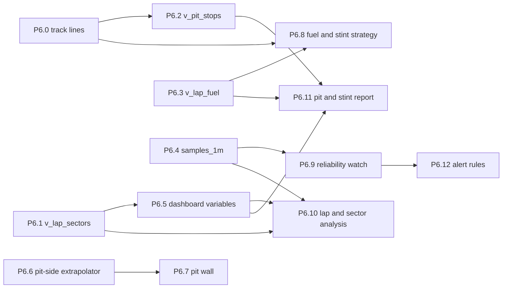

# Phase 6 work packages — the endurance dashboard set

Briefs for the dashboards a race engineer actually stands in front of
during a six-to-twenty-four hour event, and for the read surface they need
underneath. Phase 5 shipped one dashboard — the car-and-engine view — plus
the provisioning discipline, the `samples_1s` aggregate and the
session-control operator UI. This phase turns one dashboard into a set, and
adds the three views and one aggregate that set cannot be built without.

Phase 5's closing section said the next dashboards get briefed *after* the
first one has been used in anger, and that remains the right rule for
layout. It is the wrong rule for the schema work, which is why this
document is split down that line: **the read-surface packages (P6.1–P6.4)
and the variable work (P6.5) are independent of what the first race
teaches and can start now; the dashboard and alerting packages (P6.7–P6.12)
are briefed here but explicitly re-openable after the first event.**
Nothing in P6.1–P6.5 is a guess about layout.

## What this phase exists to answer

1. **The pit has a car dashboard and no strategy dashboard.** Everything
   currently provisioned answers "what is the engine doing". Nothing
   answers "will we make the window", "which driver is costing us", or
   "what has drifted since hour one" — which is most of what endurance
   race engineering consists of.
2. **Three questions the read surface cannot answer.** `v_lap_sectors` and
   `v_pit_stops` were deferred by name in P5.2. Per-lap fuel is a third
   that nobody has designed yet, and it is the one that matters most.
3. **Nobody watches a gauge at 3am.** The stack has zero alert rules
   (`provisioning/alerting/none.yaml` is a placeholder that exists to say
   so). Over a race distance, a threshold rule is worth more than a tenth
   dashboard.
4. **`samples_1s` was sized for a sprint.** One bucket size, chosen against
   a 6-hour default range on a dashboard with a dozen trace panels. The
   next event is 36 hours — 129,600 buckets per channel per panel. P5.2
   said the second bucket size gets added when a panel is measurably too
   slow; a 36-hour range is the thing that makes it measurably too slow.

5. **Nothing in the stack has been sized for 36 hours of samples.** At
   `LINK_BUDGET.md`'s ~4,000 samples/s that is ~518 M rows in one event,
   which is roughly **37 GB** of heap and index before the continuous
   aggregates and WAL. This is a deployment problem rather than a dashboard
   one, it is not a work package here, and it is the single most important
   thing in this document — see "Before the next event" below.

## Ground rules for every work package

Everything in `PHASE2.md`, `PHASE3.md`, `PHASE4.md` and `PHASE5.md` →
"Ground rules" still applies verbatim, in particular: dashboards are code
and live in `deploy/pit-config/grafana/`, dashboards read the views and
never the base tables, every datasource gets an explicit `uid`, no secrets
in a checked-in dashboard, and units are physical with the Kelvin trap
concentrated in the temperature panels. Additions:

- **Migrations stay additive and numbered.** This phase adds `003_*.sql`
  and possibly `004_*.sql`. `001_init.sql` and `002_trace_read_surface.sql`
  are never edited once applied anywhere. Nothing here alters `samples`,
  `laps`, `v_samples_named`, `v_samples_1s_named` or `v_laps`.
- **A new view is a new grant.** Migration 002 gave `grafana_ro` `SELECT`
  on exactly the views that existed then. Every view this phase adds needs
  the same grant in the same migration that creates it, or the dashboard
  reading it fails at runtime rather than at review.
- **Plugins are allowed, and every one is pinned and pre-staged.** PHASE5
  locked decision 4 restricted this stack to a single non-core plugin. That
  restriction is lifted (see locked decision 7 below); the engineering
  constraints behind it are not. A plugin is added by pinning an exact
  version in `GF_PLUGINS_PREINSTALL_SYNC`, never by floating a range —
  `grafana-mqtt-datasource` is held at 1.1.0 because 1.2.0+ rejects every
  live subscription, which is the whole argument in one line. The
  synchronous preinstall downloads at first start into the `grafana-data`
  volume, so **a pit that is offline at the track only needs to have been
  online once** — which makes "start the stack once, on a network, before
  loading the trailer" a runbook step rather than a risk. Each plugin also
  earns a one-line note saying what core Grafana could not do, because the
  cost of a plugin is not the install, it is the version that breaks
  quietly two days before an event.
- **Every new dashboard extends `tests/test_grafana_dashboards.py`
  automatically.** The suite globs the dashboards directory, so a new file
  is covered by the uid, datasource, secret-scan, plugin and SQL-execution
  contracts the moment it lands. A new dashboard that makes that suite fail
  is not done. One of those contracts needs widening in this phase:
  `test_dashboards_use_only_core_panels_and_the_single_allowed_plugin`
  encodes the old one-plugin rule in its name and its assertion. It becomes
  an allowlist that is **derived from the pinned preinstall list** rather
  than one hard-coded plugin id — so a panel type that no deployed plugin
  provides still fails, which is the check that was actually worth having.
- Same commit discipline: one commit per work package, conventional
  message (`feat: … (P6.x)`, `docs: … (P6.x)`), pre-commit green, never
  `--no-verify`. Work lands through a branch and a PR.

## Decisions locked for this phase

1. **Per-lap fuel is computed from `car.fuel_total_used`, not from
   `car.fuel_flow_rate`.** This was measured, not assumed — see P6.3 for
   the evidence. `car.fuel_flow_rate` broadcasts at 8.4 Hz containing
   all-zero bytes throughout a 130-second engine run and is not configured
   on the donor car. It is also not an independent fallback even when it is
   configured, because it comes out of the same injector model as the
   counter and fails the same way.

2. **`car.fuel_level` is the cross-check everywhere except the refuelling
   stop, where it is the primary.** Nothing on the car measures fuel
   *added*, so the counter alone cannot track tank contents across a
   refuel. The level sensor re-bases the model at each refuelling stop and
   the counter decrements it in between (P6.3). 0.1 L resolution and
   observed to move with supply voltage — but the key-on, engine-off,
   stationary-in-the-bay moment when the ECU wakes at the end of a stop is
   the one condition under which that sensor is genuinely trustworthy.

3. **Alerting ships in this phase.** Endurance is the use case that makes
   the absence indefensible. It is scoped to threshold rules on channels
   the reliability dashboard already draws, provisioned as files under
   `provisioning/alerting/` like everything else, and it does not acquire a
   notification integration that needs a secret in this repository.

4. **Five new dashboards, six with the existing car view, and no more.**
   Live (P6.7–P6.9), between-stints (P6.10), post-session (P6.11).
   `car.json` stays as the general-purpose engineering view and is not
   folded into any of them. Resisting a seventh is the point: the
   predecessor stack had eight and none of them was trusted.

5. **`timing.sector_elapsed` is deferred because it is no longer needed for
   a live sector clock.** The earlier judgement was that it waits until
   someone has missed live sector deltas at an event. P6.6 changes the
   reasoning rather than the outcome: a pit-side extrapolator derives
   sector elapsed from `sector_completed` events, `lap.sector` and the wall
   clock, with no change to the timing core at all. The vehicle stays the
   authority for every completed split. A vehicle-side
   `timing.sector_elapsed` becomes an optimisation, not a prerequisite.

7. **The single-plugin restriction is lifted, and this supersedes PHASE5
   locked decision 4.** That decision capped the stack at
   `grafana-mqtt-datasource` — a list that had shortened from three the
   moment session management left Grafana, at which point the cap cost
   nothing. It costs something now: this phase draws scatter envelopes,
   stint timelines and a refuel clock, and refusing a panel plugin on
   principle means reimplementing one badly in SQL. The owner's direction
   is that plugins are fine where they make sense. What survives is the
   discipline, not the ban: exact version pins, pre-staged before the
   event, and a stated reason core could not do it (see the ground rules).

   Worth checking before reaching for one, because modern core Grafana has
   quietly absorbed several of the obvious candidates: **XY Chart** covers
   oil-pressure-against-RPM and g-g scatter, **Geomap** covers the track
   map with a speed-coloured trail, and **State timeline** covers stint and
   pit-stop bars. The plugins likely to earn their place are the ones core
   genuinely has no answer for, not the ones that are merely prettier.

8. **The pit may extrapolate, but never onto a vehicle channel.** P6.6
   publishes `timing.lap_elapsed_pit` and `timing.sector_elapsed_pit` under
   their own names. A derived pit-side value that is indistinguishable from
   received telemetry is a trap, and the whole architecture rests on being
   able to tell a stale reading from a live one.

## Dependency graph


**P6.0 goes first and has a real deadline** — the Wanneroo refuelling and
service lines have to be right before the car runs there, it is
configuration rather than code, and it gates both P6.2's stop typing and
P6.8's refuel clock.

P6.1 through P6.4 are then mutually independent and parallel; all four are
schema work with no Grafana in them. P6.5 (template variables) is small but
blocks two dashboards, so it runs early. P6.6 is the only new service in
the phase and carries an open decision about where it lives, so start the
conversation early even if the code waits. P6.7 needs no new view and can
be built at any point after P6.6.

Suggested models: P6.3, P6.4 and P6.6 want a strong model — the first has
edge cases that silently produce plausible wrong numbers, the second has a
refresh policy that fails invisibly, and the third puts an extrapolated
number on a pit wall. P6.0, P6.1, P6.2 and P6.5 are well-specified and suit
a mid-tier model. P6.12 wants a strong model: an alert rule that never
fires looks identical to a healthy car. The dashboard packages are mid-tier
once their views exist.

---

## P6.0 — Track lines for separate refuelling and service pits

**Specs:** `src/timing/timing_core.py` → `LineType`, `classify_line()`,
`TimingEngine.process_point()`; `src/timing/tracks.py` → the KML loader;
`profiles/example-club-racer/tracks/Wanneroo.kml`; `docs/WIRE_FORMAT.md` →
`lap.event` payload.

Wanneroo's refuelling area and its service pit have **separate entries and
exits onto the track**, and the event regulations treat them differently:
no work on the car during refuelling, driver changes permitted, refuelling
stops timed with an **8-minute minimum** for safety. Service stops — driver
changes without fuel, repairs, anything spannered — use the normal pit.

Two stop types with different rules, different durations and different
strategic meaning. The read surface and the dashboards have to tell them
apart, and that starts at the track definition.

**This needs no code change.** Three properties of the existing timing core
combine to make it a configuration task:

1. `TimingEngine.pit_lines` is a filtered list, and `process_point()` loops
   over **all** of it with no `break` — unlike the lap-points loop, which
   stops at the first hit. Any number of pit line pairs works today.
2. `TimingLine.name` is free-form and is carried into the event's `line`
   field, which `docs/WIRE_FORMAT.md` includes in the `lap.event` payload.
   The line name therefore reaches the pit intact.
3. `v_pit_stops` (P6.2) parses that JSON already, so it can type a stop
   from `line` without a schema or wire-format change.

**The naming convention is load-bearing.** `classify_line()` matches
`"pit" in name and "entry" in name` — a line named `RefuelEntry`
classifies as `UNKNOWN` and is **silently ignored**, with no error and no
log line, which is the worst possible failure for a timing line. Name the
four lines so they classify:

| KML placemark | Classifies as | Means |
| --- | --- | --- |
| `PitEntryRefuel` | `PIT_ENTRY` | entering the refuelling area |
| `PitExitRefuel` | `PIT_EXIT` | leaving it |
| `PitEntryService` | `PIT_ENTRY` | entering the service pit |
| `PitExitService` | `PIT_EXIT` | leaving it |

Renaming the existing `PitEntry`/`PitExit` is part of the package, not a
follow-up — two lines called `PitEntry` and `PitEntryRefuel` is exactly the
ambiguity this is trying to remove.

**`pit_status` stays `"track"`/`"pit"` for both types.** Do not extend it.
It is CHECK-constrained in the schema, it is in the frozen wire format, and
`line` already carries the distinction. Both entry types correctly set
`lap_valid = False`; an in-lap is an in-lap regardless of why.

**Add a test that asserts the classification of the real names.** This
repository already tests its deploy configs and its runbooks; a
`classify_line()` assertion over every placemark in every shipped `.kml`,
failing on `UNKNOWN`, is the same idea and is the only thing standing
between a well-meaning rename and a dead timing line on race day.

**Acceptance:** the four lines are in `Wanneroo.kml` and every placemark in
every shipped track classifies to something other than `UNKNOWN`; a
simulated crossing of each produces a `pit_entry`/`pit_exit` event carrying
the right `line` name; `tools/lap_simulator.py` can drive a refuel stop and
a service stop distinguishably.

**Suggested model:** mid-tier. The reasoning is settled; the work is
careful GPS line placement and a test.

**Do this first.** It is config, it gates P6.2's stop typing and P6.8's
refuel countdown, and unlike everything else in this phase it has a
deadline — the lines have to be right before the car runs at Wanneroo.

---

## P6.1 — `v_lap_sectors` (`003_*.sql`)

**Specs:** `docs/PIT_SCHEMA.md` → the read surface and the `lap_sectors`
table, `docs/WIRE_FORMAT.md` → `lap.event` payload schema,
`src/pit/db/migrations/002_trace_read_surface.sql` for the grant pattern.

`lap_sectors(lap_id, sector, split_time_s, crossed_at)` is populated by the
ingest-writer and exposed by nothing. `v_laps` flattens a lap with its
session, stint and driver; this does the same for its sectors, so that
"every sector 2 by driver X in this session" is a `WHERE` clause.

Deferred by name in P5.2 with the reasoning that no Phase 5 panel needed
it. P6.10 needs it.

**Columns:** the `v_laps` column set, plus `sector`, `split_time_s` and the
sector's own `crossed_at`. Flattening the lap's context onto every sector
row denormalises deliberately — the alternative is every consumer joining
back to `v_laps`, which is the join this view exists to remove.

Grant `SELECT` to `grafana_ro` in the same migration. Update
`docs/PIT_SCHEMA.md` in the same commit: what it answers, and what it
deliberately does not.

**Acceptance:** `openlaps-migrate` applies `003` cleanly on a fresh
database and on one holding `001`+`002`; `--dry-run` lists it pending
exactly once. Tests in the `tests/test_pit_schema.py` style: seeded laps
with sectors produce one row per sector with correct lap context; a lap
with no sector rows produces no rows rather than a row of NULLs;
`grafana_ro` can `SELECT` it.

**Suggested model:** mid-tier.

---

## P6.2 — `v_pit_stops` (`003_*.sql`)

**Specs:** as P6.1, plus `docs/WIRE_FORMAT.md` → `lap.event` `type` values
(`pit_entry`, `pit_exit`).

The larger of the two deferred views. **Pit stops are not a table.** They
are a window-function pairing of `pit_entry` and `pit_exit` samples, and
P5.2 named two asymmetric edge cases that this package has to get right:

- **A car currently in the pits** has an entry and no exit, and still needs
  a duration — measured to now, and flagged as open rather than presented
  as a completed stop.
- **An agent that started in the pit lane** has an exit with no preceding
  entry. That is not a stop and is discarded, not rendered as a stop of
  unknown length.

A third that endurance adds: **the engine is routinely shut off during a
stop**, for refuelling and driver changes. Nothing in the pairing should
assume a continuous sample stream across the stop window.

**Stops are typed, from the `line` name.** P6.0 puts four pit lines at
Wanneroo — refuelling and service have separate entries and exits — and the
`lap.event` payload carries `line`, which this view already parses. A
refuelling stop and a service stop have different rules, different minimum
durations and different strategic meaning, and presenting them in one
undifferentiated list is the same mistake as averaging an in-lap into a
stint pace. Expose `stop_type` alongside the duration, derived from `line`,
with an explicit "unknown" for a line the view does not recognise rather
than a silent default to one of the two.

**Refuelling stops have a regulated floor of 8 minutes** at this event.
That belongs in the dashboard (P6.8), not hard-coded in the view — it is an
event regulation, not a property of the data — but the view has to make it
computable, which means the stop's start time has to be exact and not
rounded to a lap boundary.

Note that `lap.event` rows live in `samples.value_text` as raw JSON, so
this view parses JSON — the one place in the read surface that does. Say so
in `PIT_SCHEMA.md`, because it is the reason this view is more expensive
than the others and the reason a future migration might materialise it.

**Acceptance:** as P6.1's shape. Tests must cover both named edge cases
explicitly plus the normal paired case, and an open stop must report a
duration that grows between two queries.

**Suggested model:** mid-tier, but the edge cases are the package.

---

## P6.3 — `v_lap_fuel` (`003_*.sql`)

**Specs:** `profiles/example-club-racer/catalog.yaml` → the `car.fuel_*`
channels and their units, `docs/PIT_SCHEMA.md`, `docs/CATALOG.md`.

The genuinely new design problem in this phase, and the one that carries
the strategy dashboard. Lap boundaries are irregular timestamps, so a
continuous aggregate cannot express this; it wants a lateral join taking
the first and last `car.fuel_total_used` inside each lap's `crossed_at`
window.

### The measurement this is built on

Not assumed. Measured from `candump-2026-05-23_085133.log` (235,840 frames,
154.9 s, containing a real engine start — the current repository fixture is
the first 8,000 frames of it and has the engine switched off throughout,
which is [issue #41](https://github.com/Robert-McMahon/openlaps/issues/41)):

| Channel | Finding |
| --- | --- |
| `car.fuel_total_used` | **Works.** 0 → 57 cc, monotonic, 57 increments of exactly 1 cc, first increment 1.5 s after the engine fires and last 0.6 s before it stops. 26.2 cc/min ≈ 1.57 L/hr at warm idle — physically plausible, which is what says the injector model behind it is calibrated |
| `car.fuel_flow_rate` | **Dead.** All-zero raw bytes across 1,297 frames at 8.4 Hz, right through the engine run |
| `car.fuel_trip_used` | **Dead.** Trip meter never started; both its signals all-zero |
| `car.fuel_level` | **Live, coarse.** 0.1 L resolution. Its only movement in the log is a 0.1 L dip beginning exactly at the cranking voltage sag (battery to 10.4 V) and recovering ~3 s after the voltage does |

1 cc resolution against a lap burning 300–1000 cc is 0.1–0.3% quantisation.
Not a constraint.

### What the view has to handle

- **Counter resets.** `TOTAL_FUEL_USED` is *since engine startup*, and in
  endurance the engine is shut off at every driver change and refuel. A lap
  straddling a restart produces a negative delta. **Discard it; never
  record negative fuel burn.** The available log has exactly one engine
  start so it cannot demonstrate the reset behaviour either way — the
  counter did read 0 through 17 s of ECU-powered, engine-off time before
  first fire, which is consistent with a per-start reset but does not
  establish it. Handle it defensively regardless.
- **Laps with no samples in window.** A lap recorded while the vehicle link
  was down has lap rows and no fuel rows. NULL, not zero — zero burn for a
  completed lap is a strategy error, not a missing value.
- **Unattributed laps.** `v_laps` carries laps with NULL `session_id`
  (`PIT_SCHEMA.md` is explicit that a lap with no session is still a lap).
  This view inherits that and does not invent attribution.

**Columns:** the lap identity from `v_laps`, plus fuel used in the lap
(cc and L), the counter values at both ends, and a flag distinguishing a
clean measurement from a discarded-reset lap. Litres alongside cc because
every strategy number a human reads is in litres and a dashboard should not
be doing unit arithmetic in a panel expression.

### Fuel added is not measured — so the level sensor re-bases the model

`TOTAL_FUEL_USED` counts fuel **out**. Nothing on the car counts fuel
**in**. So tank contents cannot be derived from the counter alone, and the
level sensor stops being a mere cross-check and becomes load-bearing at
exactly one moment: the refuelling stop.

The model is:

```
fuel_remaining(t) = level_at_last_rebase
                    - Σ positive deltas of car.fuel_total_used since that rebase
```

Summing **positive** deltas is what makes this robust. The counter resets to
zero at every engine start, and in a 36-hour race the engine is stopped at
every refuel and at most driver changes. Summing positive deltas absorbs
every reset without needing to detect one, and it means a reset without a
refuel — a service stop for a driver change — simply carries the running
total forward, which is correct.

**The ECU is off during refuelling, so the re-base happens at stop exit,
not during the stop.** The logger stack stays live throughout — but with
the ECU unpowered there are no CAN frames, so `car.fuel_level` has no
samples at all for the length of the stop. Do not design around an
eight-minute averaging window that will not exist.

What exists instead is better than it sounds. When the ECU comes back on at
the end of the stop there is a **key-on, engine-not-yet-running window**,
and every condition that makes the level sender untrustworthy is absent in
it: the car is stationary in the refuel bay so there is no slosh, the engine
is not turning so there is no vibration, and the sender is powered off a
settled electrical load. That is the exact state captured in
`candump-2026-05-23_085133.log`, where the ECU broadcast for **17.3 seconds
before cranking began** — at 4.2 Hz, roughly seventy level samples with
visible dither, which is enough to average through the 0.1 L quantisation.

**Re-base from the key-on window, and fall back to post-start.** If the
window is too short — a driver who cranks immediately — use the first
stable reading after the voltage recovers from the start instead, and mark
the re-base as the lower-confidence one. The measurement in this brief
shows the level dipping 0.1 L exactly with the crank voltage sag and
recovering about 3 s after the voltage does, so **never re-base across a
start** under any circumstance.

**Capture the reading before shutdown too, and you get fuel added for
free.** The last stable level before the ECU powers down at refuel entry,
against the first stable one after it comes back at exit, is a direct
measurement of **how much fuel actually went in**. That is worth having on
its own — a short fill is a strategy problem that is otherwise invisible
until the car runs dry early — and it independently cross-checks the exit
reading that the whole model re-bases on.

**Fuel temperature** is the remaining second-order term: cold fuel into a
hot car is roughly 0.85 L per 60 L per 15 °C of thermal expansion, and
`car.fuel_temp` exists (in Kelvin). Real, and explicitly **not** in scope
for the first version — noted so the next person knows it was considered
rather than missed.

**Service stops do not re-base.** No fuel was added, so the last re-base
still stands and the counter simply carries on.

### The validation this buys, which is the point

Level-derived burn across a stint and counter-derived burn across the same
stint are two independent measurements of the same quantity. They should
agree. **A panel showing them diverging is how the team learns whether to
trust the number before betting a race on it** — and divergence is
diagnostic, pointing at either injector-model drift or a level-sender
problem. Build the comparison, not just the primary.

**Keep the level regression itself in a separate view.** Do not fold a
stint-scale regression over `car.fuel_level` into a per-lap view: different
failure modes (voltage transients, slosh), a different natural window, and
mixing them produces one column nobody can reason about. It lands as
`v_stint_fuel_level`, with the voltage-transient rejection stated, and
`v_lap_fuel` stays per-lap. The re-basing above reads that view; it does
not reimplement it.

**Acceptance:** as P6.1's shape, plus: a seeded sequence with a mid-lap
counter reset yields a discarded lap and not a negative one; a lap with no
samples yields NULL and not 0; cc and L agree; `grafana_ro` can `SELECT`
it. Update `docs/PIT_SCHEMA.md`, including the reset semantics — the next
person to read this view needs to know why a lap can be NULL.

**Suggested model:** strong. Every edge case here produces a plausible
wrong number rather than an error, and a plausible wrong fuel number loses
a race.

---

## P6.4 — `samples_1m` (`004_*.sql`)

**Specs:** `src/pit/db/migrations/002_trace_read_surface.sql` — this is
that file's pattern at a coarser bucket, `docs/PIT_SCHEMA.md` →
"One-second traces", `docs/LINK_BUDGET.md` §3.

P5.2 shipped one bucket size and said explicitly that a second one gets
added "when a panel is measurably too slow, not in anticipation of one".
Endurance is that measurement. **The next event is 36 hours**, which is
129,600 one-second buckets per channel per panel, and P6.9 puts a dozen
trace panels with min/max bands on one screen. At one minute the same range
is 2,160 buckets.

The earlier draft of this package said "measure before building, and
declining it is a real outcome". At 36 hours that hedge is gone: build it,
and use the measurement to confirm rather than to decide.

If it is built: `time_bucket('1 minute')`, same `avg`/`min`/`max`/`count`
column set, same numeric-only rule, same unbounded start offset for the
same reason (backlog and historical imports insert old samples), plus
`v_samples_1m_named` in the same named shape so a panel switches bucket by
changing one table name. Cascade it off `samples_1s` rather than off
`samples` if Timescale's version supports it on this schema — recomputing
minutes from seconds is far cheaper than from raw, and `min`/`max` compose
correctly across that nesting while `avg` needs weighting by `count`.
**That weighting is the trap in this package**: a naive `avg(avg)` over
unequal-count buckets is wrong, quietly, and only under exactly the
irregular sampling that report-by-exception produces.

**Acceptance:** the aggregate's `min`/`max` match a hand-checked value over
raw `samples`; its `avg` matches a count-weighted hand calculation over
buckets of deliberately unequal counts; text channels are absent; the
grant covers `grafana_ro`; `PIT_SCHEMA.md` describes it. If declined, a
dated paragraph in `PIT_SCHEMA.md` recording the measurement.

**Suggested model:** strong.

---

## P6.5 — Dashboard template variables

**Specs:** `deploy/pit-config/grafana/dashboards/car.json` → its existing
`vehicle`, `session` and `trace_source` variables.

Small, and it blocks two dashboards, so it runs early rather than being
rediscovered inside P6.10.

Three additions, all sourced from the relational tables the way `vehicle`
and `session` already are:

- **`driver`** — from `drivers` via `v_laps`. Every between-stints question
  is per-driver.
- **`stint`** — from `stints`, dependent on `session`.
- **`lap`** — a lap picker keyed on `lap_id`, so laps compare **by identity
  rather than by time range**. This is the thing the relational schema
  bought that the predecessor's Flux tags could not do, and P5's closing
  section names it specifically. Label it with lap number, driver and time
  so the dropdown is readable; the value is the `lap_id`.

Deliver as a documented, copyable variable block plus its application to
one existing dashboard, not as a floating snippet. A variable definition
that lives only in a brief is a variable definition that drifts.

**Acceptance:** `car.json` still passes `tests/test_grafana_dashboards.py`;
the lap picker's query executes against a seeded database and returns
`lap_id` values; a chained variable (stint depending on session) repopulates
when its parent changes.

**Suggested model:** mid-tier.

---

## P6.6 — Pit-side timing extrapolator

**Specs:** `src/agent/timing_app.py:186-192` (`timing.lap_elapsed`),
`src/timing/timing_core.py` → `TimingEvent.time`, `docs/WIRE_FORMAT.md` →
`lap.event`, `adr/0008-rp2040-gnss-receiver-interface.md`,
`deploy/pit-config/live-decoder.yaml`.

A pit-side clock that runs up smoothly from the last line crossing and is
corrected by the vehicle's authoritative value when the lap or sector
completes.

**What already exists.** `timing.lap_elapsed` is emitted per GPS point as
`point.timestamp - state.lap_start_time` and published at 10 Hz by
live-decoder. The count-up is therefore already smooth **while the radio is
up**. Two things are missing, and only one of them is cosmetic:

- **It stops when the link drops.** `ARCHITECTURE.md` is explicit that a
  dead link shows as stale gauges, not zeros — so the lap timer freezes at
  whatever it last received. That is the moment a pit wall most wants a
  clock.
- **There is no sector equivalent.** `timing.sector_elapsed` does not
  exist, which is what locked decision 5 deferred.

**Grafana cannot do this.** Core panels are query-driven and hold no state,
so a free-running local clock would need a second plugin — which locked
decision 4 forbids. It belongs in a pit-side service.

**The mechanism.** Every crossing event carries `time`: the **interpolated
crossing time in epoch seconds**, computed on the vehicle from GPS. A pit
service holding the last `lap.event` can publish `now - event.time` at
whatever rate the dashboard wants, and it keeps counting through a radio
dropout because it depends on the pit's own clock, not on new samples.

Because it extrapolates from the crossing *timestamp* rather than from the
arrival time, **publish lag corrects itself** — the service does not need
to know or estimate the link latency.

**This dissolves locked decision 5's blocker.** A live sector clock comes
from `sector_completed` events plus `lap.sector` plus the wall clock, with
**no change to the timing core at all**. `timing.sector_elapsed` stays
deferred because it is no longer the only way to get the number. The
vehicle remains the authority for every completed split and lap time; the
pit only fills the gap between crossings.

**Three hazards, all of which have to be visible rather than hidden:**

1. **Runaway.** If a `lap_completed` event is lost or late, the pit clock
   counts straight past the real lap time and then snaps backwards when the
   event lands. Degrade visibly once elapsed exceeds a plausible bound —
   a multiple of the best lap is the obvious one — rather than continuing
   to present a confident wrong number.
2. **Clock divergence.** This is only sound while the pit host's clock
   agrees with the vehicle's GNSS-derived one. `sys.host.clock_offset_s`,
   `clock_stratum` and `clock_source` already exist for exactly this.
   Gate the extrapolation on them and say on the dashboard when it is
   ungated.
3. **Mistaking it for telemetry.** An extrapolated value must be
   distinguishable from a received one, in the topic name and on the panel.
   Publish it under its own names — `timing.lap_elapsed_pit` and
   `timing.sector_elapsed_pit` — never over the vehicle's channels.

**It is a separate pit service — settled, not open.** live-decoder is the
wrong home: it is a selection-and-rate-limiting republisher, its config
file is a channel selection, and giving it a derivation role muddies a
service whose single job is currently easy to describe in one sentence.
The cost is a real one — a new service to deploy, health-check, document
and monitor — and it is accepted deliberately rather than absorbed by
overloading an existing one.

Follow the shape the other pit services already have: its own module under
`src/pit/`, a `/health` endpoint in the live-decoder style, an entry in
`deploy/pit-compose.yaml`, its own environment block in `example.env`, and
a row in whatever the deploy-topology test asserts. A new pit service that
is invisible to `tools/link_probe.py` and the bench check is a new blind
spot, and this one is on the critical display path.

**It is a derivation service, not a store.** It holds the last crossing
event per line and nothing else. Its entire state should be reconstructible
from the next `lap.event` that arrives, so a restart mid-race costs one
crossing of accuracy and never needs a database, a volume or a migration.

**Acceptance:** with the vehicle link severed mid-lap, the pit clock keeps
running and the panel says it is extrapolating; when the link returns and
the lap completes, the displayed lap time is the vehicle's value and not
the extrapolation; a lost `lap_completed` produces a visibly degraded
display rather than an unbounded count; sector elapsed tracks
`lap.sector` correctly across a sector boundary; nothing is ever published
onto a `timing.*` channel the vehicle owns.

**Suggested model:** strong. The failure mode is a confident wrong number
on a pit wall, which is the same failure mode as P6.3 and is worse than an
error.

---

## P6.7 — Pit wall / live timing

**uid:** `pitwall`. **File:**
`deploy/pit-config/grafana/dashboards/pitwall.json`. **Datasource:**
`mqtt-live` almost throughout.

The thing a pit wall actually watches, at 1 s refresh. Depends on no new
view, which makes it the first dashboard to build.

Lap number, current lap elapsed (`timing.lap_elapsed`), last
(`lap.last_time`), best (`lap.best_time`), delta to best
(`timing.delta_best`), predicted (`timing.predicted_lap`), position on a
map with the trail coloured by speed (`position.lat`/`lon`/`speed`), stint
clock, driver name. All of these publish today —
`deploy/pit-config/live-decoder.yaml` already selects `lap.*` unlimited and
`timing.*` at 10 Hz.

**Large type, few numbers.** This is read at distance, in sunlight,
by someone who is also doing three other things. The car dashboard is the
one that gets to be dense; this one is not. If a panel is not readable from
two metres it does not belong here.

**Sector deltas are absent and the dashboard says so** — locked decision 5.
A quiet omission reads as a broken panel; a labelled one reads as a
decision.

`position.fix_quality` deserves a small indicator: an RTK fix dropping to
autonomous changes what the map and the speed trace are worth, and it is
the kind of thing that is obvious in hindsight and invisible at the time.

**Acceptance:** against a replayed session with `tools/lap_simulator.py`,
every panel updates at the feed's rate; severing the vehicle link leaves
panels stale rather than zeroed; passes the dashboard test suite.

**Suggested model:** mid-tier.

---

## P6.8 — Fuel and stint strategy

**uid:** `fuel`. **Depends on:** P6.3.

The highest-value endurance-specific dashboard and the one with no
equivalent anywhere in the predecessor stack.

- Litres per lap, and a rolling mean over the last *n* laps — the rolling
  number is the one strategy is computed from, because a single lap is
  traffic and safety cars.
- **Laps remaining at current burn**, against fuel remaining.
- Projected dry time, against the stint clock, against the next planned
  window. Three clocks on one axis is the entire dashboard in one panel and
  it is worth spending the space on.
- Target lap time to reach the window — the number that gets radioed.
- In-lap and out-lap cost, which distorts every per-lap average and should
  be visible rather than averaged into the strategy.
- `car.fuel_level` drawn as a slow-smoothed cross-check, **visibly labelled
  as the cross-check**, per locked decision 2 — plus the level-vs-counter
  divergence panel P6.3 describes, which is how the team decides whether to
  believe any of this.

**The refuelling stop clock is a panel with consequences.** Refuelling
stops at this event have a regulated **8-minute minimum**, so releasing the
car early is a penalty rather than a gain. During a refuel stop the
dashboard shows elapsed, time remaining to the legal minimum, and the wall
time at which the car may be released — large, and unambiguous about which
of those three numbers is which. It reads its stop type from P6.2 and its
start from the `PitEntryRefuel` crossing.

**Driver changes are permitted during refuelling; work on the car is not.**
That makes "can this driver change be folded into the next refuel stop?"
one of the highest-value questions on the dashboard, because the answer
turns a separate service stop into no time lost at all. Show the stint
clock against the fuel window against the driving-time regulations, so the
question is answerable at a glance instead of on a whiteboard.

**Where the numbers are uncertain, show it.** A projected dry time computed
from three laps of data and one computed from a full stint should not look
identical. This is the dashboard most likely to be believed when it should
not be.

**Acceptance:** against a seeded database with a known fuel profile, the
per-lap and rolling numbers match a hand calculation; a lap containing a
counter reset appears as a gap, not a spike; passes the dashboard suite.

**Suggested model:** mid-tier once P6.3 lands.

---

## P6.9 — Reliability watch

**uid:** `reliability`. **Depends on:** P6.4 (or its measured decline).

Built to compare hour one against hour six. That framing is the only thing
separating it from the car dashboard's trace row, and it should drive every
choice in it — default range is the whole session, not the last hour.

- Oil pressure against RPM as an envelope, not two lines. A pressure that
  is fine at 6,000 rpm and quietly no longer fine at idle is the shape this
  catches.
- Coolant, oil and gearbox oil temperature trends with min/max bands from
  the aggregate, per P5.2's reasoning about what an average hides.
- Knock (`car.knock_level1`/`2`) as counts over time rather than a trace.
- `car.engine_protection_severity` / `_reason_number` / `_reason_letter`
  and `car.check_engine_light` as an event strip.
- Alternator voltage under electrical load — and the **PDM per-circuit
  currents**, which are the genuinely endurance-specific panel here. A
  thermo fan drawing more current at hour five than at hour one is a
  bearing telling you something, and the donor car exposes a dozen of these
  (`car.thermo_fan_1_current`, `car.fuel_pump_current`,
  `car.ign_coils_current`, `car.power_steering_pump_1_current` and the
  rest).
- Night running: `car.head_light_current`, the light states, and
  `car.pd16_total_current` against `car.battery_v`.

**Every temperature panel is a Kelvin trap.** See the ground rules; this
dashboard has more of them than any other.

**Acceptance:** a session-length range renders without visible query delay
on the pit hardware — this is the panel P6.4 exists for and the measurement
that justifies it; passes the dashboard suite.

**Suggested model:** mid-tier.

---

## P6.10 — Lap and sector analysis

**uid:** `laps`. **Depends on:** P6.1, P6.5, and P6.4 for the long ranges.

Between-stints, SQL only, no live feed.

Lap-time scatter by driver and stint; best theoretical lap from the best
sector splits; sector-by-sector deltas between two laps chosen with the lap
picker; degradation as lap time against lap-in-stint. Outlier flagging so
that traffic, safety cars and off-track laps are visibly excluded from a
degradation trend rather than silently included — `v_laps.valid` and
`pit_status` carry most of what is needed.

**Acceptance:** every panel's SQL executes against a seeded database and
returns its declared columns; the lap picker drives a genuine two-lap
comparison; passes the dashboard suite.

**Suggested model:** mid-tier.

---

## P6.11 — Pit and stint report

**uid:** `stints`. **Depends on:** P6.2, P6.5, and P6.3 for per-driver
burn.

Post-session, and the dashboard a team argues over on Sunday night.

Stop durations and pit-lane delta from `v_pit_stops`; a stops timeline
against planned windows; per-driver consistency (median, spread, best, and
laps within 1% of best); **per-driver fuel burn**, which routinely varies
5–10% between drivers and changes strategy outright; in/out lap cost per
driver; and driving-time compliance, which `stints` can nearly answer today
and which many endurance regulations make a hard requirement rather than an
interest.

An open stop (P6.2's first edge case) must be visibly open here, not
rendered as a completed stop of the current duration.

**Acceptance:** as P6.10's shape, plus the open-stop rendering.

**Suggested model:** mid-tier.

---

## P6.12 — Alert rules

**Specs:** `deploy/pit-config/grafana/provisioning/alerting/none.yaml` —
the placeholder this replaces, and its comment explaining why the directory
has to exist at all.

Locked decision 3. Threshold rules on channels P6.9 already draws, so that
every alert has a panel to explain it: oil pressure low against RPM,
coolant and oil temperature high, battery voltage low, knock, engine
protection severity, and — the pipeline one — `sys.agent.publish_lag_ms`
high or the live feed stale.

**Scope discipline.** Provisioned as files, like everything else. **No
notification integration that requires a secret in this public
repository** — the delivery channel is a decision for the deployment, and
this package ships the rules plus a documented, secret-free local
contact point.

**A refuelling stop looks exactly like a CAN bus failure.** The ECU is
powered down while the logger stack stays live, so every `car.*` channel
stops arriving while `sys.agent.*` keeps publishing happily. Any rule
phrased as "no engine data for N seconds" fires at every single refuel stop
in a 36-hour race, and an alert that cries wolf a dozen times a night is
worse than no alert — it trains the crew to dismiss the one that matters.
Gate the staleness rules on pit status, or scope them to a car that is on
track.

The hard part is not the syntax. It is that **an alert rule that never
fires looks exactly like a healthy car.** Every rule needs a demonstrated
firing in a test or a runbook step, or it is decoration. Thresholds lifted
from the legacy dashboards are in Celsius and the channels are Kelvin;
that trap has already cost this project once.

**Acceptance:** rules provision cleanly into a running Grafana; each rule
has a demonstrated firing against seeded or replayed data; no secret
appears in any provisioned file; `tests/test_grafana_dashboards.py`'s
credential scan extended to cover `provisioning/alerting/`.

**Suggested model:** strong.

---

## Before the next event

Not work packages, and more important than any of them. The next event is
**36 hours**, and three things in this list are load-bearing for it.

- **Storage has headroom, but the estimate should be measured.** The pit
  runs on the development laptop: Docker's root is `/var/lib/docker` on a
  1 TB NVMe filesystem with ~934 GB free, so an estimated ~37 GB race is
  comfortable and the volume needs no relocating. Two notes rather than
  actions. The figure is 518 M rows × ~72 bytes of heap and index derived
  from `LINK_BUDGET.md`'s ~4,000 samples/s, and a timed replay through the
  real stack gives a true bytes-per-row that scales honestly — worth doing
  once, because everything downstream of it is arithmetic. And under WSL2
  the ext4 volume is a dynamically-growing VHDX on the Windows disk, so the
  real ceiling is that disk's free space (~561 GB) rather than the ~934 GB
  reported inside; the VHDX also does not shrink when data is deleted.
  Neither matters at 37 GB. Both would matter at ten races.
- **Report-by-exception is switched off** — no channel in the shipped
  catalog carries an `rbe` policy, so every sample is stored. That was
  filed as a link-budget tidiness item; at 36 hours it is a capacity item,
  because rows removed at the vehicle are rows not written at the pit.
- **Nothing backs this database up.** `PIT_SCHEMA.md` says Timescale is the
  archive and there is no retention policy by design. After this event the
  archive contains 36 hours of data that exists in exactly one place, on
  consumer storage, in a car park. Phase 5 said this should not wait much
  past cutover.

## After Phase 6

- **`timing.sector_elapsed`** and live sector deltas, if the first event
  makes the case (locked decision 5).
- **Whatever the first race teaches.** The same clause Phase 5 closed on,
  and it applies to this set exactly as it applied to the first dashboard.
  Expect the fuel dashboard to be the one that changes most.
- **Backup and restore**, still. Phase 5 said it should not wait much past
  cutover; this phase adds three views and possibly a second aggregate to a
  database that nothing backs up.
- **Materialising `v_pit_stops`** if its JSON parsing proves too slow over
  a race distance — noted in P6.2 so the option is already scoped.
- **The configuration surface and its ADR**, unchanged from Phase 5's
  closing section: the tiered operational/engineering split, the
  docker-socket question, and the `cmd.<vehicle>.config` path.
- **Report export.** Six dashboards is the point at which someone asks for
  a PDF at the end of an event. It is not briefed here and it is the most
  likely seventh thing.
