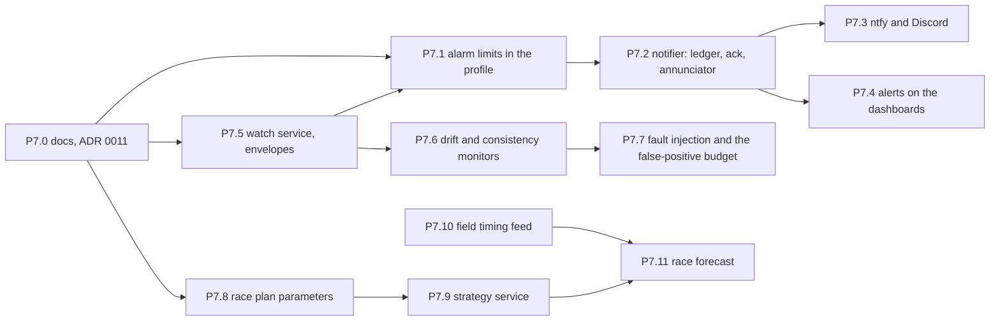

# Phase 7 work packages — alerting, anomaly detection and prediction

Briefs for the part of the pit that watches when nobody else can. Phase 6
shipped the endurance dashboard set, the read surface under it, the
pit-side timing extrapolator and eight threshold alert rules that post to a
local log. This phase turns "eight rules that land in a log" into an
alerting path a tired crew can trust, adds a service that looks for the
faults no single threshold catches, and puts the strategy arithmetic —
fuel, stops, driver time, and where the car finishes — into code that runs
continuously instead of a panel expression that runs when someone looks.

The framing is the one the owner gave: during an endurance race the team
is stretched thin, tired, and not always looking at all the relevant data.
Every package here is judged against that sentence. A feature that needs a
rested engineer staring at the right panel to be useful does not belong in
this phase.

Everything here is agent-ready in the Phase 3 sense: a brief plus the specs
it names should be executable with no prior context. The later packages
(P7.10, P7.11) depend on an external data source that this repository has
never touched, and they say so; their first step is a spike, not a build.

## What this phase exists to answer

1. **An alert that lands in a log is not an alert.** P6.12's rules post to
   `session-control`'s `/grafana-alerts`, which writes one line per alert
   to the service log. Nothing on a screen changes colour, nothing makes a
   sound, nothing reaches a phone, and nothing records that a human saw it.
   `docs/BENCH_RUNBOOK.md`'s firing drill reads the result back with
   `docker compose logs`. That is the correct first step and an
   indefensible last one.

2. **Alarm limits are buried in generated-looking YAML.** The eight rules
   in `provisioning/alerting/endurance.yaml` carry their thresholds inside
   raw SQL strings, in Kelvin, against a hard-coded vehicle id
   (`'example-club-racer'`, in a stack whose pit names its vehicle once in
   `OPENLAPS_VEHICLE_ID`). Changing "coolant high" from 110 °C to 105 °C
   means editing an SQL string in a 500-line file and getting the Kelvin
   conversion right by hand. The limits are car configuration and belong in
   the profile, next to the catalog that gives the channels their units.

3. **Thresholds catch the failure; nothing catches the *change*.** Oil
   pressure that is fine at 6,000 rpm and quietly lower at idle than it
   was at hour one, a thermo fan drawing 15 % more current than it did at
   the start, one wheel speed reading 2 % under the other three — none of
   these cross a fixed limit until the damage is done. P6.9's reliability
   dashboard draws every one of them, for a human to compare hour six
   against hour one by eye, at 3 am.

4. **Strategy is a panel expression.** `fuel.json` panel 3 computes laps
   remaining as `level_end_l / fuel_used_l` per lap, with no rolling
   window, no in/out-lap exclusion, no confidence, no driver-time
   regulation and no knowledge of when the race ends. It was briefed as
   the first version and it is; it is also what the crew will radio from.

5. **The pit knows nothing about the other cars.** Position, gap, the
   rival's stint length and pit count, the flag state — every one of these
   changes the right strategy call and every one of them is on a live
   timing screen the pit already has open in a browser tab. None of it is
   in the database, so none of it can be reasoned about.

## Ground rules for every work package

Everything in `PHASE2.md` through `PHASE6.md` → "Ground rules" still
applies verbatim: dashboards are code, dashboards read views, migrations
are additive and numbered, every new view gets its `grafana_ro` grant in
the migration that creates it, plugins are pinned and pre-staged, no
secrets in anything checked in, and units are physical with the Kelvin
trap named at every temperature. Additions:

- **The pit never publishes onto a vehicle channel.** PHASE6 locked
  decision 8 extended: every value this phase derives at the pit lives in
  a pit-owned namespace (`watch.*`, `strategy.*`, `field.*`), never in
  `car.*`, `position.*`, `lap.*`, `timing.*` or `sys.*`. These namespaces
  never appear in a catalog and never cross the radio. `docs/CATALOG.md`
  gets a paragraph saying so (P7.0).
- **Derived pit data is written to Timescale by the service that derives
  it**, following `pit-monitor`'s pattern (`src/pit/pit_monitor/store.py`:
  sync psycopg, one transaction per poll, connect as the owner role),
  never by teaching the ingest-writer a second input. Each such table gets
  a view and a grant like everything else in `docs/PIT_SCHEMA.md`.
- **An alert or a finding that never fires looks exactly like a healthy
  car.** P6.12's rule is now a phase-wide rule: every alert rule, every
  anomaly monitor and every strategy warning has a demonstrated firing in
  a test or a runbook step, *and* a demonstrated non-firing against a
  clean replay. Both, or it is decoration.
- **No cloud, no accounts, no model that needs a GPU.** The pit is a
  laptop in a car park that sometimes has internet for NTRIP. Everything
  that decides something must run offline; anything that reaches the
  internet is a best-effort add-on with a timeout and a queue.
- **No new dependency without a sentence.** This phase is the first that
  genuinely wants `numpy`. Adding it is fine; adding it silently is not
  (P7.0 records the decision). `scikit-learn`, `pandas` and anything with
  a compiled BLAS are out unless a package proves a binned lookup table
  cannot do the job.
- Same commit discipline: one commit per work package, conventional
  message (`feat: … (P7.x)`, `docs: … (P7.x)`), pre-commit green, never
  `--no-verify`. Work lands through a branch and a PR.

## Decisions locked for this phase

Settled with the owner on 2026-09-16. A first draft proposed all of these;
decisions 1, 4 and 6 were revised in that conversation and 8 was added.
Do not relitigate.

1. **Grafana stays the alert manager; a pit service does the delivery; and
   the path is tuned to under 10 seconds.** Grafana already owns rule
   evaluation, state, `for` durations, silences, history and a UI for all
   of it, and P6.12 put the rules there. What Grafana does badly —
   acknowledgement, audible annunciation, retry when the internet is down,
   and fan-out with per-severity policy — moves to one new pit service,
   **`notifier`** (P7.2), which becomes the *only* contact point Grafana
   knows about. Grafana's native Discord/Telegram contact points are not
   used: no acknowledge concept, no offline queue, and the delivery policy
   would sit in provisioning YAML where it cannot be unit-tested.

   The owner's concern is latency: as shipped, a crossing takes the
   evaluation interval (10 s), the rule's `for` (15–30 s) and the policy's
   `group_wait` (10 s) to reach anyone — up to 50 s, which is a quarter of
   a lap and the difference between "pit this lap" and a car stopped on
   the far side of the circuit. None of that is inherent. The evaluation
   floor is configuration (`min_interval` and `scheduler_tick_interval`
   under `[unified_alerting]`, both settable from the environment),
   `group_wait` can be 0, and `for` is per rule. **P7.1 sets a target of
   under 10 seconds from threshold crossing to phone for a critical
   alarm**, keeps `for` as the dominant term because it is the thing that
   stops one bad sample paging the crew, and measures the result at the
   bench. Only if that measurement misses does the fallback get built:
   the watch service already reads every sample live and can evaluate
   the same `alarms.yaml` limits at sample rate and post to the notifier
   directly, with Grafana kept as the record. Dashboard refresh intervals
   play no part in any of this.

2. **Phones get `ntfy`, on the pit LAN, with Discord as the
   internet-dependent second channel.** `ntfy` is open source, runs as one
   container in `pit-compose.yaml`, needs no account, and its Android/iOS
   apps subscribe to a self-hosted server over the pit's own wifi — so a
   phone in the garage gets a push **with no internet at all**, which is
   the constraint that rules out every hosted service as the primary.
   Discord is the second channel because the team plausibly already has a
   server, Grafana-style webhooks to it are one HTTP POST, and it works
   from anywhere — but only while the pit has internet, so it is
   best-effort by construction. WhatsApp is rejected: the Business API
   needs Meta approval, a phone number and a template review for every
   message shape. Telegram is a one-line swap for Discord if the team
   prefers it; the notifier's channel interface (P7.2) is written so that
   swap is a module, not a redesign.

3. **Alarm limits live in the profile and the Grafana rules are
   generated.** `profiles/<car>/alarms.yaml` declares each limit in the
   channel's catalog units, with a stated `for`, a clear-threshold for
   hysteresis, a severity and an on-track gate. A generator renders
   `provisioning/alerting/*.yaml` and a test asserts the rendered file is
   committed and current. The Kelvin trap is solved structurally: the
   generator reads `units` from the catalog and refuses a limit whose
   declared unit does not match.

4. **Anomaly detection is explainable, and one monitor needs almost no
   configuration.** Every monitor in the `watch` service carries the
   expected value, the observed value and the baseline it was judged
   against, so a crew member at 3 am can read a finding and decide
   whether to believe it. Two families ship:

   - **Hand-configured monitors** (P7.5, P7.6) for faults whose shape is
     known — an envelope of oil pressure against RPM and temperature, a
     drifting fan current, a wheel speed out of step with the other three.
   - **One whole-car monitor** (P7.6) configured with nothing but a
     channel list and a baseline policy. During the baseline it learns
     each channel's expected value from all the others; afterwards it
     reports, per channel, how far the observed value sits from that
     expectation, and an overall score across the vector. A finding names
     the contributing channels with their expected and observed values
     ("oil pressure 22 % below expected, oil temperature 7 K above"),
     which is the owner's requirement: enough for the crew to deduce the
     cause and what it means for strategy. This is the linear form of an
     autoencoder, needs only `numpy`, and its explanation is free rather
     than bolted on. It re-baselines per stint, because a driver change,
     nightfall or rain legitimately changes the correlations it learned.

   Isolation forests and autoencoders proper are listed under "After
   Phase 7", gated on a fault the crew found by eye that neither family
   caught.

5. **Strategy is a service, not a query.** Fuel, stops, driver time and the
   race plan are computed continuously by **`strategy`** (P7.9), written to
   Timescale and published live under `strategy.*`. `fuel.json` becomes a
   consumer of that table rather than the place the arithmetic lives.
   Scenarios are first-class: P7.9 compares alternative plans on fuel and
   stops alone, and P7.11 adds where each one finishes once field data
   exists. `watch` and `strategy` are two services, not one: one runs at
   sample rate and holds sample-level state, the other runs per lap and
   reads views; they fail differently and they restart differently.

6. **The field timing feed is an adapter with a fixed internal schema,
   and the first live source is a browser relay.** The Natsoft live
   timing page is not HTML that can be polled: it loads a 470 KB
   obfuscated client that opens a **binary WebSocket** to the same host,
   sends a binary request, and renders the standings itself, which is why
   it updates faster than any poll. Timing71's provider plugins are a
   private package, and its core library states that provider code is
   reverse-engineered and cannot be published. So P7.10 defines `field.*`
   tables shaped like Timing71's Common Timing Data format and builds
   sources behind one interface, in this order:

   1. a **replay/file source**, so everything downstream is testable;
   2. a **browser relay** — a userscript on the pit's own browser that
      reads the rendered standings table from the Natsoft live page *or*
      the Timing71 page and posts a snapshot to `timing-feed` about once a
      second. No protocol work, works with either site, needs internet,
      breaks only when a page layout changes;
   3. a **WebSocket frame capture** (Playwright, both directions) of the
      Natsoft feed during the first live session, so the question of
      decoding it is answered against real bytes rather than argued;
   4. the **timekeepers' TCP feed**, with permission — the only source
      that works with no internet, since it is local at the track.
      Capture first; decode after the event.

   **Reverse-engineering the binary WebSocket is deferred, not
   rejected.** No terms of use were found on the Natsoft site, but the
   obfuscation is a signal of intent, the client changes without notice,
   and Natsoft already supplies a live feed specification to third
   parties (HH Timing users obtain a host and port from the timekeepers).
   **Ask Natsoft for that specification before anyone opens the
   obfuscated client.** If decoding does go ahead, the decoder lives in
   the private companion repository (ADR 0007), which is how Timing71
   handles the same problem. Race prediction (P7.11) consumes the schema
   and does not care which source filled it.

7. **`numpy` is added as a dependency**, for P7.6's whole-car monitor and
   regressions and P7.11's Monte Carlo. Recorded in P7.0's ADR so the
   next person knows it was a decision and not an accident of `uv add`.
   `scikit-learn` enters only if isolation forests are later chosen.

8. **Timing71 is a format, not a dependency.** Its reusable libraries
   (`@timing71/common`, `livetiming-analysis`) are JavaScript on
   mobx-state-tree under AGPL-3.0; this is a Python repository under
   Apache-2.0 with a no-frontend-toolchain rule, and a combined work
   served over a network would carry AGPL obligations. The part that
   would actually save work — the Natsoft provider plugin — is private
   anyway. What is adopted is free: the **Common Timing Data state
   shape and column vocabulary** as the `field_*` schema; Timing71's
   **standalone WebSocket message protocol** (`MANIFEST_UPDATE` /
   `STATE_UPDATE` JSON, default port 24771) as an accepted ingest format,
   so a Timing71 service run locally could push to `timing-feed`
   unchanged; and the analysis library's stint and pit-stop prediction
   logic as a reference for P7.11. Nothing from those repositories is
   vendored or imported.

## Dependency graph



Three independent tracks after P7.0: **alerting** (P7.1–P7.4), **watch**
(P7.5–P7.7) and **strategy** (P7.8–P7.11). The one cross-link is that
P7.5's findings become alerts through P7.1's generator (a `watch` rule
kind), so P7.1 should know P7.5's table shape before it is closed —
which is why P7.0 fixes that shape in `PIT_SCHEMA.md` up front.

**Order of value if only one track can be staffed:** alerting first. A
threshold alert that reaches a phone and gets acknowledged is worth more
than any monitor or forecast, and P7.5's findings are worthless without a
delivery path.

Suggested models: P7.2 wants a strong model — it is the path an alert
takes to a human and its failure modes are silent. P7.5, P7.6 and P7.9
want a strong model; each produces a plausible number with a wrong
baseline. P7.10 wants a strong model for the spike and a mid-tier one for
the poller. P7.1, P7.3, P7.4, P7.7 and P7.8 are well-specified and suit a
mid-tier model. P7.11 wants a strong model and should not start until
P7.10 has produced a real captured session.

---

## P7.0 — Spec reconciliation and ADR 0011 (docs only; no code)

**Specs:** `docs/ARCHITECTURE.md` → "Pit data flow" and the deployment
section, `docs/CATALOG.md` → naming, `docs/PIT_SCHEMA.md`,
`docs/adr/README.md`, `pyproject.toml`.

1. **ADR 0011 — pit-derived data: namespaces, storage and the alert
   path.** One ADR, three decisions that later readers will want in one
   place: pit-owned namespaces (`watch.*`, `strategy.*`, `field.*`) that
   never appear in a catalog or on the wire; pit services writing their
   derived tables to Timescale directly in the `pit-monitor` pattern rather
   than through the ingest-writer; and Grafana as the alert manager with
   `notifier` as its only contact point (locked decisions 1 and 3 above), and Timing71 as a format rather than a dependency (locked decision 8).
   Record `numpy` as a dependency decision in the same ADR. Follow ADR
   0010's form.

2. **`docs/CATALOG.md`** — the naming section says `position.*`, `sys.*`,
   `lap.*` and `timing.*` are "the only namespaces outside `car.*`". Add
   the pit-owned namespaces with the rule that they are never mappable and
   never cross the radio, and point at ADR 0011.

3. **`docs/PIT_SCHEMA.md`** — declare the tables this phase adds, before
   any of them exist, so three packages build against one shape:
   `alert_events` (P7.2), `watch_scores` / `watch_findings` /
   `watch_baselines` (P7.5), `race_plans` (P7.8), `strategy_state` (P7.9),
   `field_session` / `field_cars` (P7.10), `race_forecasts` (P7.11). Column
   sets are given in each package; put them in the schema document now and
   have each package's migration match. Flag them as "declared, not yet
   migrated" until they land.

4. **`docs/ARCHITECTURE.md`** — add `notifier`, `watch`, `strategy`,
   `timing-feed` and `ntfy` to the pit diagram and the deployment list,
   with one sentence each. The diagram already draws things that exist;
   it should not draw things that do not, so add them with a "(Phase 7)"
   tag that P7.11's closing commit removes.

**Acceptance:** ADR 0011 is in the index; `CATALOG.md` names the pit-owned
namespaces; `PIT_SCHEMA.md` declares every table in this phase; `uv run
pytest -q` still green (the doc/code agreement tests must not be broken by
declaring tables that do not exist yet — if one is, the declaration goes
in a clearly-marked "planned" section).

**Suggested model:** mid-tier.

---

## P7.1 — Alarm limits in the profile, rules generated

**Specs:** `deploy/pit-config/grafana/provisioning/alerting/endurance.yaml`
(the file this package makes generated), `tests/test_grafana_alerts.py`,
`profiles/example-club-racer/catalog.yaml` → `units`,
`docs/BENCH_RUNBOOK.md` → "Endurance alert firing drill".

**What to build:**

- **`profiles/example-club-racer/alarms.yaml`.** One entry per limit:

  ```yaml
  alarms:
    coolant_temperature_high:
      channel: car.coolant_temp
      units: "°C"           # declared; generator converts to the catalog's K
      above: 110
      clear_below: 105      # hysteresis: the rule resolves here, not at 110
      for: 30s
      severity: critical
      gate: on_track        # on_track | always | engine_running
      summary: "Coolant temperature high"
      panel: { dashboard: reliability, id: 2 }
    oil_pressure_low:
      channel: car.oil_pressure
      units: kPa
      below: 200
      clear_above: 250
      for: 15s
      severity: critical
      gate: on_track
      when: { channel: car.rpm, above: 2000 }   # conditional limit
      ...
  ```

  Kinds the generator must support, because the existing eight need
  them: `above`/`below` with a clear threshold, a `when` condition on a
  second channel, a **staleness** kind (`live-feed-stale`: no sample on
  a channel for N seconds while gated on track), and a **watch** kind
  that alerts on `v_watch_findings` (P7.5) by severity — so the anomaly
  path reuses this file and this delivery chain rather than growing its
  own.

- **Unit handling is the point of the package.** The generator loads the
  catalog, reads each alarm channel's `units`, and either converts a
  declared `°C` limit to the catalog's `K` or fails loudly on any unit
  it cannot reconcile. A limit with no `units` key is an error, not a
  default. The rendered SQL carries a comment naming the declared value
  and the converted one, so a reviewer reading `383.15` sees `110 °C`
  beside it.

- **`tools/gen_alert_rules.py`** renders `provisioning/alerting/*.yaml`
  from every profile that has an `alarms.yaml`. The vehicle id is
  rendered from the profile's `vehicle.yaml` — not typed in — and the
  package should check whether Grafana's provisioning `$VAR` expansion
  reaches alerting files; if it does, render `$OPENLAPS_VEHICLE_ID` and
  let the environment supply it, and say so in the file header. Rule
  `uid`s are derived from the alarm key so they stay stable across
  regenerations (alert history is keyed on them).

- **Hysteresis in Grafana terms.** Grafana's threshold expression has no
  clear-threshold, so render the condition as a *pair* of thresholds
  across the `for` window in the way the Grafana version in use supports
  (the `math` expression path is the usual answer), and demonstrate in
  the test that a value oscillating between the two does not flap.

- **The latency budget** (locked decision 1). Lower Grafana's
  evaluation floor to 2 s (`GF_UNIFIED_ALERTING_MIN_INTERVAL` and
  `GF_UNIFIED_ALERTING_SCHEDULER_TICK_INTERVAL`, verified against the
  pinned Grafana version at the bench, since the second is thinly
  documented), set the rule group interval to match, set `group_wait` to
  0 in the policy, and give every alarm a `for` chosen from the physics —
  oil pressure 3 s, coolant 15 s — rather than one value for all. Then
  **measure**: a bench sample crossing a critical limit must reach the
  notifier in under 10 s, and the number goes in the runbook. If the
  measurement misses, P7.5's scope grows a sample-rate evaluation of
  `severity: critical` limits posting straight to the notifier; do not
  build that pre-emptively.

- **A sync test.** `tests/test_grafana_alerts.py` gains a contract that
  the committed rendered file equals a fresh render of the profile —
  the same discipline as dashboards-as-code, applied to the generator's
  output. The existing tests (`REQUIRED_RULES`, the secret scan, the
  pit-gating check, the runbook check) stay and pass against the
  rendered file.

**The first render must be a refactor.** Encode today's eight limits in
`alarms.yaml`, render, and diff against the committed `endurance.yaml`:
the rules should be semantically identical (same channels, same
thresholds after conversion, same `for`, same gates) before any limit is
changed. Then change limits, if the owner wants, in a separate commit
that shows only limits changing.

**Watch for:** `noDataState: OK` in the existing rules is deliberate (a
refuel stop removes every `car.*` channel) and must survive rendering.
The `runbook_url` annotations point at `reliability` panels by id; the
generator must keep them and P7.4 must keep the ids.

**Acceptance:** the rendered file for the example profile is committed
and matches a fresh render; a critical limit crossed at the bench reaches
the notifier in under 10 s and the measured figure is recorded in
`BENCH_RUNBOOK.md`; a limit declared in `°C` renders in K with
both values visible; a limit with a mismatched or missing unit fails the
generator; the firing drill in `BENCH_RUNBOOK.md` still passes for every
rule; a value oscillating across the clear threshold does not resolve and
re-fire within one `for` window.

**Suggested model:** mid-tier, with one strong-model review of the
hysteresis rendering.

---

## P7.2 — `notifier`: ledger, acknowledgement, annunciator, fan-out

**Specs:** `src/pit/session_control/service.py` → `_log_grafana_alerts`
and `POST /grafana-alerts` (the receiver this replaces as the contact
point), `src/pit/timing_extrapolator/` (the service shape to copy: config,
`/health`, compose entry, env block), `src/pit/pit_monitor/store.py` (the
DB-writer shape), `src/pit/session_control/static/` (the buildless UI
convention), `docs/PIT_SCHEMA.md`.

The service an alert has to get through to reach a person. Everything in
it exists to make one guarantee: **a critical alert is either
acknowledged by a named human or it keeps making noise.**

**What to build:**

- **The receiver.** `POST /grafana-alerts` in the Grafana webhook shape
  (the same payload `session-control` parses today; move that parsing
  here, bounded the same way). Every alert in every notification becomes
  a row in **`alert_events`** — `(time, rule_uid, alertname, status,
  severity, labels jsonb, annotations jsonb, fingerprint)` — so the
  history of what fired, when, and for how long is in the archive next
  to the data it fired on. `session-control` keeps its endpoint as a
  logging fallback and the Grafana contact point moves here.

- **The ledger and acknowledgement.** An **`alert_acks`** table —
  `(fingerprint, acked_at, acked_by, note)` — and `POST /ack` from the
  annunciator. "Who" is a name typed once and remembered in the browser;
  this is a pit crew, not an identity system. An ack on a firing alert
  stops re-notification of *that* firing; a new firing of the same rule
  is a new alert. Grafana silences are **not** used for this: a silence
  hides the alert from Grafana too, and the point of an ack is that the
  alert stays visible but stops shouting.

- **The annunciator** — a static page served by `notifier` at `/`, in the
  session-control UI's hand-written, dependency-free style. Active
  alerts, large, colour by severity, newest at the top, each with an
  acknowledge button; a running strip of the last hour; the alerting
  pipeline's own health (see the heartbeat). **Sound**: a browser tone
  on each new critical alert, repeating at an interval until
  acknowledged, on a page meant to be left open on a screen at the pit
  wall. Server-sent events for the live update — no websocket library,
  no polling, one `EventSource`.

- **Fan-out with policy.** A `channels` list in `notifier`'s config:
  each channel has a type (`annunciator`, `ntfy`, `discord`, `log`), a
  minimum severity and a repeat interval for unacknowledged alerts.
  `critical` reaches every channel and repeats every 5 minutes until
  acked or resolved; `warning` reaches the annunciator and `ntfy` once.
  The channel interface is one method — deliver this rendered message,
  return success or a retryable failure — so P7.3's `ntfy` and Discord
  are modules and a future Telegram is a third.

- **A retry queue that survives no internet.** Deliveries that fail are
  queued in memory with backoff and a deadline; a queue that drains when
  the internet returns is the difference between "the Discord message
  arrived 4 minutes late" and "it never arrived". A queue that is
  growing is itself shown on the annunciator.

- **The heartbeat.** Grafana gets one always-firing rule
  (`notifier-heartbeat`, rendered by P7.1's generator, severity `none`)
  on a short repeat interval. `notifier` records the last one received;
  the annunciator shows "alerting path healthy, last heartbeat 40 s ago"
  and goes red when it is older than three intervals. **This is the only
  way to tell a quiet night from a broken pipe**, and it is the reason
  the notifier and not Grafana owns the annunciator.

- **Service plumbing**, as P6.6 listed it: own module under `src/pit/`,
  `/health`, an entry in `pit-compose.yaml`, an `example.env` block, a
  row in the deploy-topology assertions, and a mention in
  `tools/link_probe.py`'s manifest if that is where pit services are
  enumerated.

**Watch for:** Grafana batches alerts into one notification by
`group_by`; a notification can carry several alerts, some firing and some
resolved, and the ledger must record each. The webhook is unauthenticated
by design (the comment in `endurance.yaml` explains why the operator key
is not in a committed file); bound what an unauthenticated caller can
write, as `session-control` does today, and keep the receiver on the
compose network rather than the host.

**Acceptance:** a firing rule produces a row in `alert_events`, an entry
on the annunciator, and a tone; acknowledging it records who and when and
stops the repeat; the same rule resolving records the resolution; with
every external channel unreachable, alerts still annunciate and the queue
is visible; stopping the heartbeat rule turns the annunciator's pipeline
indicator red within three intervals; `BENCH_RUNBOOK.md`'s firing drill
is rewritten to read the annunciator instead of the log.

**Suggested model:** strong.

---

## P7.3 — `ntfy` in the stack, Discord, and the phone runbook

**Specs:** `deploy/pit-compose.yaml`, `example.env`, P7.2's channel
interface, `docs/CUTOVER_RUNBOOK.md` (where the pre-event checklist
lives).

- **`ntfy` service** in `pit-compose.yaml`, pinned image, its own volume
  for the message cache, listening on the pit LAN. Two topics,
  `openlaps-critical` and `openlaps-warning`; the topic names are config,
  not code. The `ntfy` channel in `notifier` posts to it with priority
  mapped from severity, and with the ack URL in the message so a phone
  can acknowledge from the notification. If the server is configured
  with access control, the token comes from `example.env`, never a
  committed file.

- **Discord channel** in `notifier`: one webhook POST per rendered
  message, the webhook URL from `OPENLAPS_DISCORD_WEBHOOK`, a 5-second
  timeout, and the retry queue behind it. An empty URL disables the
  channel with a log line at start, not an error.

- **The phone runbook**, in `CUTOVER_RUNBOOK.md`'s pre-event checklist:
  install the `ntfy` app, point it at the pit server's LAN address,
  subscribe to both topics, and — the step that matters — **send a test
  alert and see it arrive on every phone that is meant to get it**,
  before the car leaves the trailer. The `ntfy` Android app's
  self-hosted "instant delivery" mode has to be on or the phone will
  only fetch when it feels like it; say so.

**Acceptance:** a test notification from the annunciator's "test
delivery" button reaches a phone on the pit wifi with no internet; with
internet, the same alert appears in Discord; with the Discord URL
unreachable, the alert queues and the queue shows on the annunciator;
`git grep` for the webhook URL finds only `example.env`'s empty stub.

**Suggested model:** mid-tier.

---

## P7.4 — Alerts visible on every dashboard

**Specs:** `deploy/pit-config/grafana/dashboards/*.json`,
`tests/test_grafana_dashboards.py`.

An alert should be visible from whichever dashboard someone happens to be
on, not only from the annunciator.

- **An alert strip** at the top of `pitwall`, `car`, `reliability` and
  `fuel`: Grafana's core alert list panel, filtered to the `openlaps`
  folder, firing only, compact. On `pitwall` it must be readable from
  two metres, per P6.7's rule.
- **Alert annotations** on the panels each rule links to: Grafana draws
  state changes on the linked panel automatically when `dashboardUID`
  and `panelID` are set — P7.1's generator keeps them — and this package
  checks they actually render on the panels named, because a stale panel
  id annotates nothing and says nothing.
- **A findings row** on `reliability` reading `v_watch_findings`
  (P7.5): open findings as a table with expected, observed and baseline,
  so a finding has a panel to explain it the way every alert already
  does.

**Acceptance:** the dashboard suite passes; with a rule firing, the strip
shows it on all four dashboards and the linked panel carries the
annotation.

**Suggested model:** mid-tier.

---

## P7.5 — `watch`: the service and the envelope monitors

**Specs:** `src/pit/timing_extrapolator/service.py` (the NATS consumer
shape: `_INPUT_CHANNELS`, registry cache, MQTT publish, health),
`src/pit/pit_monitor/store.py` (the DB writer), `docs/PIT_SCHEMA.md` →
`samples_1s`, `deploy/pit-config/grafana/dashboards/reliability.json`
(the panels whose comparisons this automates), P7.0's declared tables.

A pit service that consumes the sourced `TELE` stream like the timing
extrapolator does, holds sample-level state per monitor, and emits a
**score** per monitor continuously and a **finding** when a score stays
past its threshold. Its whole design is decision 4: every finding says
what was expected, what was seen, and against which baseline.

**The monitor model.** A monitor is configured in
`profiles/<car>/watch.yaml`:

```yaml
monitors:
  oil_pressure_envelope:
    kind: envelope
    target: car.oil_pressure
    conditioned_on:
      - { channel: car.rpm, bins: 250 }        # 250 rpm bins
      - { channel: car.oil_temp, bins: 10 }    # 10 K bins
    baseline: session_start          # learn from this session's first clean window
    min_bin_samples: 50
    residual_sigma: 3.0              # |z| for a sample to count against the score
    score_window: 30s                # EWMA time constant
    open_finding_above: 0.8          # fraction of the window's samples out of band
    severity: critical
    gate: on_track
```

- **Envelope** is the one kind this package ships. For each target, a
  lookup table over the conditioning bins holding the **median and MAD**
  of the target in that bin (robust; no distribution assumed; trivially
  explainable). A sample's residual is its z-score against its bin; the
  score is an EWMA of "out of band"; a finding opens when the score
  exceeds the threshold and closes when it falls back. **A bin with too
  few baseline samples has no opinion**: the score is NULL there, never
  zero, and the finding carries which bins were consulted.

- **Baselines.** `baseline: session_start` learns from the first N clean
  on-track minutes of the active session, then freezes; a finding
  therefore means "different from how this car started today", which is
  exactly the hour-one-versus-hour-six question P6.9 asks a human to
  answer by eye. `baseline: stored` loads a table fitted earlier by
  `tools/watch_fit.py` from any past session and checked into the
  profile — the option for a monitor whose "normal" is known from a
  previous event. Baselines are written to **`watch_baselines`** so a
  restart mid-race reloads them rather than re-learning from a car that
  is now six hours old.

- **Outputs.** `watch_scores` hypertable — `(time, vehicle_id, monitor,
  score, residual, expected, observed, baseline_status)` at 1 Hz per
  monitor; `watch_findings` — `(finding_id, vehicle_id, monitor,
  opened_at, closed_at, severity, peak_score, summary jsonb)`; views
  `v_watch_scores` and `v_watch_findings` with the `grafana_ro` grant;
  and live MQTT under `watch.<monitor>.score` for the reliability
  dashboard's live strip. P7.1's `watch` rule kind alerts on open
  findings by severity, which is how a finding reaches the notifier and a
  phone with no second delivery path.

- **The monitors this package configures for the example car**, all
  envelopes: oil pressure against RPM and oil temperature; fuel pressure
  against RPM and injector duty; coolant temperature against ambient and
  vehicle speed; each PDM circuit current (`car.thermo_fan_1_current`,
  `car.fuel_pump_current`, `car.power_steering_pump_1_current`,
  `car.oil_pump_current`, `car.lift_pump_current`) against its own
  "on" state and battery voltage; battery voltage against
  `car.pd16_total_current` (alternator output under load).

**Watch for:** report-by-exception. If a channel carries an `rbe`
policy the sample stream is irregular and a score computed per-sample
over-weights change; compute over time, not over samples. Engine-off
periods must not learn into a baseline (gate on `car.rpm` above idle as
well as on track). The Kelvin trap: bins are in catalog units, and the
finding's summary must render temperatures with the unit from the
registry, never a bare number.

**Acceptance:** against a clean replay (`tools/replay.py` with the
engine-start fixture) every monitor learns a baseline and opens **no**
finding; against the same replay with oil pressure scaled by 0.7 after
the baseline window (P7.7's injector, built minimally here), the oil
pressure monitor opens a finding whose summary states expected, observed
and bin; a restart reloads the stored baseline and does not re-learn;
`v_watch_findings` is readable by `grafana_ro`; the service has a
`/health`, a compose entry, an env block and a topology row.

**Suggested model:** strong.

---

## P7.6 — Drift, consistency and the whole-car monitor

**Specs:** P7.5, `docs/PIT_SCHEMA.md` → `v_laps`, `v_samples_1s_named`,
`profiles/example-club-racer/catalog.yaml` → the wheel-speed, driveshaft,
gear and trigger channels, `numpy`.

Four more monitor kinds, each catching a failure shape the envelope
cannot. The first three are hand-configured; the fourth is the
low-configuration catch-all of locked decision 4.

- **`drift`** — per-lap, not per-sample. For each completed clean lap
  (`v_laps.valid`, on track, not in/out), the lap's mean of a target
  within a stated condition (e.g. mean `car.oil_pressure` where
  `car.rpm` is in 4000–5000) is compared with the same statistic over
  the baseline laps by a **CUSUM** on the per-lap residual. A slow
  decline that never trips the envelope on any single sample — a
  bearing, a fan, a slipping belt — accumulates and trips this. The
  finding shows the per-lap series, which is what makes it believable.
  Configured for: the PDM currents above, oil pressure at cruise RPM,
  `car.battery_v` at cruise, coolant and gearbox oil temperature at
  cruise.

- **`ratio`** — a physical relationship that should be a constant.
  `car.rpm / car.driveshaft_rpm` per `car.gear` is one number per gear;
  a change is clutch slip or a gear-position fault. Each `car.wheel_speed_*`
  against the mean of the other three, evaluated only at steady speed
  (small `car.accel_x`, above 60 km/h, brake off, on track): a wheel
  reading persistently low is a puncture or a pressure loss, persistently
  high is a dragging brake or a bearing, and the sign says which. Tyre
  circumference differences are a per-wheel baseline, learned, not
  assumed to be zero.

- **`counter`** — a monotonic count that should not move.
  `car.trigger_error_count` rising at any rate on track is a crank or cam
  sensor going; the finding is the rate.

- **`whole_car`** — one monitor, a channel list, a baseline policy, and
  nothing else to configure:

  ```yaml
  whole_car:
    kind: whole_car
    channels: [car.rpm, car.map, car.throttle_pos, car.oil_pressure,
               car.oil_temp, car.coolant_temp, car.fuel_pressure,
               car.battery_v, car.lambda1, car.thermo_fan_1_current, ...]
    baseline: stint_start        # re-learn at every driver change
    baseline_minutes: 15
    open_finding_above: 4.0      # overall score, in sigma
    severity: warning
    gate: on_track
  ```

  During the baseline window it standardises every channel and fits, for
  each channel, a ridge regression predicting it from all the others
  (`numpy` least squares; no iterative training, no hyperparameters a
  crew would have to understand). Afterwards each sample yields a
  residual per channel — observed minus expected — and an overall score
  as the Mahalanobis distance of the residual vector against the
  baseline's residual covariance, smoothed over `score_window`. A finding
  opens on the overall score and its summary lists the channels ranked
  by residual with expected and observed values and the direction, in
  catalog units, so it reads as "oil pressure 22 % below expected from
  rpm and oil temperature; oil temperature 7 K above expected". This is
  the linear form of an autoencoder and it ships the explanation an
  autoencoder would need extra work to give.

  It will fire on legitimate change — nightfall, rain, a driver with a
  different throttle habit — which is why `baseline: stint_start` is the
  default and why the finding names its baseline. Its false-positive
  budget (P7.7) is the one most likely to need a recorded decision
  rather than a zero.

Each kind is a class with the same interface as `envelope`; `watch.yaml`
declares them alongside. The finding summary for every kind carries the
same three fields — expected, observed, baseline — so P7.4's findings
table needs no per-kind rendering.

**Acceptance:** for each kind, a replay with an injected fault (P7.7)
opens a finding and the clean replay does not; the wheel-speed monitor
does not fire during a braking zone or a pit stop; the ratio monitor
learns per-gear baselines and reports a slip in the gear it happened in;
the whole-car monitor, given a scaled oil-pressure fault it was never
configured for, opens a finding whose top-ranked channel is
`car.oil_pressure` with the expected and observed values stated.

**Suggested model:** strong.

---

## P7.7 — Fault injection and the false-positive budget

**Specs:** `tools/replay.py`, `tests/fixtures/` (the engine-start
candump and the GPS traces), `docs/BENCH_RUNBOOK.md`.

The test harness the other two packages are judged by, promoted to a
tool so the runbook can use it too.

- **`tools/replay.py --fault`** (or a wrapper that composes with it): a
  small fault-injection layer between decode and the pipeline that can,
  from a time offset, **scale**, **offset**, **freeze**, **drop** or
  **ramp** a named channel. Faults are declared in a YAML file so a
  scenario is a checked-in artefact: "oil pressure ×0.7 from 400 s",
  "thermo fan 1 current ramps +20 % over 30 min", "rear-left wheel speed
  ×0.98 from 300 s", "trigger error count +1 every 10 s from 500 s".

- **A scenario suite** under `tests/fixtures/watch/`: one clean scenario
  and one per monitor. The test asserts every fault scenario opens its
  intended finding and *only* that finding, and the clean scenario opens
  none. That second assertion is the **false-positive budget**, and it is
  zero for the shipped fixtures. A budget above zero is a decision to
  record, not a threshold to tune until it passes.

- **The runbook drill.** `BENCH_RUNBOOK.md` gains a "watch firing drill"
  in the alert drill's form: run the scenario, watch the finding appear
  on `reliability`, watch the alert reach the annunciator and a phone,
  acknowledge it, watch it close when the fault clears.

**Watch for:** the shipped candump is 155 s with one engine start; that
is enough for an envelope baseline and not for a per-lap drift monitor.
The GPS traces are 24.7 h long. A stitched, looped candump
(`tools/stitch_candump.py`) under a real GPS trace is the scenario
substrate for the drift kinds; say in the fixture README what is real and
what is looped.

**Acceptance:** the scenario suite is green with a zero false-positive
budget; the drill is in the runbook; a fault scenario can be run against
the live stack with one command.

**Suggested model:** mid-tier.

---

## P7.8 — Race plan parameters in `session-control`

**Specs:** `src/pit/session_control/` (service, database, UI),
`src/pit/db/migrations/001_init.sql` → `sessions`, `stints`,
`docs/PIT_SCHEMA.md`.

Strategy needs facts about the event that nothing currently records.

- **`race_plans`** table, one row per session: race end (a wall-clock
  time or a lap count — both, with one authoritative), tank capacity
  (L), usable fuel (L), refuelling stop minimum duration (s), service
  stop typical duration (s), per-driver limits (maximum continuous
  drive, maximum total, minimum rest, in minutes), and a planned-stops
  list (lap or time, type, driver in) as jsonb. Additive migration,
  view `v_race_plan`, grant.

- **Operator UI.** A "race plan" form in the session UI beside the
  session and stint forms, in the same buildless style, validated the
  same way. Edits are versioned (`updated_at`, previous values kept)
  because a plan changed at 2 am is a plan somebody will ask about at
  9 am.

- **A `strategy` section of the session UI** is deliberately not built
  here — it is P7.9's, once there is something to show.

**Acceptance:** a plan can be created and edited from the UI, read back
via the API and the view; the UI refuses a plan with no end condition or
a usable-fuel figure above tank capacity; `test_pit_schema.py`-style
coverage of the migration.

**Suggested model:** mid-tier.

---

## P7.9 — `strategy`: fuel, stops, driver time and the target lap

**Specs:** `docs/PIT_SCHEMA.md` → `v_lap_fuel`, `v_stint_fuel_level`,
`v_pit_stops`, `v_laps`, `docs/plan/PHASE6.md` → P6.3 (the fuel model
this implements in code) and P6.8 (the panel arithmetic this replaces),
`deploy/pit-config/grafana/dashboards/fuel.json`, P7.8.

A per-lap service. On every `lap_completed` (and on a timer while the
car is in the pits) it reads the views, computes the state of the race
for this car, writes it to **`strategy_state`** and publishes a small
set of numbers live under `strategy.*`.

**What it computes:**

- **Fuel remaining**, by P6.3's model in code rather than in a panel:
  the last re-base from `v_stint_fuel_level` less the positive counter
  deltas since — with the re-base confidence carried through.
- **Burn per lap**: a rolling mean over the last N clean laps, in-laps,
  out-laps, and laps under a full-course yellow (from P7.10's flag state
  when available, else from a lap-time outlier rule) **excluded**, with a
  standard deviation so the projection has a width.
- **Laps to dry** and **time to dry** with a lower and upper bound, not
  a single number. The lower bound is the one that gets radioed.
- **The pit window**: earliest lap the car can stop and still make the
  end with the planned number of stops; latest lap it can stay out.
- **The stop plan**: given the race plan, the burn, the stop minimum and
  the driver limits, the remaining stops as a list — lap, type, driver
  in — recomputed every lap and diffed against the plan the operator
  entered, so a drift between "the plan" and "what the numbers now say"
  is visible before it is a problem.
- **Driver time**: remaining continuous time and remaining total for
  the current driver against the regulation limits, and a warning
  finding when either is within a stated margin. This is a compliance
  requirement at most endurance events and today it is a whiteboard.
- **Target lap time to the window**: the lap time that reaches the next
  planned stop exactly dry, the number P6.8 asked for.
- **Refuel stop clock**: elapsed, remaining to the legal minimum, and the
  earliest release time, from the `PitEntryRefuel` crossing — moved here
  from the panel so it is one computation, not one per dashboard.

**Outputs:** `strategy_state` — one row per evaluation, columns for every
number above with its bounds, jsonb for the stop plan; `v_strategy_latest`
and `v_strategy_history`; MQTT `strategy.laps_to_dry`,
`strategy.time_to_dry_s`, `strategy.pit_window_open_lap`,
`strategy.pit_window_close_lap`, `strategy.target_lap_s`,
`strategy.driver_time_remaining_s`, `strategy.refuel_release_at` for the
pit wall. Warnings (driver time, window closing, plan drift, short fill)
are written as `watch_findings` rows with `monitor` prefixed
`strategy.` so they alert through the same chain as everything else.

**`fuel.json` becomes a consumer.** Its panels read `v_strategy_*`; the
per-lap SQL that computed the projection is removed, and the panel that
showed a single projected dry time now shows a band. P6.8's rule that
"a projection from three laps and one from a full stint should not look
identical" is met by drawing the bounds.

**Watch for:** everything P6.3 warned about — counter resets, laps with
no samples, the level sensor's voltage sensitivity, never re-basing
across a start. The service inherits those semantics from the views and
must not reimplement them. A short fill (level rose less than the plan
expected) is the highest-value warning in the package and the easiest to
forget.

**Acceptance:** against a seeded database with a known fuel profile and
a race plan, every number matches a hand calculation, bounds included; a
counter reset lap is excluded from the burn, not averaged in; the stop
plan changes when burn changes and the diff against the operator's plan
is visible; a driver approaching a time limit produces a finding that
reaches the annunciator; `fuel.json` passes the dashboard suite reading
the new views.

**Suggested model:** strong.

---

## P7.10 — `timing-feed`: the field timing adapter

**Specs:** P7.0's declared `field_*` tables; Timing71's Common Timing
Data format documentation (`info.timing71.org` → reference: service
manifest, service state — read it before fixing the schema) and the
`@timing71/common` `Stat` column vocabulary; the Natsoft live timing
pages (`racing.natsoft.com.au`); `tools/replay.py` for the shape of a
replayable source; ADR 0007 for where a proprietary decoder would live.

**The stable part: the schema.** `field_session` — `(time, source,
session_name, flag_state, time_remaining_s, laps_remaining, time_elapsed_s)`
— and `field_cars` — `(time, source, car_number, class, position,
class_position, laps, last_lap_s, best_lap_s, gap_s, interval_s,
pit_count, in_pit, driver, state)` — as snapshot rows per update, plus
`field_laps` derived in the service when a car's lap count increments.
Views `v_field_standings` (latest snapshot), `v_field_laps`, `v_field_gaps`
(gap-to-us per car per lap, joined on the car number in the race plan).
Shaped after the Common Timing Data format so a Timing71 state maps onto
it with no loss; a scraped standings table maps onto it with some columns
NULL.

**Two ingest endpoints, both simple.** `POST /ingest/snapshot` takes one
standings snapshot in the `field_*` shape as JSON — what the browser
relay sends. `WS /ingest/t71` accepts Timing71's standalone message
protocol (`MANIFEST_UPDATE` carrying a column spec, `STATE_UPDATE`
carrying cars as rows against it) so a Timing71 service run locally could
push to this service unchanged (locked decision 8). Both are
unauthenticated on the compose network and bounded the way
`session-control`'s webhook is.

**The sources, in order, behind one `Source` interface (`async for
snapshot in source`):**

1. **Replay** from a recorded snapshot file. Built first so P7.11 and
   every test have data before any live source works.

2. **Browser relay.** `tools/timing_relay/` holds a userscript (Tampermonkey
   or equivalent; hand-written, dependency-free, per the repository's
   no-toolchain rule) that runs on the pit's own browser against the
   Natsoft live timing page or the Timing71 page, reads the rendered
   standings table, normalises it to the snapshot shape, and posts it to
   `POST /ingest/snapshot` about once a second, with a visible indicator
   on the page that it is relaying and when it last succeeded. It needs
   internet and it breaks when a page layout changes — say both on the
   indicator. **A captured set of real page states is the fixture** for
   the normaliser; the first task is to save some during a live session.
   The `woodmaniac13/VisualiseRaceResults-natsoft` repository is reading
   material here: its lesson that Natsoft links carry dynamic object
   paths (navigate by clicking, never by URL) applies, and its
   `natsoft-parser.js` shows the Result/Times page columns.

3. **WebSocket frame capture.** `tools/timing_relay/capture.py` drives a
   Playwright browser to the Natsoft live page and records every
   WebSocket frame in both directions, timestamped, to a file — the
   client's binary request on connect included. Run it for a whole live
   session at the first opportunity. It decodes nothing. Its purpose is
   to make the decode-or-not decision on evidence and, if the answer is
   yes, to give the companion repository something to test against.
   **Before running it, ask Natsoft for the feed specification** they
   already supply to timing-software vendors; a spec makes the capture a
   validation set rather than a reverse-engineering target.

4. **Timekeepers' TCP feed.** `timing-feed --capture host:port file` tees
   the raw byte stream to a timestamped file and does nothing else. Do
   this at the first event where the port is offered, with the
   timekeepers' permission. A decoder is "After Phase 7" and cannot be
   briefed until a capture exists.

**Not built here, and why:** a decoder for either binary feed. It is a
reverse-engineering task against a deliberately obfuscated client, it
would live in the private companion repository (ADR 0007) rather than
here, and locked decision 6 defers it until a capture and Natsoft's
answer both exist.

**Our own car, reconciled.** The car number from the race plan (P7.8)
identifies us in the feed. The service compares the feed's lap count and
last lap for our car against `v_laps`, and writes a finding when they
disagree by more than a lap — which catches both a missed timing line on
the vehicle and a transponder problem at the track, and says which is
which by whose count is higher.

**Acceptance:** the replay source drives the schema end to end; the
relay's normaliser is tested against captured real page states and
survives a column being absent; `POST /ingest/snapshot` and
`WS /ingest/t71` both land data in the schema, the latter tested with a
hand-built `MANIFEST_UPDATE`/`STATE_UPDATE` pair; the capture tools write
files that replay mode can read back as raw, undecoded bytes with
timestamps; `v_field_standings` is readable by `grafana_ro`.

**Suggested model:** strong for the schema and the ingest protocol;
mid-tier for the relay once real page states exist.

---

## P7.11 — Race forecast and the race dashboard

**Specs:** P7.9, P7.10, `numpy`, `deploy/pit-config/grafana/dashboards/`
(the seventh dashboard, with the reason PHASE6 decision 4 said there
would not be one: this reads data none of the six have).

**The model — Monte Carlo over the remaining race, re-run every lap.**
Per car in the feed: a lap-time distribution fitted on its last N clean
laps (in/out and yellow laps excluded, the same rule `strategy` uses for
us); an estimate of remaining stops from its observed stint pattern
(median laps per stint, laps since last stop) with a stop-duration
distribution from its observed stops or the class minimum; for our car,
the `strategy` stop plan and — the point of the exercise — **each
alternative plan** the operator wants compared. Simulate the remaining
time or laps a few thousand times; report per car the finishing position
distribution, and for us the probability of each class position, the
expected gap to the car ahead and behind at the flag, and the same for
each alternative plan.

**What it deliberately does not model in v1, stated on the dashboard:**
safety cars and full-course yellows (they compress the field and reset
strategy; a v1 that pretends to model them is worse than one that says it
does not), weather, and retirements. Every number is conditional on the
race continuing as it has.

**Outputs:** `race_forecasts` — `(time, session_id, scenario, car_number,
p_position jsonb, expected_position, expected_gap_ahead_s,
expected_gap_behind_s, runs)`; `v_race_forecast_latest`; live
`strategy.expected_position` and `strategy.p_class_win` for the pit wall.

**The race dashboard (`uid: race`).** Field standings from
`v_field_standings` with our car highlighted; gap-to-rivals per lap from
`v_field_gaps`; the forecast as a probability bar per position, and the
alternative plans side by side; the flag state, large. Between-stints
density, not pit-wall density.

**What-if from the operator UI.** The session UI's strategy section
(deferred from P7.8) lets the operator define up to three alternative
plans — pit now, pit in three laps, double-stint this driver — and the
forecast evaluates all of them. The answer is the comparison, not any one
number.

**Acceptance:** against a replayed real session (P7.10's fixture) and a
seeded race plan, the forecast for the final lap of the replay matches
the actual result within its own stated spread for a majority of cars;
against a synthetic field with known lap-time distributions, the
finishing-position probabilities match an analytic expectation; an
alternative plan that stops later with enough fuel shows a better
expected position than one that stops early; runs in under 5 s per
evaluation on the pit laptop; passes the dashboard suite.

**Suggested model:** strong, and not before P7.10 has a real capture.

---

## Before the next event

Not work packages. Load-bearing for the phase.

- **The alerting path is tested end to end on the day, or it is not
  trusted.** P7.3's phone runbook step — a test alert on every phone,
  before the car leaves the trailer — is the single most important line
  in this document. A notifier that worked on the bench and has never
  been seen to reach a phone in the garage is decoration.
- **Ask Natsoft for the live feed specification** before the event. They
  supply one to timing-software vendors; a reply either way decides
  whether any reverse-engineering happens at all.
- **The Natsoft port.** Ask the timekeepers for the live broadcast host
  and port before the event and run P7.10's TCP capture for the whole of
  it. Nothing decodes it yet; the capture is what makes decoding possible
  later.
- **Capture the WebSocket and the page states.** Run P7.10's frame
  capture for a whole live session, and keep the relay's saved page
  states as the fixture set. A normaliser tested against one event's
  layout is one that breaks at the next.
- **Baselines are learned from the first clean window of the session.**
  If the car goes out with a known fault, the watch service learns the
  fault as normal. The operator UI should offer "re-learn baselines"
  and the runbook should say when to press it.
- **Phase 6's three items stand**: measured storage, report-by-exception,
  and backup. This phase adds five tables to a database that nothing
  backs up.

## After Phase 7

- **A Natsoft decoder** — WebSocket or TCP — once a capture exists and
  Natsoft has answered. In the private companion repository (ADR 0007),
  not here.
- **Official results import.** Parsing Natsoft's post-session Result and
  Times pages into the schema, so the stint report (P6.11) can be
  reconciled against the official classification. The
  `VisualiseRaceResults-natsoft` parser is the reference.
- **Multivariate anomaly detection** — a Mahalanobis distance over the
  vector of monitor residuals, or an isolation forest — if the explainable
  set is shown to miss something at an event. The evidence is a fault the
  crew found by eye that no monitor caught; without one, it stays here.
- **Alert delivery to a radio**: a text-to-speech announcement on the pit
  intercom for critical alerts. The notifier's channel interface makes it
  a module; whether the crew wants a synthetic voice on the intercom is a
  question for after they have used the annunciator.
- **Safety-car modelling** in the forecast, once P7.10's flag state has
  been recorded through a real race with real yellows.
- **Vehicle-side alarms**: a dash light or a buzzer for the driver from
  the same `alarms.yaml`. The car already has the ECU's protection; the
  gap is for limits the ECU does not know about (a PDM current, a wheel
  speed). Needs the `cmd.<vehicle>.config` path from PHASE5's closing
  section, so it waits on that ADR.
- **Report export**, still. Seven dashboards and a forecast is the point at
  which someone asks for the PDF.
